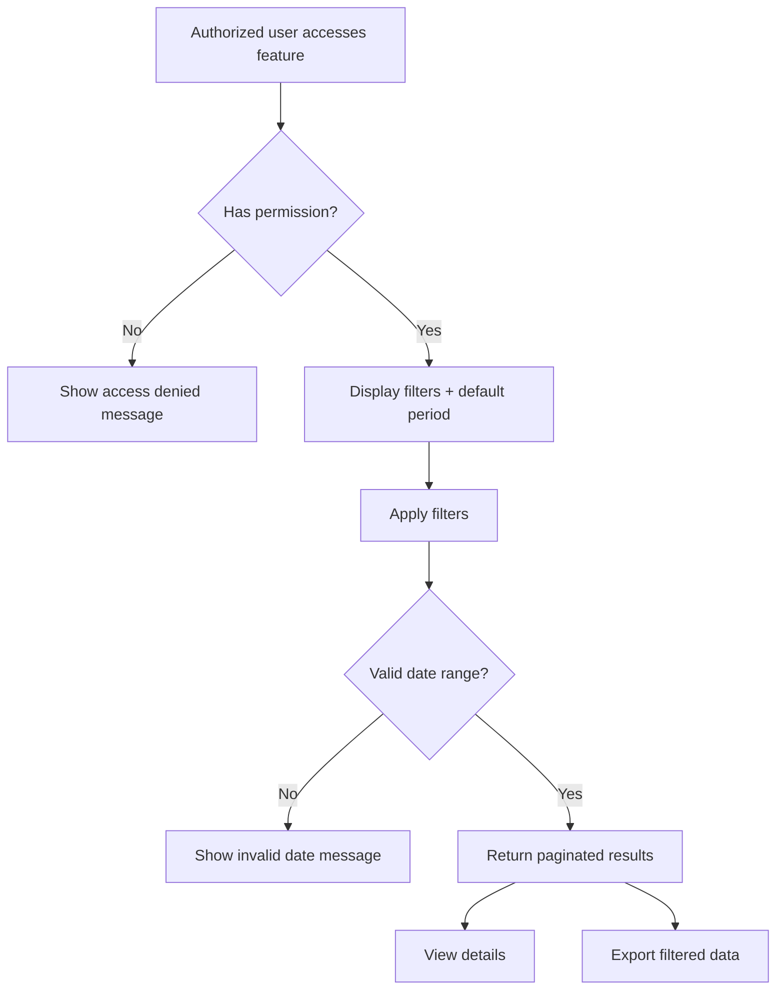

# User Story Writing

## Overview

Well-written user stories communicate requirements in a user-focused way, facilitate discussion, and provide clear acceptance criteria for developers and testers.

## When to Use

- Breaking down requirements into development tasks
- Product backlog creation and refinement
- Agile sprint planning
- Communicating features to development team
- Defining acceptance criteria
- Creating test cases

## Instructions

### 1. **User Story Format**

````markdown
# User Story Template

**Title:** [Feature name]
**Story ID:** [USR-000 / HU 000]
**Status:** [Draft | In Refinement | Approved]
**Version:** [v1.0]

**As a** [user role/persona]
**I want to** [action/capability]
**So that** [business value/benefit]

---

## Context

- **As:** [Role(s) that use this feature]
- **I want:** [Desired capability]
- **So that:** [Business/audit/compliance value]
- **Stakeholders:** [Product Owner, Business Area, Compliance, Tech Lead]

---

## Assumptions

- [Operational/system assumption 1]
- [Data/source assumption 2]
- [Access/security assumption 3]
- [Default behavior assumption when no filter/parameter is informed]

---

## User Context

- User Role: [Who is performing this action?]
- User Goals: [What are they trying to accomplish?]
- Use Case: [When do they perform this action?]

---

## Acceptance Criteria

### 1. [Scenario name]
- **Given** [precondition]
- **When** [action]
- **Then** [expected result]

### 2. [Access restriction]
- **Given** [user without required profile]
- **When** [tries to access feature]
- **Then** [block access and display standard denial message]

### 3. [Filter criteria]
- **Given** [user fills one or more filters]
- **When** [submits filtering]
- **Then** [apply combined filters using logical AND]

### 4. [Date range filter]
- **Given** [initial and/or final date provided]
- **When** [filter is executed]
- **Then** [return events in period and validate date consistency]

### 5. [Details view]
- **Given** [user selects one record]
- **When** [clicks "Details"]
- **Then** [show full event metadata and payload]

### 6. [Export]
- **Given** [filtered result set]
- **When** [clicks "Export"]
- **Then** [generate file containing only visible/filtered records]

### 7. [Pagination]
- **Given** [large result set]
- **When** [accesses listing]
- **Then** [show paginated results with navigation controls]

Example:
Given a user is logged in and viewing their cart
When they add a product to cart
Then the cart count increases and success message appears

---

## Screen Fields

### Filter Section

| Name | Description | Type | Required | Validation / Rule |
| --- | --- | --- | --- | --- |
| [Field 1] | [Description] | [text/date/select] | [Yes/No] | [Rule] |
| [Field 2] | [Description] | [text/date/select] | [Yes/No] | [Rule] |

### Listing Section

| Name | Description | Filterable |
| --- | --- | --- |
| [Column 1] | [Description] | [Yes/No] |
| [Column 2] | [Description] | [Yes/No] |

### Details Section

| Name | Description | Type |
| --- | --- | --- |
| [Attribute 1] | [Description] | [text/json/date] |
| [Attribute 2] | [Description] | [text/json/date] |

---

## Specific Rules

### Permission Rules

- [Allowed profile 1] can access all records.
- [Allowed profile 2] can access all records.
- [Restricted profile] can access only own records/context.
- [Sensitive action] must mask protected values in history/audit payload.

### Filtering Rules

- Filters are combined using logical AND.
- Validate end date must be greater than or equal to start date.
- If no filter is provided, return default period (e.g., last 7 days).
- Support start date only, end date only, or both.

### Export Rules

- Export includes only filtered records currently in scope.
- Exported file must include a header row.
- Filename pattern: `[feature]_YYYYMMDD_HHMMSS.[csv|pdf]`.

### Pagination Rules

- Default page size: [e.g., 20 items].
- Allow page navigation and total count visibility.
- Preserve active filters when changing pages.

---

## System Messages

| Situation | Message |
| --- | --- |
| Access denied | `[Standard access denied message]` |
| No results | `[No records found message]` |
| Data load error | `[Generic load error message]` |
| Export success | `[Export completed message]` |
| Export error | `[Export failed message]` |
| Invalid date filter | `[End date must be after start date message]` |

---

## Process Flow (Mermaid)



---

## Traceability Matrix

| Req ID | Requirement Description | Acceptance Criteria | API/Module | Test Case |
| --- | --- | --- | --- | --- |
| [REQ-001] | [Description] | [AC-01, AC-02] | [module/controller/service] | [TC-001] |
| [REQ-002] | [Description] | [AC-03, AC-04] | [module/controller/service] | [TC-002] |

---

## Definition of Done

- [ ] Code written and peer reviewed
- [ ] Unit tests written (>80% coverage)
- [ ] Integration tests passing
- [ ] Acceptance criteria verified
- [ ] Documentation updated
- [ ] No console errors or warnings
- [ ] Performance acceptable
- [ ] Accessibility requirements met
- [ ] Security review completed
- [ ] Product owner approval

---

## Additional Details

**Story Points:** 5 (estimate of effort)
**Priority:** High
**Epic:** [Parent feature]
**Sprint:** Sprint 23
**Assignee:** [Developer]
**Dependencies:** [Other stories this depends on]

---

## Notes

- Any additional context or considerations
- Edge cases to consider
- Performance constraints
- Accessibility requirements
- Security considerations
- Privacy/LGPD considerations (for payloads/audit data)
````

### 2. **Story Refinement Process**

```python
# Story refinement and quality gates

class UserStoryRefinement:
    QUALITY_GATES = {
        'Independent': 'Story can be implemented independently',
        'Negotiable': 'Details can be discussed and refined',
        'Valuable': 'Delivers clear business value',
        'Estimable': 'Team can estimate effort',
        'Small': 'Can be completed in one sprint',
        'Testable': 'Clear acceptance criteria'
    }

    def evaluate_story(self, story):
        """Assess story quality using INVEST criteria"""
        assessment = {}

        for criterion, description in self.QUALITY_GATES.items():
            assessment[criterion] = self.check_criterion(story, criterion)

        return {
            'story_id': story.id,
            'assessment': assessment,
            'ready_for_development': all(assessment.values()),
            'issues': self.identify_issues(story),
            'recommendations': self.provide_recommendations(story)
        }

    def check_criterion(self, story, criterion):
        """Evaluate against specific INVEST criterion"""
        checks = {
            'Independent': lambda s: len(s.dependencies) == 0,
            'Negotiable': lambda s: len(s.acceptance_criteria) > 0,
            'Valuable': lambda s: len(s.business_value) > 0,
            'Estimable': lambda s: s.story_points is not None,
            'Small': lambda s: s.story_points <= 8,
            'Testable': lambda s: len(s.acceptance_criteria) > 0 and all(
                ac.get('test_case') for ac in s.acceptance_criteria
            )
        }
        return checks[criterion](story)

    def refine_story(self, story):
        """Guide refinement discussion"""
        return {
            'story_id': story.id,
            'refinement_agenda': [
                {
                    'topic': 'Clarify scope',
                    'questions': [
                        'What exactly does the user need?',
                        'What's NOT included?',
                        'Are there edge cases?'
                    ]
                },
                {
                    'topic': 'Define acceptance criteria',
                    'questions': [
                        'How do we know when it's done?',
                        'What are success criteria?',
                        'What should fail gracefully?'
                    ]
                },
                {
                    'topic': 'Technical approach',
                    'questions': [
                        'How will we implement this?',
                        'Are there dependencies?',
                        'What are the risks?'
                    ]
                },
                {
                    'topic': 'Estimation',
                    'questions': [
                        'How much effort?',
                        'Any unknowns?',
                        'Buffer needed?'
                    ]
                }
            ],
            'outputs': [
                'Refined story description',
                'Detailed acceptance criteria',
                'Technical approach identified',
                'Story points estimate',
                'Dependencies listed',
                'Team agreement on scope'
            ]
        }
```

### 3. **Acceptance Criteria Examples**

```yaml
Story: As a customer, I want to save payment methods so I can checkout faster

Acceptance Criteria:

Scenario 1: Add a new payment method
  Given I'm logged in
  And I'm on the payment settings page
  When I click "Add payment method"
  And I enter valid payment details
  And I click "Save"
  Then the payment method is saved
  And I see a success message
  And the new method appears in my saved list

Scenario 2: Edit existing payment method
  Given I have saved payment methods
  When I click "Edit" on a method
  And I change the expiration date
  And I click "Save"
  Then the changes are saved
  And other fields are unchanged

Scenario 3: Delete a payment method
  Given I have multiple saved payment methods
  When I click "Delete" on a method
  And I confirm the deletion
  Then the method is removed
  And my default method is updated if needed

Scenario 4: Error handling
  Given I enter invalid payment information
  When I click "Save"
  Then I see an error message
  And the method is not saved
  And I'm returned to the form to correct

Scenario 5: Security
  Given the payment form is displayed
  When I view the page source
  Then I don't see full payment numbers (PCI compliance)
  And credit card data is encrypted
  And the connection is HTTPS

---

Non-Functional Requirements:
  - Performance: Form save must complete in <2 seconds
  - Usability: Form must be completable in <3 steps
  - Reliability: 99.9% uptime for payment service
  - Accessibility: WCAG 2.1 AA compliance
  - Security: PCI DSS Level 1 compliance
```

### 4. **Story Splitting**

```javascript
// Breaking large stories into smaller pieces

class StorySpitting {
  SPLITTING_STRATEGIES = [
    'By workflow step',
    'By user role',
    'By CRUD operation',
    'By business rule',
    'By technical layer',
    'By risk/complexity',
    'By priority'
  ];

  splitLargeStory(largeStory) {
    return {
      original_story: largeStory.title,
      original_points: largeStory.story_points,
      strategy: 'Split by workflow step',
      split_stories: [
        {
          id: 'US-201',
          title: 'Add payment method - Form UI',
          points: 3,
          description: 'Build payment form UI with validation',
          depends_on: 'None',
          priority: 'First'
        },
        {
          id: 'US-202',
          title: 'Add payment method - Backend API',
          points: 5,
          description: 'Create API endpoint to save payment method',
          depends_on: 'US-201',
          priority: 'Second'
        },
        {
          id: 'US-203',
          title: 'Add payment method - Integration',
          points: 3,
          description: 'Connect form to API, handle responses',
          depends_on: 'US-202',
          priority: 'Third'
        },
        {
          id: 'US-204',
          title: 'Add payment method - Security hardening',
          points: 2,
          description: 'PCI compliance, encryption, data protection',
          depends_on: 'US-202',
          priority: 'Critical'
        }
      ],
      total_split_points: 13,
      complexity_reduction: 'From 13pt single story to 5pt max',
      benefits: [
        'Faster feedback cycles',
        'Parallel development possible',
        'Easier testing',
        'Clearer scope per story'
      ]
    };
  }
}
```

### 5. **Story Estimation**

```yaml
Story Pointing Framework:

1 Point: Trivial
  - Update label text
  - Add CSS class
  - Simple config change
  - Time: <2 hours

2 Points: Very small
  - Add simple field to form
  - Update error message
  - Simple validation
  - Time: 2-4 hours

3 Points: Small
  - Create single page/component
  - Add basic API endpoint
  - Simple integration
  - Time: 4-8 hours

5 Points: Medium
  - Create feature with multiple interactions
  - Build API with multiple endpoints
  - Complex business logic
  - Time: 1-2 days

8 Points: Large
  - Feature spanning multiple pages
  - Complex integration
  - Multiple technical challenges
  - Time: 2-3 days

13 Points: Very large (TOO BIG - Split it!)
  - Should be split into smaller stories
  - Or elevated to epic
  - Time: >3 days

---

Estimation Tips:
  - Use relative sizing (compare to known stories)
  - Consider unknowns and risks
  - Include non-coding time (testing, docs)
  - Account for team skill level
  - Be transparent about assumptions
  - Re-estimate after learning
```

## Best Practices

### ✅ DO
- Write from the user's perspective
- Focus on value, not implementation
- Create stories small enough for one sprint
- Define clear acceptance criteria
- Use consistent format and terminology
- Have product owner approve stories
- Include edge cases and error scenarios
- Link to requirements/business goals
- Update stories based on learning
- Create testable stories

### ❌ DON'T
- Write technical task-focused stories
- Create overly detailed specifications
- Write stories that require multiple sprints
- Forget about non-functional requirements
- Skip acceptance criteria
- Create dependent stories unnecessarily
- Write ambiguous acceptance criteria
- Ignore edge cases
- Create too large stories
- Change stories mid-sprint without discussion

## User Story Tips

- Keep stories focused on user value
- Use story splitting when >5 points
- Always include acceptance criteria
- Review stories with team before sprint
- Update definitions of done as team learns
