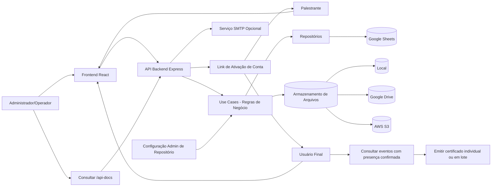
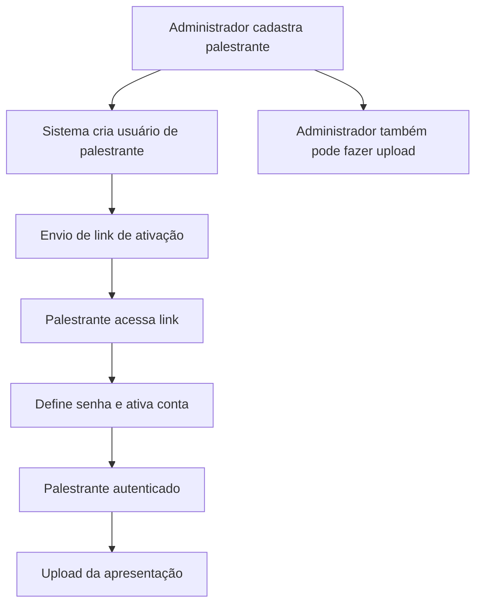
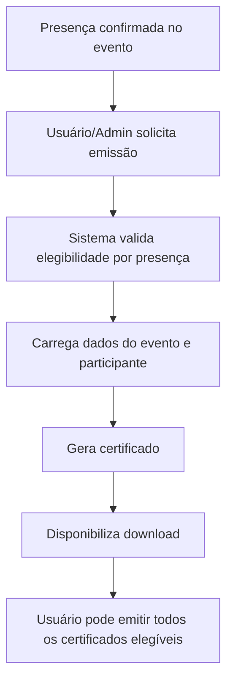
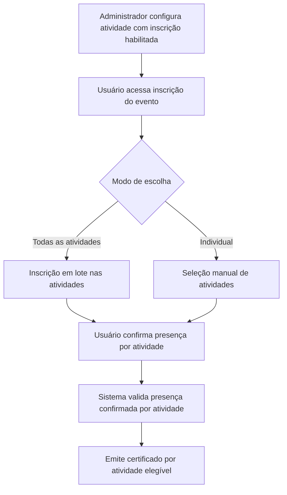
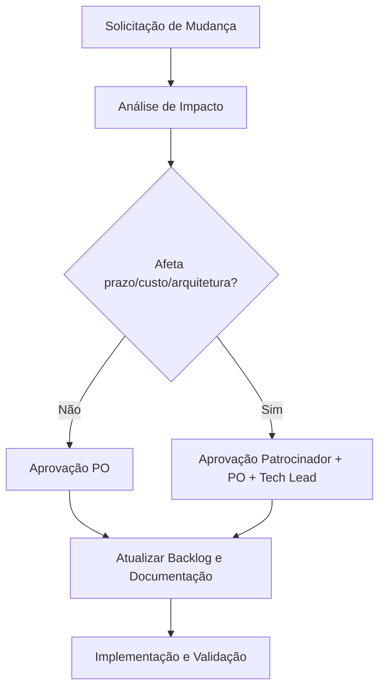

# Declaração de Escopo do Projeto — Plataforma Eventos

## 1. Identificação

| Campo               | Valor                        |
| ------------------- | ---------------------------- |
| Projeto             | Plataforma Eventos           |
| Versão do documento | 1.5                          |
| Data                | 2026-02-27                   |
| Responsável         | Time de Produto e Engenharia |
| Status              | Em vigor                     |

## 2. Objetivo do Projeto

Disponibilizar uma aplicação web para gestão de eventos, inscrições e controle de presença, com autenticação e governança de acesso, incluindo cadastro opcional da programação dos eventos, gestão de palestrantes e materiais de apresentação, com upload em repositório configurável (local, Google Drive ou AWS S3), utilizando frontend em React + TypeScript e backend em Node.js + Express (arquitetura limpa), com persistência em Google Sheets via API backend.

## 3. Objetivo de Negócio

- Centralizar o cadastro e a manutenção de eventos.
- Permitir o cadastro opcional da programação dos eventos.
- Permitir configuração administrativa de inscrição por atividade da programação.
- Permitir o ciclo completo de inscrição e confirmação de presença.
- Permitir a gestão completa de palestrantes (perfil, currículo, redes e contato).
- Viabilizar ativação segura de conta de palestrante por link e definição de senha.
- Permitir auto cadastro de usuário com ativação por link de e-mail e definição de senha.
- Permitir upload e gestão de arquivos de apresentação por palestrante e administradores.
- Permitir seleção administrativa do repositório de arquivos (local, Google Drive, AWS S3) com configuração de credenciais.
- Permitir emissão de certificados de presença com base nos dados do evento e presença confirmada.
- Permitir autoemissão, pelo próprio usuário, dos certificados de todos os eventos em que confirmou presença.
- Permitir emissão de certificados por atividade da programação quando houver inscrição por atividade, independentemente da forma de escolha do usuário (todas as atividades ou seleção individual).
- Reduzir trabalho manual de consolidação de dados em planilhas.
- Garantir rastreabilidade operacional por meio de API documentada e testes automatizados.

## 4. Escopo do Produto (Incluído)

### 4.1 Funcionalidades incluídas

1. **Autenticação e sessão**
   - Login com emissão de token JWT.
   - Refresh automático de sessão no frontend em caso de `401`.

2. **Gestão de Eventos**
   - Criar, listar, atualizar e remover eventos.
   - Consulta com paginação e filtros suportados pela API.
   - Cadastro opcional da programação do evento (agenda/sessões).
   - Definição, por atividade da programação, da possibilidade de inscrição específica.

3. **Gestão de Usuários**
   - Cadastro e administração de usuários do sistema.
   - Auto cadastro de usuário final.
   - Definição de senha e ativação de conta via link enviado por e-mail no momento do cadastro.

4. **Gestão de Inscrições**
   - Registro de inscrições vinculando usuário e evento.
   - Consulta e manutenção de inscrições.
   - Quando habilitado pelo administrador, permitir inscrição por atividade da programação.
   - Permitir ao usuário optar por inscrição em todas as atividades do evento ou escolher atividades individualmente.

5. **Gestão de Presenças**
   - Registro e consulta de presença por inscrição/evento.

6. **Gestão de Palestrantes**
   - Cadastro de palestrantes com dados profissionais e biográficos.
   - Registro de currículo, redes sociais e dados de contato.

7. **Conta de acesso para palestrante**
   - Geração de usuário vinculada ao cadastro do palestrante.
   - Ativação de conta e definição de senha por link enviado no momento do cadastro.

8. **Gestão de arquivos de apresentação**
   - Upload de apresentações pelo próprio palestrante.
   - Upload e gestão de apresentações por usuários administradores.
   - Armazenamento em repositório configurável: local, Google Drive ou AWS S3.

9. **Configuração administrativa de repositório de arquivos**
   - Interface para administrador definir o tipo de repositório de upload (local, Google Drive, AWS S3).
   - Interface para cadastro/atualização de credenciais de acesso ao repositório selecionado.
   - Validação de conectividade e disponibilidade do repositório configurado.

10. **Envio de e-mails (quando SMTP configurado)**

- Endpoint para envio via backend.
- Comportamento explícito de erro quando SMTP não estiver configurado.

11. **Emissão de certificados de presença**

- Geração de certificado a partir dos dados de cadastro do evento e do participante.
- Regra de elegibilidade condicionada à presença confirmada.
- Emissão por administradores e autoemissão pelo usuário autenticado.
- Emissão em lote pelo usuário para todos os eventos elegíveis.
- Quando houver inscrição por atividade, emissão de certificado por atividade com presença confirmada.
- Regra de emissão por atividade independente do modo de inscrição escolhido pelo usuário (todas as atividades ou individual).

12. **Documentação e observabilidade técnica mínima**

- Swagger em `/api-docs`.
- Estrutura de testes automatizados para frontend e backend.

### 4.2 Fluxo macro do negócio (escopo funcional)

### 4.3 Fluxo de ativação e envio de apresentação

### 4.4 Fluxo de emissão de certificados

### 4.5 Fluxo de inscrição por atividade e certificado por atividade

## 5. Escopo do Projeto (Entregáveis)

| ID  | Entregável                            | Descrição                                                                                                          | Critério de conclusão                         |
| --- | ------------------------------------- | ------------------------------------------------------------------------------------------------------------------ | --------------------------------------------- |
| E01 | Frontend Web                          | Interface para autenticação, eventos, inscrições e presenças                                                       | Build e lint aprovados                        |
| E02 | API Backend                           | API REST com rotas `/api/events`, `/api/users`, `/api/inscriptions`, `/api/presences`, `/api/emails`               | Testes backend aprovados                      |
| E03 | Integração com Google Sheets          | Repositórios e inicialização de planilhas/cabeçalhos                                                               | Aplicação inicializa com variáveis válidas    |
| E04 | Segurança de sessão                   | JWT + refresh automático no cliente                                                                                | Fluxo autenticado operante                    |
| E05 | Documentação técnica                  | README, docs de setup e Swagger                                                                                    | Documentação acessível e consistente          |
| E06 | Testes automatizados                  | Suíte Cypress frontend e backend                                                                                   | Execução sem falhas críticas                  |
| E07 | Módulo de Programação e Palestrantes  | Cadastro da programação (opcional) e cadastro completo de palestrantes (currículo, redes e contato)                | Fluxos funcionais homologados                 |
| E08 | Módulo de Ativação e Upload           | Ativação de conta por link (palestrante e usuário auto cadastrado) e upload de apresentações por palestrante/admin | Fluxo de ativação e upload validado           |
| E09 | Módulo de Configuração de Repositório | Interface administrativa para escolher repositório (local, Google Drive, AWS S3) e cadastrar credenciais de acesso | Configuração e validação de conexão aprovadas |
| E10 | Módulo de Certificados de Presença    | Emissão de certificados por presença confirmada, incluindo autoemissão individual e em lote pelo usuário           | Emissão validada para eventos elegíveis       |
| E11 | Módulo de Inscrição por Atividade     | Configuração de inscrição por atividade e inscrição do usuário em todas as atividades ou seleção individual        | Fluxo de inscrição por atividade validado     |

## 6. Fora de Escopo (Excluído)

- Aplicativo mobile nativo (Android/iOS).
- Integrações com ERPs, CRMs ou gateways de pagamento.
- BI avançado, dashboards analíticos complexos e data warehouse.
- Multi-tenant com segregação organizacional avançada.
- SLA de alta disponibilidade com arquitetura distribuída multi-região.
- Streaming ao vivo e hospedagem de vídeo sob demanda.

## 7. Stakeholders

| Stakeholder                | Papel                            | Interesse principal                  |
| -------------------------- | -------------------------------- | ------------------------------------ |
| Patrocinador/Cliente       | Aprovação de valor e prioridades | Entrega de funcionalidades de gestão |
| Product Owner              | Priorização de backlog           | Aderência ao processo de negócio     |
| Time de Desenvolvimento    | Implementação técnica            | Requisitos claros e testáveis        |
| QA                         | Validação de qualidade           | Critérios de aceite objetivos        |
| Operação/Usuários internos | Uso diário da plataforma         | Usabilidade e confiabilidade         |

## 8. Premissas

- Credenciais Google Sheets estarão disponíveis e válidas no ambiente.
- Ambiente Node.js compatível com as versões definidas no projeto.
- Disponibilidade de SMTP é opcional, conforme necessidade operacional.
- Para funcionalidades de upload, haverá ao menos um repositório disponível e configurável no ambiente de execução (local, Google Drive ou AWS S3).
- Credenciais válidas dos provedores escolhidos estarão disponíveis para configuração pelo administrador.
- Os dados cadastrais do evento e do participante serão suficientes para compor o certificado de presença.
- Os dados da atividade e a confirmação de presença por atividade estarão disponíveis para suportar emissão granular de certificado.
- Equipe manterá convenções arquiteturais (Clean Architecture no backend).

## 9. Restrições

- Persistência principal definida em Google Sheets.
- Dependência de variáveis de ambiente obrigatórias para inicialização do backend.
- Uso de stack tecnológica atual (React/Vite no frontend; Express/TypeScript no backend).
- Fluxos de ativação por link dependem de entrega de e-mail configurada para ambiente alvo.
- Funcionalidades de upload em nuvem dependem de conectividade com APIs externas dos provedores (Google Drive/AWS).
- Emissão de certificado depende de registro de presença confirmado e íntegro.
- Certificados por atividade dependem de vínculo entre inscrição, atividade e presença confirmada por atividade.
- Escopo limitado aos módulos funcionais descritos nesta declaração.

## 10. Critérios de Aceite do Escopo

| ID   | Critério                                  | Métrica de validação                                                                                            | Status esperado            |
| ---- | ----------------------------------------- | --------------------------------------------------------------------------------------------------------------- | -------------------------- |
| CA01 | Funcionalidades essenciais implementadas  | Checklist dos módulos incluídos                                                                                 | 100% concluído             |
| CA02 | API funcional e documentada               | Acesso ao `/api-docs` e rotas válidas                                                                           | Aprovado                   |
| CA03 | Integridade arquitetural                  | Revisão técnica por camadas                                                                                     | Conforme padrão do projeto |
| CA04 | Qualidade mínima                          | Lint/build/testes executáveis                                                                                   | Sem falha bloqueante       |
| CA05 | Rastreabilidade de requisitos             | Matriz requisito ↔ entrega ↔ validação                                                                          | Completa                   |
| CA06 | Programação de eventos (opcional)         | CRUD de programação por evento                                                                                  | Operante                   |
| CA07 | Cadastro completo de palestrante          | Campos de currículo, redes e contato                                                                            | Operante                   |
| CA08 | Ativação e upload de apresentações        | Link de ativação + upload por perfil autorizado                                                                 | Operante                   |
| CA09 | Auto cadastro de usuário                  | Cadastro + ativação por e-mail + definição de senha                                                             | Operante                   |
| CA10 | Configuração de repositório e credenciais | Seleção de tipo + credenciais válidas + teste de conexão                                                        | Operante                   |
| CA11 | Emissão de certificado por elegibilidade  | Geração apenas para presença confirmada                                                                         | Operante                   |
| CA12 | Autoemissão de certificados pelo usuário  | Emissão individual e em lote para todos os eventos elegíveis                                                    | Operante                   |
| CA13 | Inscrição por atividade                   | Usuário consegue inscrever-se em todas as atividades ou individualmente, conforme configuração do administrador | Operante                   |
| CA14 | Certificado por atividade                 | Emissão por atividade com presença confirmada, independente da forma de escolha de inscrição                    | Operante                   |

## 11. Matriz de Rastreabilidade

| Requisito de Negócio                        | Requisito Funcional                                                                                  | Entregável | Evidência de Validação                                       |
| ------------------------------------------- | ---------------------------------------------------------------------------------------------------- | ---------- | ------------------------------------------------------------ |
| RN01 - Gerir eventos                        | RF01 - CRUD de eventos                                                                               | E01, E02   | Testes + endpoint `/api/events`                              |
| RN02 - Gerir usuários                       | RF02 - CRUD de usuários                                                                              | E01, E02   | Testes + endpoint `/api/users`                               |
| RN03 - Controlar inscrições                 | RF03 - CRUD de inscrições                                                                            | E01, E02   | Testes + endpoint `/api/inscriptions`                        |
| RN04 - Controlar presença                   | RF04 - Registro/consulta de presença                                                                 | E01, E02   | Testes + endpoint `/api/presences`                           |
| RN05 - Comunicação por e-mail               | RF05 - Envio de e-mails via API                                                                      | E02        | Endpoint `/api/emails` + validação SMTP                      |
| RN06 - Operação confiável                   | RF06 - Build/lint/testes e docs                                                                      | E05, E06   | Execução de pipelines locais/CI                              |
| RN07 - Programar agenda do evento           | RF07 - Cadastro opcional de programação                                                              | E07        | Fluxo de programação por evento                              |
| RN08 - Gerir palestrantes                   | RF08 - Cadastro de perfil e currículo                                                                | E07        | CRUD de palestrantes + dados complementares                  |
| RN09 - Habilitar acesso do palestrante      | RF09 - Criação de usuário e ativação por link                                                        | E08        | Fluxo de ativação e definição de senha                       |
| RN10 - Gerir apresentações                  | RF10 - Upload por palestrante e administrador                                                        | E08        | Upload e listagem de arquivos por evento/palestrante         |
| RN11 - Permitir auto cadastro de usuário    | RF11 - Auto cadastro com ativação por e-mail e definição de senha                                    | E08        | Fluxo de cadastro, envio de link, ativação e primeiro acesso |
| RN12 - Configurar repositório de arquivos   | RF12 - Interface de administração para seleção de repositório e credenciais (local/Drive/S3)         | E09        | Configuração salva + teste de conexão + upload funcional     |
| RN13 - Emitir certificados de presença      | RF13 - Geração de certificado com base nos dados do evento e presença confirmada                     | E10        | Certificado gerado apenas para participante elegível         |
| RN14 - Permitir autoemissão de certificados | RF14 - Usuário emite certificados de todos os eventos com presença confirmada                        | E10        | Emissão individual e em lote para eventos elegíveis          |
| RN15 - Permitir inscrição por atividade     | RF15 - Admin define inscrição por atividade e usuário escolhe todas as atividades ou individualmente | E11        | Fluxo de inscrição por atividade executado com sucesso       |
| RN16 - Emitir certificado por atividade     | RF16 - Certificado emitido por atividade com presença confirmada, independente da forma de inscrição | E10, E11   | Emissão granular por atividade validada                      |

## 12. Governança de Mudança de Escopo

## 13. Riscos de Escopo (Resumo)

| Risco                                                   | Impacto                                      | Mitigação                                                       |
| ------------------------------------------------------- | -------------------------------------------- | --------------------------------------------------------------- |
| Falta de credenciais Google válidas                     | Bloqueia backend                             | Checklist de ambiente e validação antecipada                    |
| Mudanças frequentes sem controle                        | Retrabalho                                   | Processo formal de mudança de escopo                            |
| Divergência documentação x código                       | Erros de operação                            | Revisões periódicas e fonte de verdade nas rotas                |
| Falha no envio de link de ativação                      | Bloqueia onboarding de palestrante           | Monitoramento de e-mail e estratégia de reenvio                 |
| Upload de arquivo sem governança                        | Risco de segurança e armazenamento           | Política de tipo/tamanho e controle de acesso                   |
| Auto cadastro sem validações adequadas                  | Risco de cadastro indevido                   | Verificação de e-mail, expiração de token e política de senha   |
| Credenciais de repositório expostas ou inválidas        | Falha de upload e risco de segurança         | Cofre/criptografia, mascaramento em UI e rotação de credenciais |
| Emissão indevida de certificado sem presença confirmada | Risco reputacional e de conformidade         | Regra de elegibilidade obrigatória e trilha de auditoria        |
| Inconsistência entre inscrição e presença por atividade | Erro na emissão de certificado por atividade | Validações de integridade e reconciliação periódica de dados    |

## 14. Aprovação

Este documento estabelece a linha de base de escopo para o projeto. Quaisquer alterações devem seguir o fluxo de governança descrito na seção 12.

| Papel         | Nome | Data | Assinatura |
| ------------- | ---- | ---- | ---------- |
| Patrocinador  |      |      |            |
| Product Owner |      |      |            |
| Tech Lead     |      |      |            |
| QA Lead       |      |      |            |
