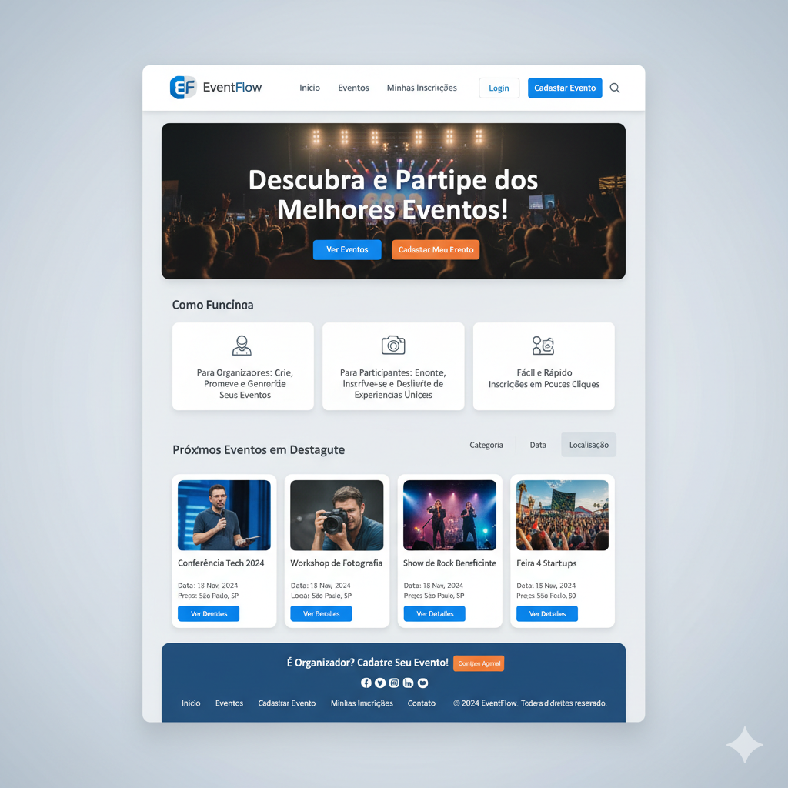
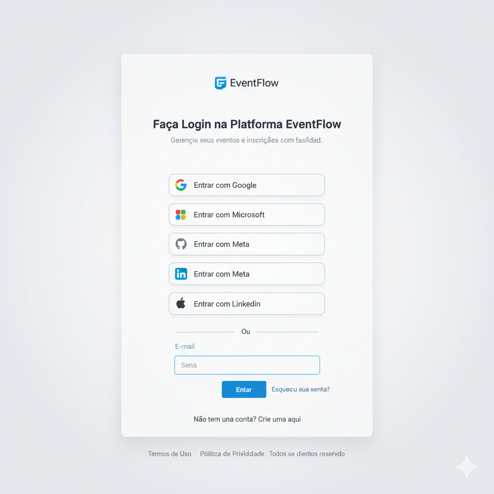
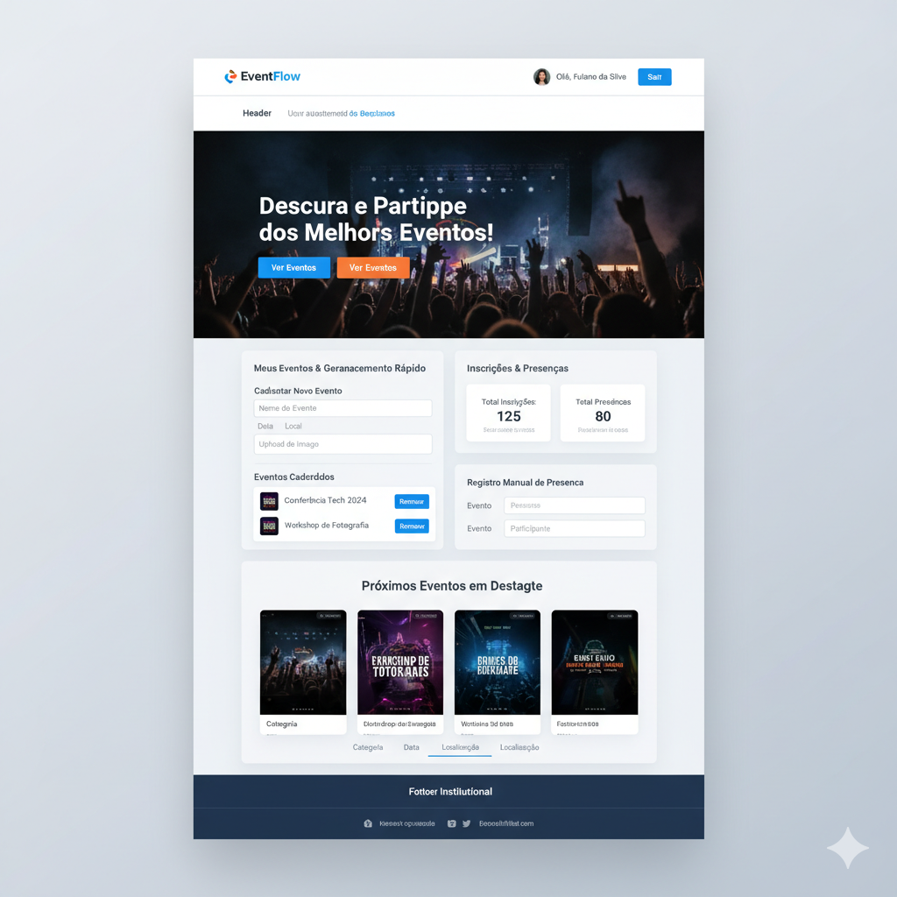
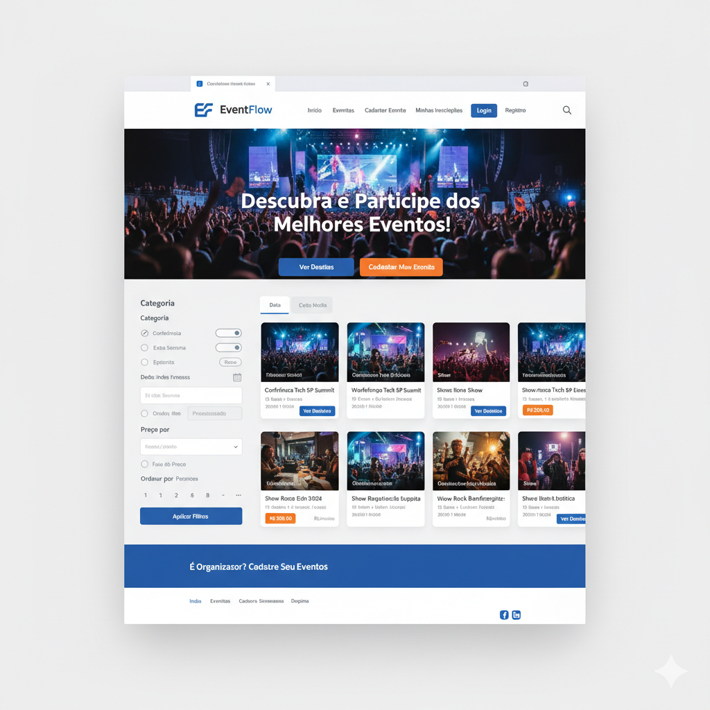
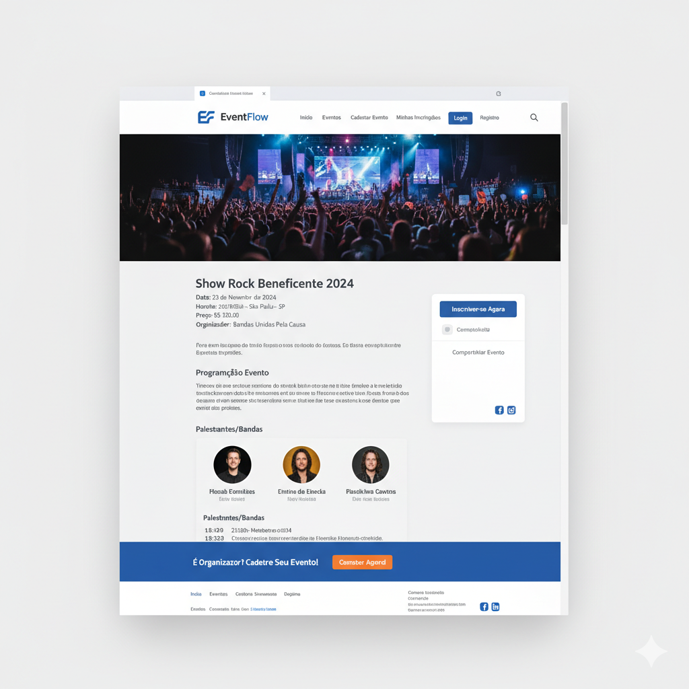
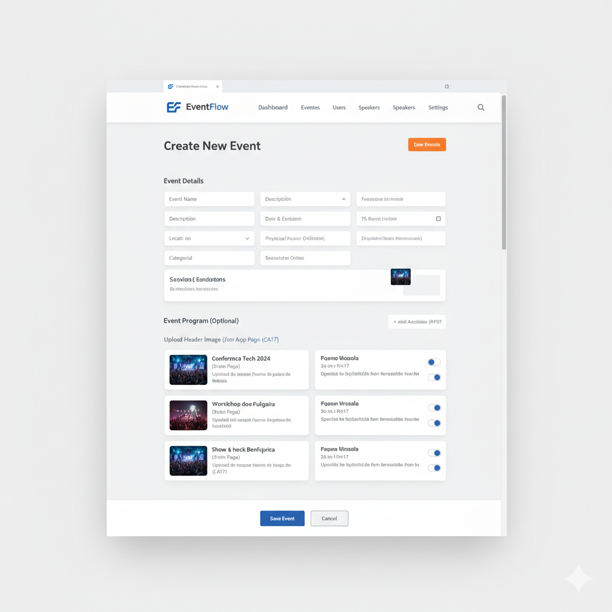
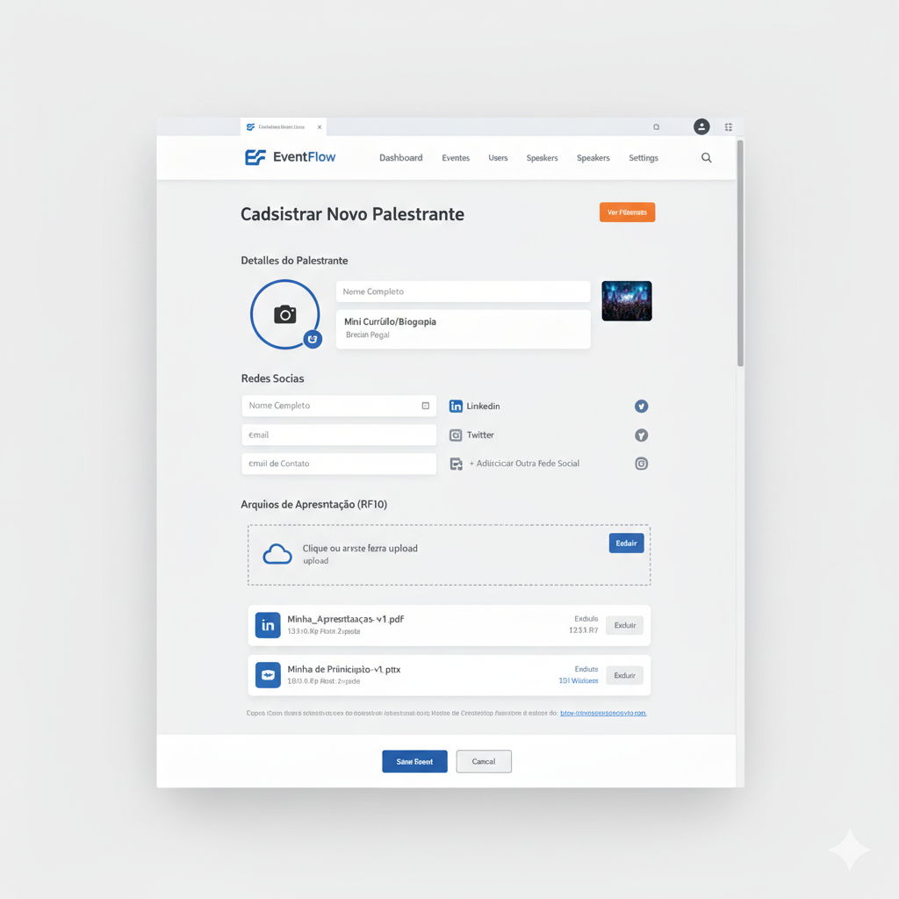
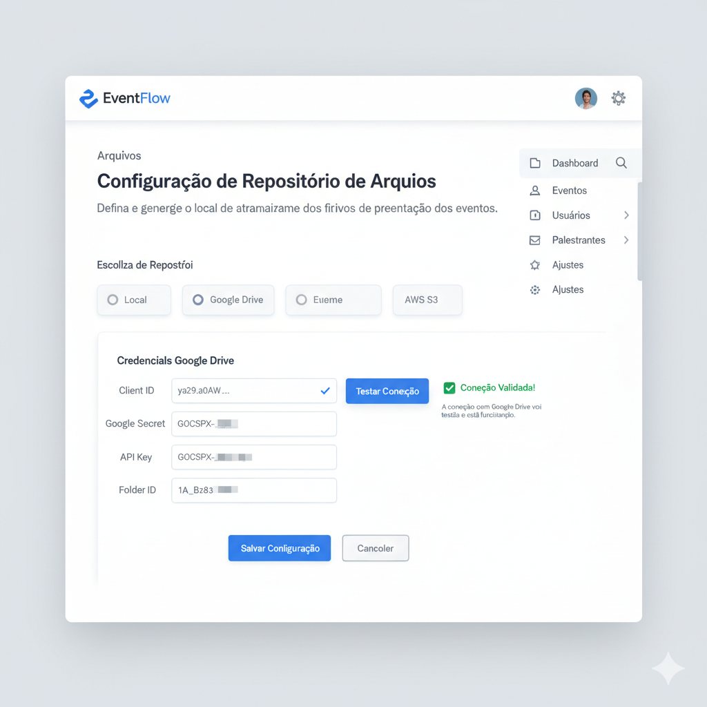
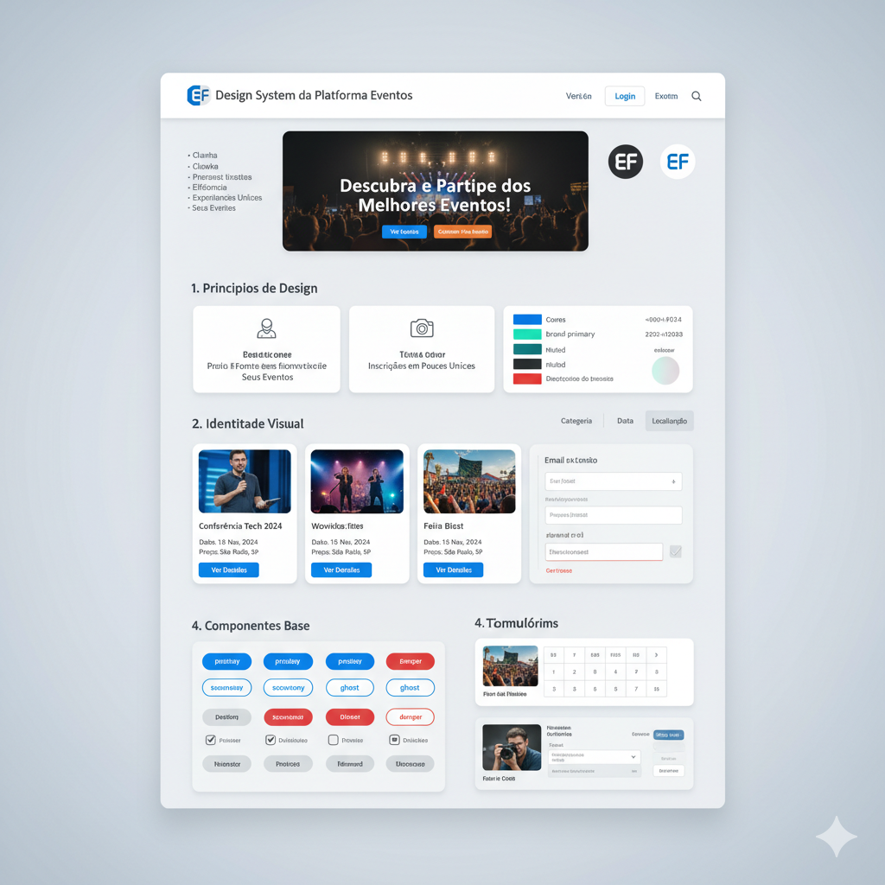

# Definição de Layouts das Páginas — Plataforma Eventos

## 1. Identificação

| Campo       | Valor                            |
| ----------- | -------------------------------- |
| Projeto     | Plataforma Eventos               |
| Documento   | Definição de Layouts das Páginas |
| Versão      | 1.0                              |
| Data        | 2026-03-01                       |
| Responsável | Time de Produto e Engenharia     |
| Status      | Em vigor                         |

## 2. Objetivo

Definir a estrutura visual e funcional das páginas da aplicação web, estabelecendo os blocos de layout, comportamento por estado e regras de responsividade para implementação e validação de UX no MVP.

## 3. Mapa de páginas e rotas

| Página                           | Rota                           | Perfil              | Objetivo                                                         |
| -------------------------------- | ------------------------------ | ------------------- | ---------------------------------------------------------------- |
| Página inicial (pública)         | `/`                            | Visitante           | Exibir evento em destaque, status de inscrição e agenda resumida |
| Página inicial (painel interno)  | `/`                            | Usuário autenticado | Gerenciar eventos e fluxos operacionais no mesmo shell da home   |
| Página de acesso                 | `/auth`, `/login`, `/cadastro` | Visitante           | Realizar login, autocadastro e entrada por OAuth                 |
| Estado de carregamento de sessão | (mesmas rotas)                 | Todos               | Informar validação/carregamento de autenticação                  |

## 4. Estrutura base de layout

### 4.1 Contêiner principal

- Estrutura vertical em tela cheia (`min-height: 100vh`).
- Fundo institucional claro com gradiente radial suave.
- Hierarquia padrão: `Header` → `Main` → `Footer`.

### 4.2 Grid e espaçamento

- Conteúdo principal com padding lateral responsivo (`clamp(1rem, 4vw, 4rem)`).
- Seções principais com espaçamento vertical amplo para escaneabilidade.
- Cartões (`panel-card`) como unidade visual padrão de conteúdo.

### 4.3 Componentes base recorrentes

- Botões: `primary`, `ghost`, `danger`, com variações de largura (`full`).
- Formulários: campos verticais com label superior e área de erro textual.
- Tipografia de apoio: `eyebrow` (rótulo) e `muted` (texto secundário).

## 5. Definição de layout por página

### 5.1 Página inicial pública (`/`) — não autenticado

#### Ordem de blocos

1. **Header institucional**
   - Branding (logo + órgão).
   - Navegação âncora (`O evento`, `Inscrições`, `Painel`).
   - Ação secundária (`Contate a equipe`).
2. **Hero do evento**
   - Coluna 1: título, tema, metadados (local/data), CTAs.
   - Coluna 2: status do evento e card de localização.
3. **Seção Inscrições + Painel** (`content-grid` em 2 colunas adaptativas)
   - Coluna esquerda: card de informações de inscrição (passos + alerta).
   - Coluna direita: card de login/autocadastro (`Login`).
4. **Galeria de eventos**
   - Cabeçalho da seção (título + contador de itens).
   - Grade de cards de eventos (até 3 cards na visão resumida).
5. **Footer institucional**

#### Comportamentos de estado

- Carregando eventos: exibir placeholders textuais nos cards.
- Erro de carregamento: exibir mensagem de erro na seção da galeria.

### 5.2 Página inicial com painel interno (`/`) — autenticado

Mantém `Header`, `Hero`, `Galeria` e `Footer` da home pública, mas substitui o card de login por um **Dashboard Administrativo**.

#### Estrutura do dashboard

1. **Cabeçalho do painel**
   - Contexto do painel + ação de logout.
2. **Resumo do usuário autenticado**
   - Nome, perfil e e-mail.
3. **Formulário de cadastro de evento**
   - Campos de identificação, período do evento, período de inscrição e URLs de identidade visual.
4. **Filtro + listagem paginada de eventos**
   - Busca por título/local.
   - Lista com ação de remoção por item.
5. **Painel operacional MVP**
   - Formulários de inscrição e presença.
   - Indicadores resumidos de inscrições/presenças/elegíveis.
6. **Painel de palestrantes e repositório MVP**
   - Cadastro de palestrante.
   - Validação de upload.
   - Configuração/teste de conexão de repositório.

#### Comportamentos de estado

- Salvando evento: botão principal com estado de progresso.
- Sem eventos: mensagem informativa no bloco de listagem.
- Erros de API: mensagem textual no bloco de eventos.

### 5.3 Página de acesso (`/auth`, `/login`, `/cadastro`)

#### Estrutura

1. **Shell centralizado**
   - Conteúdo central na viewport, sem `header`/`footer` institucionais.
2. **Card de autenticação**
   - Título contextual de acesso.
   - Formulário de login (e-mail/senha).
   - Alternância para autocadastro (inclui campo nome).
   - Botão de ação principal e botão de alternância de modo.
   - Opções OAuth (quando disponíveis) com uma ação por provedor.

#### Regras de navegação

- Usuário já autenticado: redirecionar automaticamente para `/`.

### 5.4 Estado de carregamento de autenticação

Aplicável às rotas `/` e `/auth` quando `isLoading` estiver ativo.

- Cartão centralizado (`loading-state`) com:
  - Marca textual (`Portal CGEAC`).
  - Título de progresso.
  - Mensagem curta de orientação.

## 6. Responsividade

### 6.1 Breakpoint principal

- Em larguras até `768px`:
  - `site-header` reorganiza para coluna.
  - navegação permite quebra de linha.
  - hero torna-se coluna única.
  - botões passam a ocupar largura total.

### 6.2 Comportamento de grids fluidos

- `hero`, `content-grid` e `events-grid` usam `repeat(auto-fit, minmax(...))` para adaptação sem layout fixo por dispositivo.

## 7. Diretrizes visuais do layout

- Base cromática orientada pelas variáveis globais (`--brand-primary`, `--brand-secondary`, `--surface`, `--muted`, `--border`, `--danger`).
- Cartões com cantos arredondados e contraste claro para leitura.
- Destaques visuais reservados para CTAs e status relevantes.
- Texto de apoio em tom secundário para reduzir ruído visual.

## 8. Critérios de aceite do layout

1. Todas as rotas mapeadas exibem os blocos previstos neste documento.
2. Home pública e home autenticada compartilham shell visual, variando apenas o bloco de painel.
3. Página de acesso apresenta login, autocadastro e OAuth no mesmo card funcional.
4. Estados de carregamento e erro são visíveis e compreensíveis ao usuário.
5. Em telas até `768px`, os blocos principais permanecem legíveis sem sobreposição.

## 9. Layout Proposto

### 9.1 Página Inicial Pública (/) — Não Autenticado

Esta é a página que visitantes veem. Deverá exibir eventos em destaque, status de inscrição (se relevante para o contexto sem login) e uma agenda resumida.

Ordem dos Blocos (5.1 da Definição de Layouts):

1. Header Institucional: Branding (logo + órgão), navegação âncora ("Eventos", "Inscrições", "Painel" - este último pode ser para o login), ação secundária ("Contate a equipe").
2. Hero do Evento: Coluna 1 (título, tema, metadados, CTAs), Coluna 2 (status do evento e card de localização).
3. Seção Inscrições + Painel: content-grid em 2 colunas adaptativas. Coluna esquerda com card de informações de inscrição. Coluna direita com card de login/autocadastro.
4. Galeria de Eventos: Cabeçalho da seção (título + contador de itens), grade de cards de eventos (até 3 na visão resumida).
5. Footer Institucional.

### 9.2 Página de Acesso (/auth, /login, /cadastro)

Para login, autocadastro e entrada por OAuth. O documento especifica "Shell centralizado, sem header / footer institucionais" e "Card de autenticação" com opções de login, autocadastro e OAuth.

Estrutura (5.3 da Definição de Layouts):

1. Shell Centralizado: Conteúdo central na viewport, sem header / footer institucionais.
2. Card de Autenticação:

- Título contextual de acesso ("Faça Login" ou "Crie Sua Conta").
- Formulário de login (e-mail/senha).
- Alternância para autocadastro (inclui campo nome).
- Botão de ação principal ("Entrar" ou "Cadastrar").
- Botão de alternância de modo ("Não tem conta? Cadastre-se" / "Já tem conta? Faça Login").
- Opções OAuth (quando disponíveis) com uma ação por provedor (botões "Entrar com Google", "Entrar com Microsoft", etc.).
  

### 9.3 Página Inicial com Painel Interno (/) — Autenticado

Esta página é a visão "Home" para um usuário autenticado, atuando como um dashboard administrativo. Ela mantém o Header, Hero, Galeria e Footer da Home pública, mas substitui o card de login por um Dashboard Administrativo.
Estrutura do Dashboard (5.2 da Definição de Layouts):

1. Header: O mesmo da página pública, mas com contexto do painel (ex: nome do usuário autenticado) e ação de logout.
2. Hero: Mantido da página pública.
3. Resumo do Usuário Autenticado: Nome, perfil e e-mail.
4. Formulário de Cadastro de Evento (MVP): Campos de identificação, período do evento, período de inscrição e URLs de identidade visual.
5. Filtro + Listagem Paginada de Eventos: Busca por título/local, lista com ação de remoção por item.
6. Painel Operacional MVP: Formulários de inscrição e presença, indicadores resumidos de inscrições/presenças/elegíveis.
7. Painel de Palestrantes e Repositório MVP: Cadastro de palestrante, validação de upload, configuração/teste de conexão de repositório.
8. Galeria de Eventos: Mantida da página pública.
9. Footer Institucional: Mantido da página pública.

### 9.4 Página de Listagem de Eventos

Esta página deve permitir que os usuários encontrem facilmente os eventos que lhes interessam, com opções robustas de filtro e busca.

1. Cabeçalho: O mesmo da Home.
2. Título: "Explore Nossos Eventos"
3. Filtros: Barra lateral ou superior com filtros para:
   3.1. Categoria: (Conferência, Workshop, Show, Esporte, etc.)
   3.2. Data: (Hoje, Esta Semana, Este Mês, Próximos 3 Meses, Personalizado)
   3.4. Localização: (Cidade, Estado, Presencial/Online)
   3.5. Preço: (Gratuito, Pago, Faixa de Preço)
   3.6. Ordenar por: (Mais Recentes, Mais Populares, Data Asc/Desc)
4. Resultados da Busca/Listagem: Grid de cards de eventos, similar aos da Home, mas com mais detalhes se o espaço permitir e paginação.
5. Rodapé: O mesmo da Home.

### 9.5 Página de Detalhes do Evento (para Participantes)

Essencial para fornecer todas as informações necessárias sobre um evento e permitir a inscrição.

1. Cabeçalho: O mesmo.
2. Imagem de Cabeçalho do Evento: (Conforme escopo, opcional, CA17)
3. Título do Evento
4. Informações Básicas: Data, Hora, Local, Preço, Organizador.
5. Descrição Detalhada do Evento.
6. Programação/Agenda (opcional): (RF07) Lista de sessões/atividades, com palestrantes e horários. Se a inscrição por atividade estiver habilitada (RF15), opções para selecionar atividades.
7. Palestrantes: Seção com cards ou lista de palestrantes, com foto, nome e uma breve biografia (RF08).
8. Botão CTA: "Inscrever-se Agora" (com condicional para login).
9. Compartilhamento Social: Ícones para compartilhar o evento.
10. Rodapé: O mesmo.

### 9.6 Página de Cadastro/Edição de Evento

Esta página é a interface para criar e gerenciar os eventos, seguindo o escopo (RF01, RF07, CA17).

1. Cabeçalho Administrativo: Logotipo, links para dashboards, gestão de eventos, usuários, palestrantes, configurações, etc. (Diferente do header público).
2. Título: "Cadastrar Novo Evento" ou "Editar Evento: [Nome do Evento]"
3. Formulário de Detalhes do Evento:
   3.1. Nome do Evento
   3.2. Descrição
   3.3. Data e Hora (Início/Fim)
   3.4. Local (Endereço, Link para evento online)
   3.5. Preço
   3.6. Categoria
   3.7. Upload de Imagem para Header da Aplicação: (CA17)
   3.8. Upload de Imagem para Cabeçalho do Certificado: (CA17)
4. Seção de Programação (Opcional):
   4.1. Botão "Adicionar Atividade"
   4.2. Lista de atividades cadastradas, com opções de edição/exclusão.
   4.3. Para cada atividade: Nome, Descrição, Horário, Duração, Palestrante(s), Opção de "Inscrição específica para esta atividade" (RF07, RF15).
   4.4. Botões: "Salvar Evento", "Cancelar".
   4.5. Rodapé: Simplificado, com informações de sistema ou links administrativos.

### 9.7 Página de Cadastro/Edição de Palestrante

Permite aos administradores e palestrantes gerenciar seus perfis (RF08).

1. Cabeçalho Administrativo.
2. Título: "Cadastrar Novo Palestrante" ou "Editar Palestrante: [Nome do Palestrante]"
3. Formulário de Detalhes do Palestrante:
   3.1. Nome Completo
   3.2. Foto de Perfil
   3.3. Biográfico/Mini Currículo
   3.4. Redes Sociais (LinkedIn, Twitter, Instagram, etc.)
   3.5. Contato (E-mail)
   3.6. Área para upload de arquivos de apresentação (RF10) com opções de 4.gerenciamento.
4. Botões: "Salvar Palestrante", "Cancelar".
5. Rodapé: Simplificado.

### 9.8 Página de Configuração de Repositório de Arquivos

Esta página é crucial para definir onde os arquivos de apresentação serão armazenados (RF12, CA10).

1. Cabeçalho Administrativo.
2. Título: "Configuração de Repositório de Arquivos"
3. Opções de Repositório: Radio buttons ou dropdown para selecionar:
   3.1 Local
   3.1 Google Drive
   3.1 AWS S3
4. Campos de Credenciais (condicionais): Dependendo do repositório escolhido, exibir campos para:
   4.1 Google Drive: Chave de API, Client ID, Secret (ou similar).
   4.2 AWS S3: Access Key ID, Secret Access Key, Bucket Name, Região.
5. Botão "Testar Conexão": (CA10) Para validar as credenciais e a disponibilidade.
6. Botão "Salvar Configuração", "Cancelar".
7. Rodapé: Simplificado.

## 10. Design System da Plataforma Eventos

1. Princípios de Design
   Estes princípios guiarão todas as decisões de design e desenvolvimento, refletindo a visão da plataforma:

- Clareza: A informação é fácil de entender, as ações são intuitivas.
- Eficiência: O usuário alcança seus objetivos rapidamente, com o mínimo de esforço.
- Consistência: Experiência uniforme em todas as páginas e interações.
- Acessibilidade: Design inclusivo para todos os usuários.
- Responsividade: Adaptável a qualquer dispositivo e tamanho de tela.
- Foco no Evento: Os eventos e suas informações são o centro da atenção.
- Confiança: Transmite segurança na gestão de dados e autenticação.

2. Identidade Visual

- Marca: "EventFlow" (ou nome da plataforma).
- Uso: Consistente no cabeçalho e páginas de acesso.

Baseado nas variáveis globais --brand-primary, --brand-secondary, --surface, --muted, --border, --danger e nas telas propostas:

- Primária (--brand-primary): Um azul vibrante e convidativo (ex: #1877F2 ou similar). Usado para CTAs principais, elementos interativos e branding.
- Secundária (--brand-secondary): Um tom de azul mais claro ou um verde/ciano complementar (ex: #4CAF50 ou #00BCD4). Usado para CTAs secundárias, destaques e elementos de sucesso.
- Superfície (--surface): Branco ou um cinza muito claro (ex: #FFFFFF, #F9FAFB). Para backgrounds de cards, modais e áreas de conteúdo.
- Texto Principal: Preto ou cinza escuro (ex: #212121, #424242).
- Muted (--muted): Cinza médio para textos secundários, rótulos e placeholders (ex: #757575, #BDBDBD).
- Borda (--border): Cinza claro para linhas divisórias e bordas de campos (ex: #E0E0E0).
  Perigo (--danger): Vermelho para ações destrutivas, mensagens de erro e alertas (ex: #F44336).
- Sucesso: Verde para mensagens de sucesso e ícones de validação (ex: #4CAF50).
- Fundo Institucional: Gradiente radial suave (ex: um tom pastel de azul claro para o centro e branco nas bordas).

