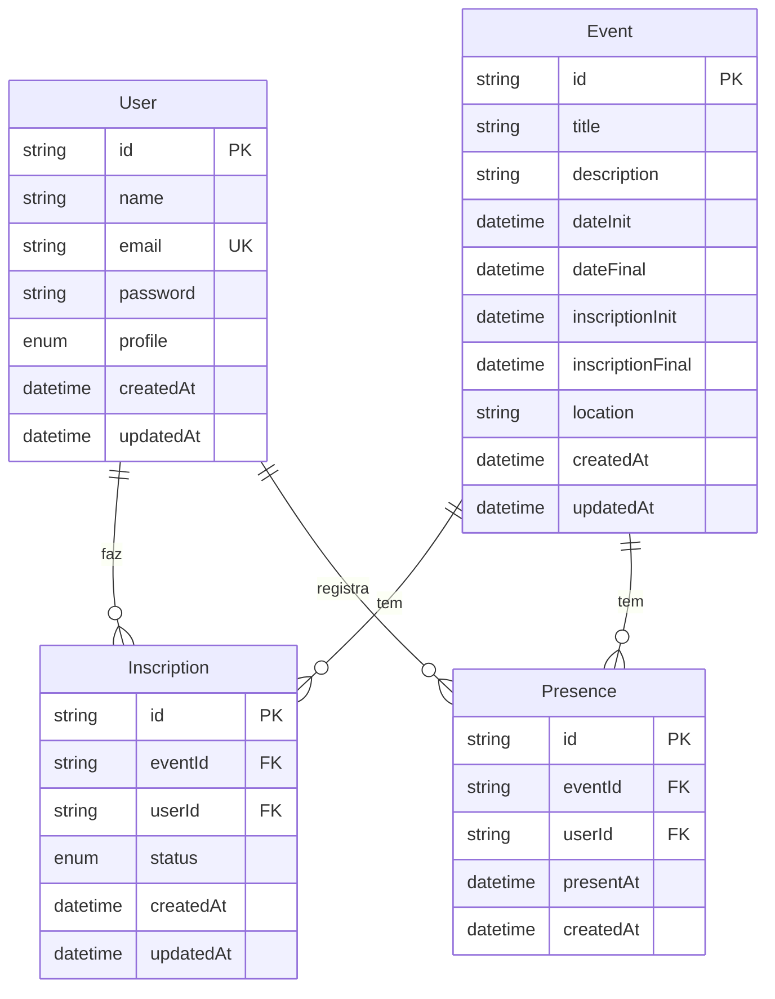
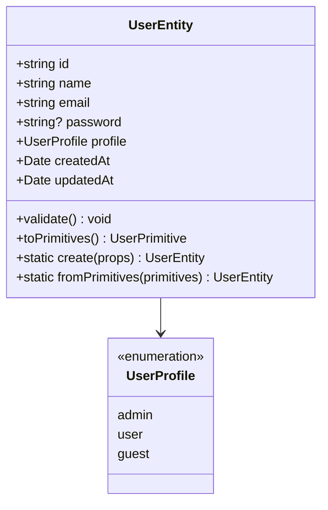
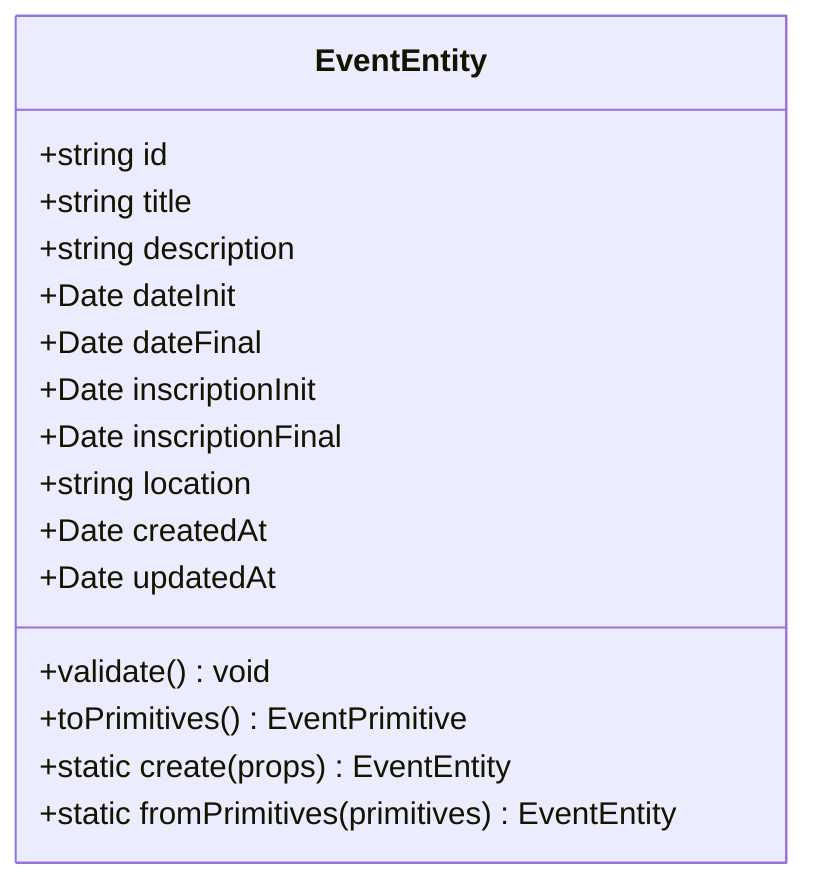
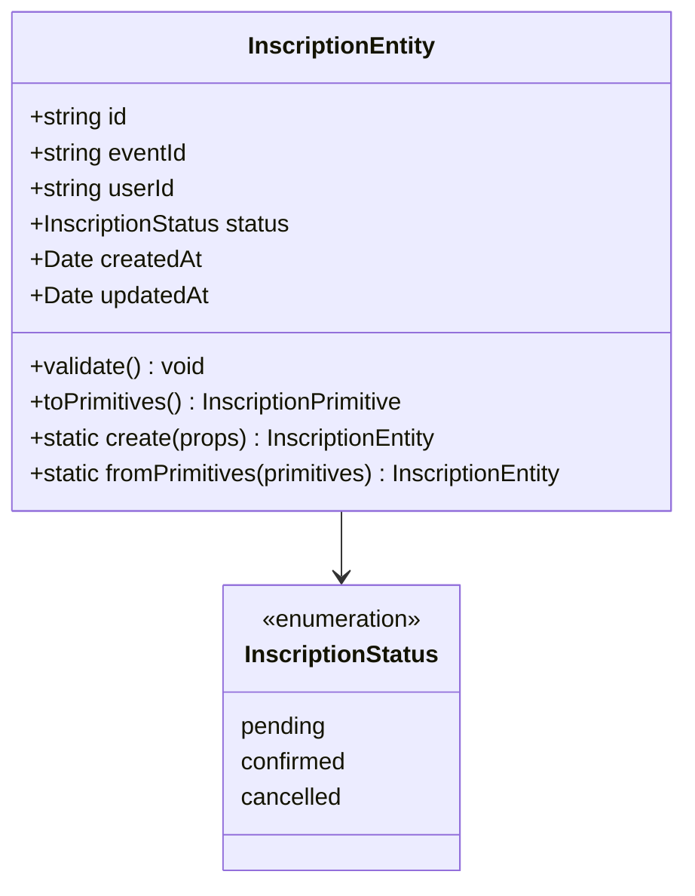
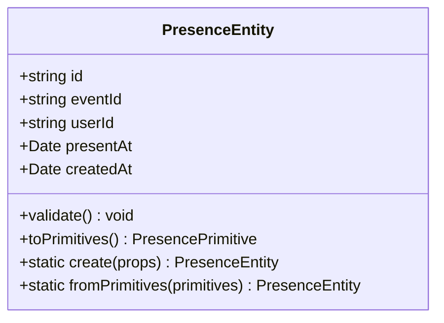
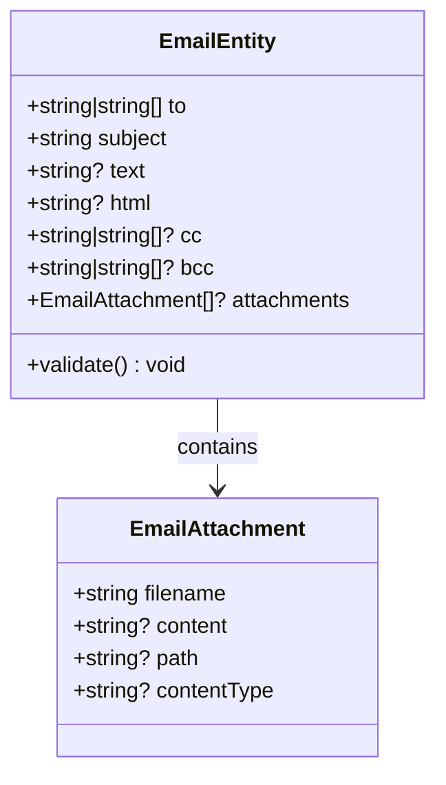
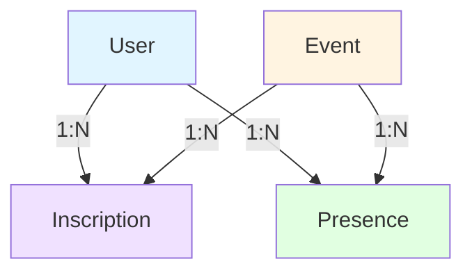

# Modelo de Dados

Este documento descreve os modelos de dados do sistema de gerenciamento de eventos.

## Visão Geral

O sistema utiliza uma arquitetura baseada em Clean Architecture, com entidades de domínio que representam os conceitos principais do negócio. Os dados são persistidos em Google Sheets, onde cada entidade possui sua própria planilha.

## Diagrama de Entidades

## Entidades

### 1. User (Usuário)

Representa um usuário do sistema com informações de autenticação e perfil.

#### Atributos

| Atributo    | Tipo            | Obrigatório | Descrição                                                    |
| ----------- | --------------- | ----------- | ------------------------------------------------------------ |
| `id`        | `string` (UUID) | Sim         | Identificador único do usuário                               |
| `name`      | `string`        | Sim         | Nome completo do usuário                                     |
| `email`     | `string`        | Sim         | Email único do usuário (usado para login)                    |
| `password`  | `string`        | Não         | Senha criptografada (hash bcrypt)                            |
| `profile`   | `enum`          | Sim         | Perfil do usuário: `admin`, `user`, `guest` (padrão: `user`) |
| `createdAt` | `Date`          | Sim         | Data de criação do registro                                  |
| `updatedAt` | `Date`          | Sim         | Data da última atualização                                   |

#### Validações

- Nome não pode estar vazio
- Email deve ter formato válido (regex: `/^[^\s@]+@[^\s@]+\.[^\s@]+$/`)
- Email deve ser único no sistema

#### Diagrama de Classe

**Nota:** O símbolo `?` após o tipo (ex: `string?`) indica que o campo é opcional/nullable.

### 2. Event (Evento)

Representa um evento que pode ter inscrições e presenças registradas.

#### Atributos

| Atributo           | Tipo            | Obrigatório | Descrição                             |
| ------------------ | --------------- | ----------- | ------------------------------------- |
| `id`               | `string` (UUID) | Sim         | Identificador único do evento         |
| `title`            | `string`        | Sim         | Título do evento                      |
| `description`      | `string`        | Não         | Descrição detalhada do evento         |
| `dateInit`         | `Date`          | Sim         | Data e hora de início do evento       |
| `dateFinal`        | `Date`          | Sim         | Data e hora de término do evento      |
| `inscriptionInit`  | `Date`          | Sim         | Data e hora de início das inscrições  |
| `inscriptionFinal` | `Date`          | Sim         | Data e hora de término das inscrições |
| `location`         | `string`        | Sim         | Localização do evento                 |
| `createdAt`        | `Date`          | Sim         | Data de criação do registro           |
| `updatedAt`        | `Date`          | Sim         | Data da última atualização            |

**Nota:** O campo `date` está disponível para compatibilidade retroativa, mas é mapeado para `dateInit` internamente.

#### Validações

- Título não pode estar vazio
- Data inicial deve ser válida
- Data final deve ser válida
- Data inicial de inscrição deve ser válida
- Data final de inscrição deve ser válida
- Localização não pode estar vazia

#### Diagrama de Classe

**Legenda de Visibilidade:**

- `+` = **public** (público) - acessível de qualquer lugar
- `-` = **private** (privado) - acessível apenas dentro da classe
- `#` = **protected** (protegido) - acessível na classe e subclasses
- `~` = **package** (pacote) - acessível dentro do mesmo pacote

### 3. Inscription (Inscrição)

Representa a inscrição de um usuário em um evento.

#### Atributos

| Atributo    | Tipo            | Obrigatório | Descrição                                                                    |
| ----------- | --------------- | ----------- | ---------------------------------------------------------------------------- |
| `id`        | `string` (UUID) | Sim         | Identificador único da inscrição                                             |
| `eventId`   | `string`        | Sim         | Referência ao evento (FK)                                                    |
| `userId`    | `string`        | Sim         | Referência ao usuário (FK)                                                   |
| `status`    | `enum`          | Sim         | Status da inscrição: `pending`, `confirmed`, `cancelled` (padrão: `pending`) |
| `createdAt` | `Date`          | Sim         | Data de criação do registro                                                  |
| `updatedAt` | `Date`          | Sim         | Data da última atualização                                                   |

#### Validações

- `eventId` é obrigatório
- `userId` é obrigatório

#### Diagrama de Classe

### 4. Presence (Presença)

Representa o registro de presença de um usuário em um evento.

#### Atributos

| Atributo    | Tipo            | Obrigatório | Descrição                                    |
| ----------- | --------------- | ----------- | -------------------------------------------- |
| `id`        | `string` (UUID) | Sim         | Identificador único do registro de presença  |
| `eventId`   | `string`        | Sim         | Referência ao evento (FK)                    |
| `userId`    | `string`        | Sim         | Referência ao usuário (FK)                   |
| `presentAt` | `Date`          | Sim         | Data e hora em que a presença foi registrada |
| `createdAt` | `Date`          | Sim         | Data de criação do registro                  |

#### Validações

- `eventId` é obrigatório
- `userId` é obrigatório

#### Diagrama de Classe

### 5. Email (E-mail)

Entidade de serviço para envio de e-mails. Não é persistida, apenas utilizada para comunicação.

#### Atributos

| Atributo      | Tipo                 | Obrigatório | Descrição                 |
| ------------- | -------------------- | ----------- | ------------------------- |
| `to`          | `string \| string[]` | Sim         | Destinatário(s) do e-mail |
| `subject`     | `string`             | Sim         | Assunto do e-mail         |
| `text`        | `string`             | Não\*       | Conteúdo em texto plano   |
| `html`        | `string`             | Não\*       | Conteúdo em HTML          |
| `cc`          | `string \| string[]` | Não         | Cópia carbono             |
| `bcc`         | `string \| string[]` | Não         | Cópia carbono oculta      |
| `attachments` | `EmailAttachment[]`  | Não         | Anexos do e-mail          |

\* Pelo menos um entre `text` ou `html` é obrigatório.

#### EmailAttachment

| Atributo      | Tipo     | Obrigatório | Descrição                     |
| ------------- | -------- | ----------- | ----------------------------- |
| `filename`    | `string` | Sim         | Nome do arquivo               |
| `content`     | `string` | Não\*       | Conteúdo do arquivo (base64)  |
| `path`        | `string` | Não\*       | Caminho do arquivo no sistema |
| `contentType` | `string` | Não         | Tipo MIME do arquivo          |

\* Pelo menos um entre `content` ou `path` é obrigatório.

#### Validações

- `to` é obrigatório e não pode estar vazio
- `subject` não pode estar vazio
- Pelo menos um entre `text` ou `html` deve ser fornecido
- Todos os endereços de e-mail devem ter formato válido

#### Diagrama de Classe

## Estrutura de Armazenamento (Google Sheets)

Cada entidade é armazenada em uma planilha separada no Google Sheets, com a seguinte estrutura:

### Sheet: `users`

| Coluna         | Tipo         | Descrição                        |
| -------------- | ------------ | -------------------------------- |
| A: `id`        | string       | UUID do usuário                  |
| B: `name`      | string       | Nome do usuário                  |
| C: `email`     | string       | Email do usuário                 |
| D: `password`  | string       | Hash da senha (bcrypt)           |
| E: `profile`   | string       | Perfil: `admin`, `user`, `guest` |
| F: `createdAt` | string (ISO) | Data de criação                  |
| G: `updatedAt` | string (ISO) | Data de atualização              |

### Sheet: `events`

| Coluna                | Tipo         | Descrição              |
| --------------------- | ------------ | ---------------------- |
| A: `id`               | string       | UUID do evento         |
| B: `title`            | string       | Título do evento       |
| C: `description`      | string       | Descrição do evento    |
| D: `dateInit`         | string (ISO) | Data/hora de início    |
| E: `dateFinal`        | string (ISO) | Data/hora de término   |
| F: `inscriptionInit`  | string (ISO) | Início das inscrições  |
| G: `inscriptionFinal` | string (ISO) | Término das inscrições |
| H: `location`         | string       | Localização            |
| I: `createdAt`        | string (ISO) | Data de criação        |
| J: `updatedAt`        | string (ISO) | Data de atualização    |

### Sheet: `inscriptions`

| Coluna         | Tipo         | Descrição                                   |
| -------------- | ------------ | ------------------------------------------- |
| A: `id`        | string       | UUID da inscrição                           |
| B: `eventId`   | string       | UUID do evento (FK)                         |
| C: `userId`    | string       | UUID do usuário (FK)                        |
| D: `status`    | string       | Status: `pending`, `confirmed`, `cancelled` |
| E: `createdAt` | string (ISO) | Data de criação                             |
| F: `updatedAt` | string (ISO) | Data de atualização                         |

### Sheet: `presences`

| Coluna         | Tipo         | Descrição             |
| -------------- | ------------ | --------------------- |
| A: `id`        | string       | UUID do registro      |
| B: `eventId`   | string       | UUID do evento (FK)   |
| C: `userId`    | string       | UUID do usuário (FK)  |
| D: `presentAt` | string (ISO) | Data/hora da presença |
| E: `createdAt` | string (ISO) | Data de criação       |

## Relacionamentos

### Descrição dos Relacionamentos

1. **User ↔ Inscription** (1:N)

   - Um usuário pode ter múltiplas inscrições
   - Cada inscrição pertence a um único usuário

2. **Event ↔ Inscription** (1:N)

   - Um evento pode ter múltiplas inscrições
   - Cada inscrição pertence a um único evento

3. **User ↔ Presence** (1:N)

   - Um usuário pode ter múltiplos registros de presença
   - Cada presença pertence a um único usuário

4. **Event ↔ Presence** (1:N)
   - Um evento pode ter múltiplos registros de presença
   - Cada presença pertence a um único evento

## Regras de Negócio

### Eventos

- A data de início do evento (`dateInit`) deve ser anterior ou igual à data de término (`dateFinal`)
- O período de inscrições (`inscriptionInit` a `inscriptionFinal`) deve estar dentro ou antes do período do evento
- Um evento não pode ser criado sem localização

### Inscrições

- Um usuário só pode se inscrever uma vez por evento
- A inscrição só pode ser feita dentro do período de inscrições do evento
- O status padrão de uma nova inscrição é `pending`

### Presenças

- Uma presença só pode ser registrada para eventos que já ocorreram ou estão ocorrendo
- Um usuário só pode ter um registro de presença por evento
- A presença deve estar vinculada a uma inscrição confirmada (opcional, dependendo da regra de negócio)

### Usuários

- O email deve ser único no sistema
- A senha deve ser criptografada antes de ser armazenada (usando bcrypt)
- O perfil padrão é `user` se não especificado

## Validações Comuns

Todas as entidades implementam validações no construtor através do método `validate()`. As validações incluem:

- Campos obrigatórios não podem estar vazios
- Formatos de dados (email, datas) devem ser válidos
- Relacionamentos (FKs) devem referenciar entidades existentes
- Datas devem estar em formatos válidos (Date ou ISO string)

## Convenções

- **IDs**: Todos os IDs são UUIDs (v4) gerados automaticamente se não fornecidos
- **Datas**: Todas as datas são armazenadas como strings ISO 8601 no Google Sheets
- **Timestamps**: `createdAt` e `updatedAt` são gerenciados automaticamente
- **Nomes de campos**: Usam camelCase no código e são mapeados para nomes apropriados no Google Sheets

## Notação dos Diagramas

### Visibilidade em Diagramas de Classe

Os diagramas de classe utilizam a notação padrão UML/Mermaid para indicar a visibilidade dos membros:

| Símbolo | Visibilidade  | Descrição                                            |
| ------- | ------------- | ---------------------------------------------------- |
| `+`     | **Public**    | Acessível de qualquer lugar (público)                |
| `-`     | **Private**   | Acessível apenas dentro da própria classe (privado)  |
| `#`     | **Protected** | Acessível na classe e em suas subclasses (protegido) |
| `~`     | **Package**   | Acessível dentro do mesmo pacote/módulo (pacote)     |

### Outras Notações

- `?` após o tipo (ex: `string?`) indica que o campo é opcional/nullable
- `static` antes do método indica que é um método estático (da classe, não da instância)
- `void` indica que o método não retorna valor
