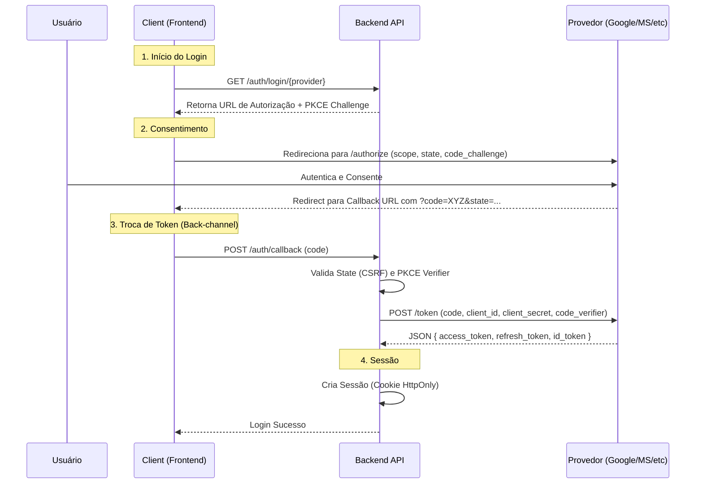

# Guia de Implementação de Autenticação OAuth 2.0 Multi-Provedor

Este guia  detalha a implementação do fluxo **Authorization Code com PKCE** (Proof Key for Code Exchange), que é o padrão atual de segurança (RFC 9700) para evitar ataques de injeção de código e interceptação de tokens,.

## 1. Arquitetura e Fluxo de Dados

O diagrama abaixo ilustra o fluxo seguro onde a troca de tokens ocorre no *back-channel* (servidor-a-servidor), garantindo que Access Tokens e Refresh Tokens nunca sejam expostos ao navegador/cliente.



---

## 2. Implementação por Provedor de Identidade

### 2.1 Google
O Google utiliza o OpenID Connect (OIDC) para autenticação. Para manter o acesso quando o usuário não está presente (offline), é crucial configurar o `access_type`.

*   **Documentação Oficial:** [Using OAuth 2.0 for Web Server Applications](https://developers.google.com/identity/protocols/oauth2/web-server).
*   **Console de Desenvolvedor:** [Google API Console](https://console.cloud.google.com/apis/credentials).

**Requisitos de Implementação:**
1.  **Parâmetros de Autorização:**
    *   `access_type=offline`: Obrigatório para receber um `refresh_token`.
    *   `prompt=consent`: Força a tela de consentimento. O Google só retorna o refresh token na **primeira** vez que o usuário consente. Se você perder o token, precisará usar esse parâmetro para forçar um novo consentimento.
    *   `include_granted_scopes=true`: Permite *Incremental Auth* (adicionar escopos no futuro sem quebrar o login atual).
2.  **Endpoints:**
    *   Auth: `https://accounts.google.com/o/oauth2/v2/auth`.
    *   Token: `https://oauth2.googleapis.com/token`.

**Snippet (Node.js/Auth.js):**
```javascript
// Configuração recomendada para garantir Refresh Token
authorization: {
  params: {
    prompt: "consent",
    access_type: "offline",
    response_type: "code"
  }
}
```

### 2.2 Microsoft Identity Platform (Entra ID)
A Microsoft suporta contas corporativas (AD) e pessoais (Outlook/Live). A distinção é feita pelo "tenant".

*   **Documentação Oficial:** [Authorization Code Flow (v2.0)](https://learn.microsoft.com/en-us/entra/identity-platform/v2-oauth2-auth-code-flow).
*   **Console de Desenvolvedor:** [Azure Portal - App Registrations](https://portal.azure.com/#view/Microsoft_AAD_RegisteredApps/ApplicationsListBlade).

**Requisitos de Implementação:**
1.  **Definição de Tenant:**
    *   Use `common` para aceitar tanto contas corporativas quanto pessoais.
    *   Use `{tenant_id}` (GUID) para restringir a uma organização específica.
2.  **Escopos Especiais:**
    *   `offline_access`: **Obrigatório** incluir explicitamente este escopo para receber um Refresh Token.
    *   `openid profile email`: Escopos padrão para identificação do usuário.
3.  **Segurança (SPA):** Se o seu frontend for um SPA, configure o tipo de Redirect URI como "SPA" no Azure Portal para que o PKCE funcione corretamente com CORS.

### 2.3 GitHub
O GitHub possui dois modelos: **OAuth Apps** e **GitHub Apps**. Recomenda-se fortemente o uso de **GitHub Apps** para segurança moderna.

*   **Documentação Oficial:** [Authorizing OAuth Apps](https://docs.github.com/en/apps/oauth-apps/building-oauth-apps/authorizing-oauth-apps).
*   **Comparativo (App vs OAuth):** [Differences between GitHub Apps and OAuth Apps](https://docs.github.com/en/apps/creating-github-apps/about-creating-github-apps/differences-between-github-apps-and-oauth-apps).

**Diferenças Críticas de Implementação:**
*   **GitHub Apps (Recomendado):**
    *   Tokens de acesso expiram (1 hora) e possuem Refresh Tokens rotativos.
    *   Permissões granulares (ex: acesso apenas a *issues*, sem ler código).
    *   Não compartilham rate limits com o usuário, o app tem sua própria cota escalável.
*   **OAuth Apps (Legado):**
    *   Tokens **não expiram** por padrão (risco de segurança se vazados).
    *   Escopos amplos (tudo ou nada).

**Endpoint de Token:**
Ao solicitar o token, envie o header `Accept: application/json` para receber um JSON limpo. O padrão do GitHub é retornar uma string no formato query param.

### 2.4 Meta (Facebook & Instagram)
O fluxo da Meta é complexo devido à necessidade de troca de tokens ("Token Exchange") para sessões longas.

*   **Documentação Oficial:** [Manually Build a Login Flow](https://developers.facebook.com/docs/facebook-login/manually-build-a-login-flow).
*   **Login for Business (Instagram):** [Facebook Login for Business](https://developers.facebook.com/docs/instagram-platform/instagram-api-with-facebook-login/business-login).

**Requisitos de Implementação:**
1.  **Troca de Token Obrigatória:**
    *   O login inicial retorna um token de "curta duração" (1-2 horas).
    *   Você deve fazer uma requisição extra ao endpoint `oauth/access_token` com `grant_type=fb_exchange_token` para obter um token de "longa duração" (60 dias).
2.  **Permissões:**
    *   Para gerenciar o Instagram, você precisa de permissões encadeadas: `instagram_basic`, `pages_show_list` e `instagram_manage_messages`.
    *   Use o parâmetro `extras={"setup":{"channel":"IG_API_ONBOARDING"}}` para fluxos de onboarding de negócios.

### 2.5 LinkedIn
O LinkedIn utiliza um fluxo padrão de 3 pernas, mas exige atenção estrita à validação de URLs.

*   **Documentação Oficial:** [Authorization Code Flow (3-legged OAuth)](https://learn.microsoft.com/en-us/linkedin/shared/authentication/authorization-code-flow).

**Requisitos de Implementação:**
1.  **Escopos:** Devem ser codificados na URL (URL-encoded) e separados por espaço (ex: `scope=openid%20profile%20email`).
2.  **Validação de Redirect:** O LinkedIn rejeita parâmetros adicionais na URL de callback. `https://site.com/callback?id=1` será tratado como `https://site.com/callback`, o que pode causar erro de *Redirect URI mismatch* se não estiver cadastrado exatamente assim.

### 2.6 Apple (Sign in with Apple)
A implementação da Apple difere significativamente por não usar um *Client Secret* estático.

*   **Documentação Oficial:** [Sign in with Apple REST API](https://developer.apple.com/documentation/sign_in_with_apple/sign_in_with_apple_rest_api),.

**Requisitos de Implementação:**
1.  **Client Secret Dinâmico (JWT):**
    *   Você deve gerar um JWT assinado com sua chave privada (`.p8`) a cada requisição de token. Este JWT deve conter os claims `iss` (Team ID), `sub` (Client ID/App ID) e `aud` (`https://appleid.apple.com`).
    *   O JWT tem validade máxima de 6 meses.
2.  **Dados do Usuário:**
    *   A Apple envia o nome e e-mail (`user` object) **apenas na primeira autenticação**. Você deve salvar esses dados imediatamente no seu banco de dados. Nas logins subsequentes, apenas o `sub` (ID do usuário) é retornado.
3.  **Response Mode:**
    *   Geralmente requer `response_mode=form_post`. A Apple fará um POST no seu callback com os dados, em vez de um GET com parâmetros na URL.

---

## 3. Segurança e Manutenção de Tokens

### 3.1 Rotação de Refresh Tokens
Para mitigar o roubo de tokens, a **RFC 9700** e as melhores práticas da indústria recomendam a rotação de Refresh Tokens (Refresh Token Rotation),.

**Algoritmo de Rotação:**
1.  O cliente envia o `Refresh Token A` (atual).
2.  O servidor valida `A`, invalida-o no banco de dados e emite `Refresh Token B` + `Access Token`.
3.  **Detecção de Roubo:** Se o `Refresh Token A` (já invalidado) for usado novamente, o servidor deve assumir que houve roubo e **invalidar toda a família de tokens** (deslogar o usuário de todos os dispositivos),.

### 3.2 Armazenamento Seguro no Cliente
*   **Não use LocalStorage:** Tokens armazenados aqui são vulneráveis a ataques XSS.
*   **Use Cookies HttpOnly:** Armazene o Refresh Token (ou o token de sessão que o mapeia) em um cookie com as flags `HttpOnly`, `Secure` e `SameSite=Strict`. Isso impede que scripts maliciosos leiam o token.

---

## 4. Bibliotecas Recomendadas

Para evitar erros criptográficos na implementação manual (especialmente com Apple e validação de tokens JWT), utilize bibliotecas maduras:

| Stack | Biblioteca Recomendada | Link |
| :--- | :--- | :--- |
| **Next.js / React** | **Auth.js (NextAuth)** | [authjs.dev](https://authjs.dev/) |
| **Node.js (Backend)** | **openid-client** | [github.com/panva/node-openid-client](https://github.com/panva/node-openid-client) |
| **SaaS Gerenciado** | **Clerk** | [clerk.com](https://clerk.com/) |
| **Banco de Dados + Auth**| **Supabase Auth** | [supabase.com/auth](https://supabase.com/auth) |

**Exemplo de Função para Gerar Client Secret da Apple (Node.js):**
Este código é necessário pois a Apple não fornece um secret fixo.

```javascript
const jwt = require('jsonwebtoken');
const fs = require('fs');

const getAppleClientSecret = () => {
  const privateKey = fs.readFileSync('AuthKey_XYZ.p8'); // Baixado do Apple Developer
  const token = jwt.sign({}, privateKey, {
    algorithm: 'ES256',
    keyid: process.env.APPLE_KEY_ID,
    expiresIn: '180d', // Max 6 meses
    issuer: process.env.APPLE_TEAM_ID,
    audience: 'https://appleid.apple.com',
    subject: process.env.APPLE_CLIENT_ID
  });
  return token;
};
```

## 5. Exemnplos
### Pré-requisito: Gerador de PKCE
Como recomendado pela **RFC 9700**, todos os fluxos abaixo devem usar PKCE. No passo 1 (Front-end), você gera o `code_verifier` e o envia hash como `code_challenge`. No passo 2 (Back-end/Exemplos abaixo), você envia o `code_verifier` original.

---

### 5.1. Google (OAuth 2.0 + OIDC)
O Google requer parâmetros específicos para garantir que você receba um `refresh_token` para acesso offline.

**Destaque:** Uso de `access_type=offline` e `include_granted_scopes`.

```javascript
async function exchangeGoogleToken(code, codeVerifier) {
  const tokenEndpoint = 'https://oauth2.googleapis.com/token'; //
  
  const body = new URLSearchParams({
    code: code,
    client_id: process.env.GOOGLE_CLIENT_ID,
    client_secret: process.env.GOOGLE_CLIENT_SECRET,
    redirect_uri: process.env.GOOGLE_REDIRECT_URI,
    grant_type: 'authorization_code',
    code_verifier: codeVerifier // PKCE
  });

  const response = await fetch(tokenEndpoint, {
    method: 'POST',
    headers: { 'Content-Type': 'application/x-www-form-urlencoded' },
    body: body
  });

  const data = await response.json();
  
  // O refresh_token só vem na primeira autenticação se access_type=offline for usado no front
  if (data.refresh_token) {
    await saveRefreshTokenSecurely(data.refresh_token); 
  }
  return data;
}
```

### 5.2. Microsoft Entra ID (Antigo Azure AD)
Para aplicações multi-tenant (SaaS), usa-se o endpoint `common`. É mandatório pedir o escopo `offline_access` explicitamente.

**Destaque:** Escopo `offline_access` e endpoint variável `{tenant}`.

```javascript
async function exchangeMicrosoftToken(code, codeVerifier) {
  // Use 'common' para contas pessoais e corporativas, ou um Tenant ID específico
  const tenant = 'common'; 
  const tokenEndpoint = `https://login.microsoftonline.com/${tenant}/oauth2/v2.0/token`; //

  const body = new URLSearchParams({
    client_id: process.env.MS_CLIENT_ID,
    scope: 'user.read offline_access openid profile', // offline_access é vital para refresh token
    code: code,
    redirect_uri: process.env.MS_REDIRECT_URI,
    grant_type: 'authorization_code',
    client_secret: process.env.MS_CLIENT_SECRET, 
    code_verifier: codeVerifier
  });

  const response = await fetch(tokenEndpoint, {
    method: 'POST',
    headers: { 'Content-Type': 'application/x-www-form-urlencoded' },
    body: body
  });

  return await response.json();
}
```

### 3. GitHub
O GitHub tem uma peculiaridade: por padrão, ele retorna a resposta em formato de string de formulário (ex: `access_token=...&scope=...`). Você deve forçar o JSON via header.

**Destaque:** Header `Accept: application/json`.

```javascript
async function exchangeGitHubToken(code) {
  const tokenEndpoint = 'https://github.com/login/oauth/access_token'; //

  const body = {
    client_id: process.env.GITHUB_CLIENT_ID,
    client_secret: process.env.GITHUB_CLIENT_SECRET,
    code: code,
    redirect_uri: process.env.GITHUB_REDIRECT_URI
  };

  const response = await fetch(tokenEndpoint, {
    method: 'POST',
    headers: {
      'Content-Type': 'application/json',
      'Accept': 'application/json' // Crítico: Se não enviar isso, o GitHub retorna string, não JSON
    },
    body: JSON.stringify(body)
  });

  return await response.json();
}
```

### 4. Meta (Facebook / Instagram)
A Meta tem um passo adicional crítico: a troca do token de curta duração (recebido no login) por um de longa duração (60 dias).

**Destaque:** Token Exchange Flow.

```javascript
async function exchangeMetaToken(code) {
  // Passo 1: Obter o token inicial (curta duração - 1h)
  const tokenEndpoint = 'https://graph.facebook.com/v19.0/oauth/access_token'; //
  
  const paramsShort = new URLSearchParams({
    client_id: process.env.META_CLIENT_ID,
    client_secret: process.env.META_CLIENT_SECRET,
    redirect_uri: process.env.META_REDIRECT_URI,
    code: code
  });

  const shortResponse = await fetch(`${tokenEndpoint}?${paramsShort}`);
  const shortData = await shortResponse.json();

  if (!shortData.access_token) throw new Error('Falha no token curto');

  // Passo 2: Trocar por token de longa duração (60 dias)
  const paramsLong = new URLSearchParams({
    grant_type: 'fb_exchange_token',
    client_id: process.env.META_CLIENT_ID,
    client_secret: process.env.META_CLIENT_SECRET,
    fb_exchange_token: shortData.access_token
  });

  const longResponse = await fetch(`${tokenEndpoint}?${paramsLong}`);
  return await longResponse.json(); // Este token deve ser salvo
}
```

### 5. LinkedIn
O LinkedIn utiliza um fluxo padrão de 3 pernas. Atenção redobrada ao `redirect_uri` que não pode ter parâmetros dinâmicos de query string que não estejam registrados.

**Destaque:** Validação estrita de URL e `grant_type`.

```javascript
async function exchangeLinkedInToken(code) {
  const tokenEndpoint = 'https://www.linkedin.com/oauth/v2/accessToken'; //

  const body = new URLSearchParams({
    grant_type: 'authorization_code',
    code: code,
    redirect_uri: process.env.LINKEDIN_REDIRECT_URI, // Deve ser idêntico ao cadastrado
    client_id: process.env.LINKEDIN_CLIENT_ID,
    client_secret: process.env.LINKEDIN_CLIENT_SECRET
  });

  const response = await fetch(tokenEndpoint, {
    method: 'POST',
    headers: { 'Content-Type': 'application/x-www-form-urlencoded' },
    body: body
  });

  return await response.json();
}
```

### 6. Apple (Sign in with Apple)
Este é o mais complexo. A Apple não fornece um `client_secret` fixo. Você deve gerar um JWT assinado com sua chave privada (`.p8`) a cada requisição (ou periodicamente).

**Destaque:** Geração dinâmica de Client Secret JWT.

```javascript
const jwt = require('jsonwebtoken'); // Biblioteca necessária
const fs = require('fs');

// Função auxiliar para gerar o Client Secret
function generateAppleClientSecret() {
  const privateKey = fs.readFileSync(process.env.APPLE_PRIVATE_KEY_PATH); // Arquivo .p8 baixado do portal
  
  const headers = {
    kid: process.env.APPLE_KEY_ID, // Key ID do portal Apple Developer
    alg: 'ES256'
  };

  const claims = {
    iss: process.env.APPLE_TEAM_ID, // Team ID
    iat: Math.floor(Date.now() / 1000),
    exp: Math.floor(Date.now() / 1000) + (86400 * 180), // Max 6 meses
    aud: 'https://appleid.apple.com',
    sub: process.env.APPLE_CLIENT_ID // App ID ou Service ID
  };

  return jwt.sign(claims, privateKey, { algorithm: 'ES256', header: headers });
}

async function exchangeAppleToken(code) {
  const tokenEndpoint = 'https://appleid.apple.com/auth/token'; //
  const clientSecret = generateAppleClientSecret();

  const body = new URLSearchParams({
    client_id: process.env.APPLE_CLIENT_ID,
    client_secret: clientSecret, // O JWT gerado acima
    code: code,
    grant_type: 'authorization_code',
    redirect_uri: process.env.APPLE_REDIRECT_URI
  });

  const response = await fetch(tokenEndpoint, {
    method: 'POST',
    headers: { 'Content-Type': 'application/x-www-form-urlencoded' },
    body: body
  });

  const data = await response.json();
  
  // DICA: O campo 'user' (nome/email) só vem no PRIMEIRO login via form_post no ID Token
  return data;
}
```

### Resumo de Melhores Práticas de Segurança (RFC 9700)
Ao implementar estas funções, lembre-se:
1.  **Nunca exponha Client Secrets** no front-end (React/Vue/Angular). Toda troca de código deve acontecer no servidor.
2.  **Use PKCE** (parâmetro `code_verifier`) sempre que suportado (Google, Microsoft, e recomendado para todos).
3.  **Valide o parâmetro `state`** antes de chamar essas funções para prevenir ataques CSRF.

