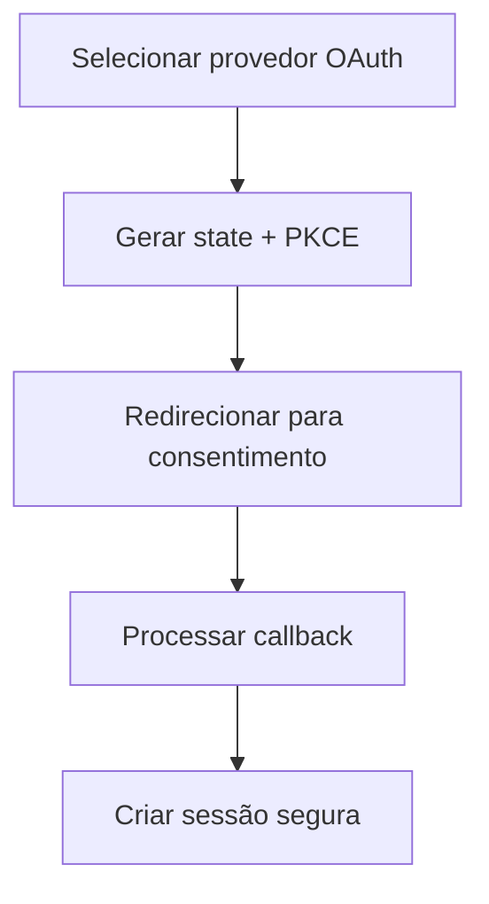

# UC-001 — Login com Sessão Segura

## Objetivo

Permitir autenticação do usuário via OAuth 2.0 (Authorization Code + PKCE) com continuidade segura de sessão.

## Atores

- Usuário
- Sistema de Autenticação

## Rastreabilidade

| Tipo | Referência |
| ---- | ---------- |
| RN   | RN02       |
| US   | US-001     |

## Pré-condições

- Usuário cadastrado e ativo.
- Provedor OAuth habilitado e disponível.

## Fluxo Principal

1. Usuário escolhe provedor OAuth.
2. Sistema inicia autorização com `state` e `code_challenge` (PKCE).
3. Usuário autentica no provedor e concede consentimento.
4. Sistema processa callback e cria sessão segura.

## Fluxos Alternativos

- FA1: Falha de autenticação no provedor → sistema retorna erro de autenticação.
- FA2: Token expirado durante uso → cliente solicita refresh e mantém sessão.

## Regras de Negócio

| ID          | Regra                                                         |
| ----------- | ------------------------------------------------------------- |
| RN-UC001-01 | Apenas contas ativas podem autenticar via identidade federada |
| RN-UC001-02 | Sessão deve suportar refresh automático com rotação de token  |

## Critérios de Aceite

| ID          | Critério                                      |
| ----------- | --------------------------------------------- |
| CA-UC001-01 | Login OAuth válido cria sessão autenticada    |
| CA-UC001-02 | Falha OAuth retorna erro claro                |
| CA-UC001-03 | Refresh em `401` funciona sem logout indevido |

## Gate UX

Este caso exige validação do UX Expert antes do aceite final.

## Subcasos Relacionados

- UC-017 — Renovar Sessão por Token
- UC-043 — Selecionar Provedor OAuth
- UC-044 — Processar Callback OAuth com PKCE

