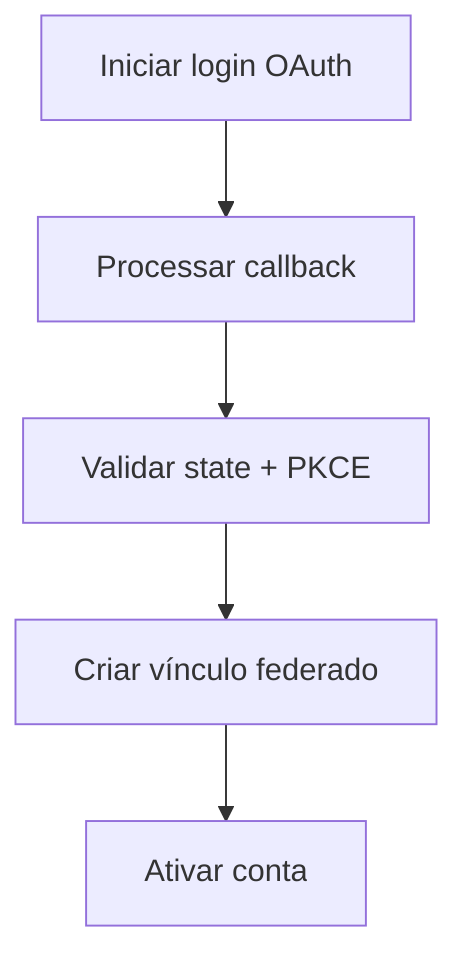

# UC-002 — Auto Cadastro de Usuário

## Objetivo

Permitir que visitantes realizem onboarding por primeiro login OAuth e criem conta federada.

## Atores

- Visitante
- Provedor OAuth/OIDC
- Sistema

## Rastreabilidade

| Tipo | Referência |
| ---- | ---------- |
| RN   | RN11, RN05 |
| US   | US-002     |

## Pré-condições

- Provedor OAuth habilitado no sistema.

## Fluxo Principal

1. Visitante inicia login com provedor OAuth.
2. Sistema processa callback com validação de `state` e PKCE.
3. Sistema obtém identidade federada do usuário (`sub`, e-mail e metadados permitidos).
4. Sistema cria conta local vinculada à identidade federada.
5. Sistema ativa conta para uso no sistema.

## Fluxos Alternativos

- FA1: Identidade federada já vinculada → sistema realiza login sem novo cadastro.
- FA2: Callback inválido/expirado → sistema bloqueia ativação e solicita novo início.

## Regras de Negócio

| ID          | Regra                                                     |
| ----------- | --------------------------------------------------------- |
| RN-UC002-01 | Conta só pode ser ativada após callback OAuth válido      |
| RN-UC002-02 | Identidade federada deve ser única por provedor + subject |

## Critérios de Aceite

| ID          | Critério                                    |
| ----------- | ------------------------------------------- |
| CA-UC002-01 | Primeiro login OAuth cria conta vinculada   |
| CA-UC002-02 | Callback inválido não ativa conta           |
| CA-UC002-03 | Conta ativa após vinculação federada válida |

## Gate UX

Este caso exige validação do UX Expert antes do aceite final.

## Subcasos Relacionados

- UC-018 — Iniciar Onboarding OAuth de Usuário
- UC-019 — Finalizar Onboarding via Callback OAuth
- UC-044 — Processar Callback OAuth com PKCE

