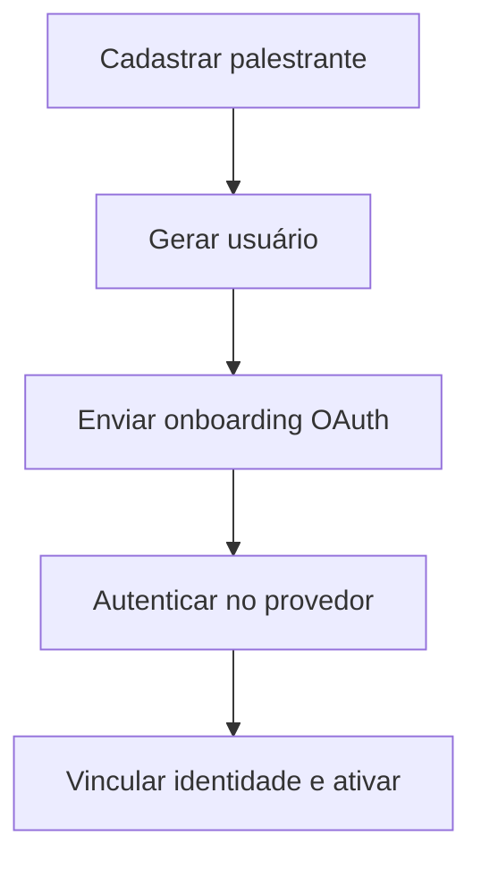

# UC-003 — Ativação de Conta de Palestrante

## Objetivo

Habilitar acesso de palestrante por conta vinculada ao cadastro e identidade OAuth.

## Atores

- Administrador
- Palestrante
- Sistema

## Rastreabilidade

| Tipo | Referência |
| ---- | ---------- |
| RN   | RN09, RN05 |
| US   | US-003     |

## Pré-condições

- Palestrante cadastrado.
- Canal de e-mail disponível.

## Fluxo Principal

1. Administrador cria/edita cadastro de palestrante.
2. Sistema gera usuário vinculado ao palestrante.
3. Sistema envia link de onboarding OAuth.
4. Palestrante conclui autenticação no provedor.
5. Sistema vincula identidade federada e ativa conta de palestrante.

## Fluxos Alternativos

- FA1: Callback OAuth inválido/expirado → sistema oferece novo onboarding.

## Regras de Negócio

| ID          | Regra                                                |
| ----------- | ---------------------------------------------------- |
| RN-UC003-01 | Conta do palestrante deve estar vinculada ao perfil  |
| RN-UC003-02 | Ativação exige vínculo de identidade federada válida |

## Critérios de Aceite

| ID          | Critério                                        |
| ----------- | ----------------------------------------------- |
| CA-UC003-01 | Usuário de palestrante é gerado automaticamente |
| CA-UC003-02 | Onboarding OAuth funciona                       |
| CA-UC003-03 | Palestrante autentica após vínculo federado     |

## Gate UX

Este caso exige validação do UX Expert antes do aceite final.

