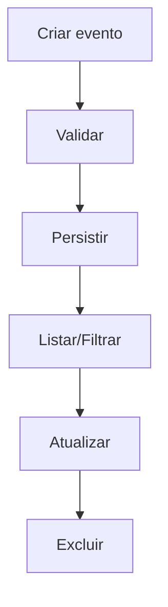

# UC-004 — CRUD de Eventos

## Objetivo

Permitir gestão completa de eventos com listagem paginada, filtros e identidade visual configurável.

## Atores

- Administrador
- Sistema

## Rastreabilidade

| Tipo | Referência |
| ---- | ---------- |
| RN   | RN01       |
| US   | US-004     |

## Pré-condições

- Administrador autenticado.

## Fluxo Principal

1. Administrador cria evento com dados obrigatórios.
2. Administrador informa, opcionalmente, imagem de header da aplicação e imagem de cabeçalho do certificado.
3. Sistema valida e persiste evento.
4. Administrador consulta lista paginada.
5. Administrador atualiza evento.
6. Administrador remove evento quando necessário.

## Fluxos Alternativos

- FA1: Campo obrigatório ausente → sistema bloqueia operação.
- FA2: Evento inexistente para edição/exclusão → sistema retorna erro.

## Regras de Negócio

| ID          | Regra                                                                                            |
| ----------- | ------------------------------------------------------------------------------------------------ |
| RN-UC004-01 | Eventos devem respeitar validações de datas e campos                                             |
| RN-UC004-02 | Operações de alteração exigem permissão administrativa                                           |
| RN-UC004-03 | Imagens de header são opcionais, mas quando informadas devem respeitar formato/tamanho definidos |

## Critérios de Aceite

| ID          | Critério                                                                                    |
| ----------- | ------------------------------------------------------------------------------------------- |
| CA-UC004-01 | Criar/editar/excluir evento funciona                                                        |
| CA-UC004-02 | Listagem com paginação e filtros funciona                                                   |
| CA-UC004-03 | Validações impedem dados inconsistentes                                                     |
| CA-UC004-04 | Evento permite persistir imagem de header da aplicação e imagem de cabeçalho do certificado |

## Gate UX

Este caso exige validação do UX Expert antes do aceite final.

## Subcasos Relacionados

- UC-020 — Criar Evento
- UC-021 — Listar e Filtrar Eventos
- UC-022 — Atualizar e Excluir Evento

