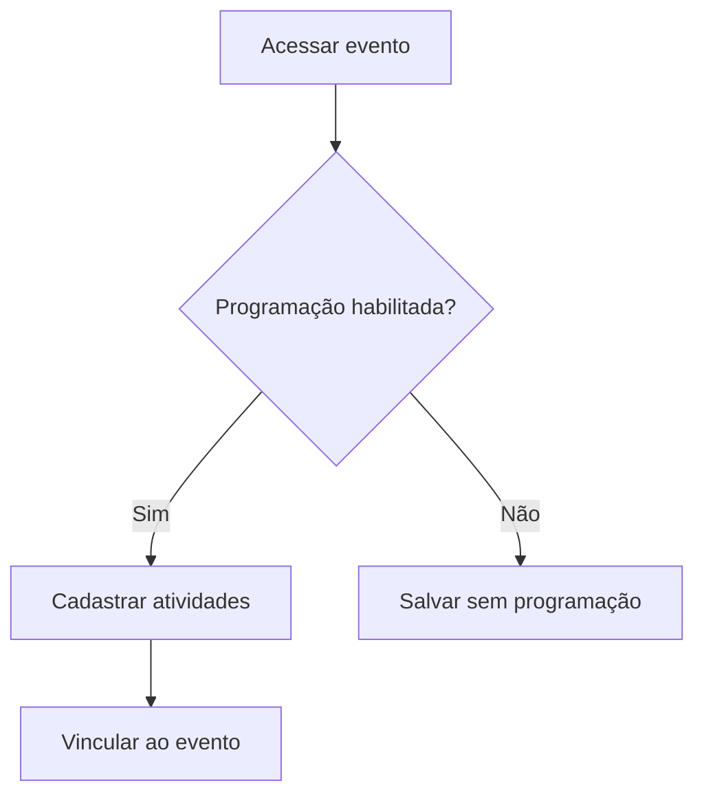

# UC-005 — Cadastro de Programação do Evento

## Objetivo

Permitir cadastro opcional da programação do evento em atividades.

## Atores

- Administrador
- Sistema

## Rastreabilidade

| Tipo | Referência |
| ---- | ---------- |
| RN   | RN07       |
| US   | US-005     |

## Pré-condições

- Evento existente.
- Administrador autenticado.

## Fluxo Principal

1. Administrador acessa evento.
2. Habilita programação opcional.
3. Cadastra atividades com dados necessários.
4. Sistema vincula atividades ao evento.

## Fluxos Alternativos

- FA1: Evento sem programação → sistema mantém evento válido.
- FA2: Atividade inválida → sistema bloqueia inclusão.

## Regras de Negócio

| ID          | Regra                                      |
| ----------- | ------------------------------------------ |
| RN-UC005-01 | Programação é opcional por evento          |
| RN-UC005-02 | Atividade deve estar vinculada a um evento |

## Critérios de Aceite

| ID          | Critério                                     |
| ----------- | -------------------------------------------- |
| CA-UC005-01 | Cadastrar/alterar/remover atividade funciona |
| CA-UC005-02 | Programação opcional não bloqueia evento     |
| CA-UC005-03 | Atividades persistem corretamente            |

## Gate UX

Este caso exige validação do UX Expert antes do aceite final.

