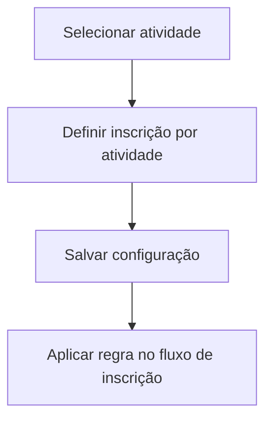

# UC-006 — Configurar Inscrição por Atividade

## Objetivo

Permitir ao administrador definir se cada atividade aceita inscrição específica.

## Atores

- Administrador
- Sistema

## Rastreabilidade

| Tipo | Referência |
| ---- | ---------- |
| RN   | RN15       |
| US   | US-006     |

## Pré-condições

- Programação cadastrada no evento.

## Fluxo Principal

1. Administrador abre atividade.
2. Define indicador de inscrição por atividade.
3. Sistema persiste configuração.
4. Fluxo de inscrição do usuário é adaptado.

## Fluxos Alternativos

- FA1: Atividade inexistente → sistema retorna erro.

## Regras de Negócio

| ID          | Regra                                           |
| ----------- | ----------------------------------------------- |
| RN-UC006-01 | Configuração é definida por atividade           |
| RN-UC006-02 | Alteração deve refletir na inscrição do usuário |

## Critérios de Aceite

| ID          | Critério                                     |
| ----------- | -------------------------------------------- |
| CA-UC006-01 | Flag por atividade pode ser alterada         |
| CA-UC006-02 | Configuração é persistida                    |
| CA-UC006-03 | Inscrição do usuário respeita a configuração |

## Gate UX

Este caso exige validação do UX Expert antes do aceite final.

