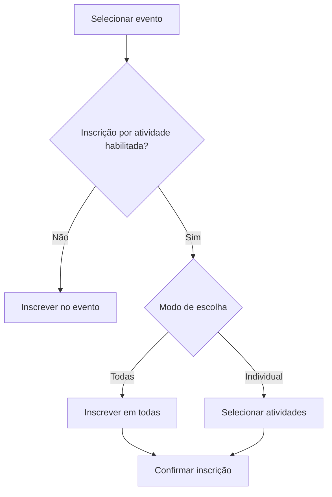

# UC-007 — Inscrição em Evento e Atividades

## Objetivo

Permitir inscrição em evento e, quando aplicável, em todas as atividades ou individualmente.

## Atores

- Usuário
- Sistema

## Rastreabilidade

| Tipo | Referência |
| ---- | ---------- |
| RN   | RN03, RN15 |
| US   | US-007     |

## Pré-condições

- Usuário autenticado.
- Evento disponível para inscrição.

## Fluxo Principal

1. Usuário seleciona evento.
2. Sistema verifica regra de inscrição por atividade.
3. Usuário escolhe “todas as atividades” ou seleção individual.
4. Sistema registra inscrições.

## Fluxos Alternativos

- FA1: Inscrição duplicada → sistema bloqueia.
- FA2: Atividade sem vagas/restrita → sistema impede inscrição.

## Regras de Negócio

| ID          | Regra                                                   |
| ----------- | ------------------------------------------------------- |
| RN-UC007-01 | Não permitir duplicidade de inscrição                   |
| RN-UC007-02 | Respeitar modo de inscrição definido pelo administrador |

## Critérios de Aceite

| ID          | Critério                                            |
| ----------- | --------------------------------------------------- |
| CA-UC007-01 | Inscrição no evento funciona                        |
| CA-UC007-02 | Seleção todas/individual funciona quando habilitado |
| CA-UC007-03 | Sistema bloqueia duplicidade                        |

## Gate UX

Este caso exige validação do UX Expert antes do aceite final.

## Subcasos Relacionados

- UC-023 — Inscrição em Todas as Atividades
- UC-024 — Inscrição Individual por Atividade

