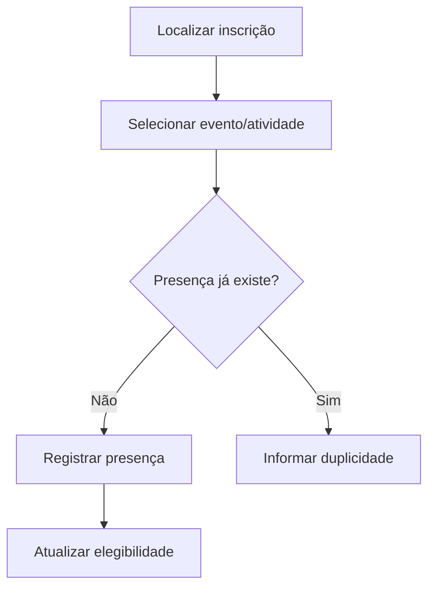

# UC-008 — Registro de Presença

## Objetivo

Registrar presença por evento ou atividade para comprovação de participação.

## Atores

- Administrador/Operador
- Sistema

## Rastreabilidade

| Tipo | Referência |
| ---- | ---------- |
| RN   | RN04       |
| US   | US-008     |

## Pré-condições

- Inscrição válida existente.

## Fluxo Principal

1. Operador localiza inscrição do participante.
2. Seleciona evento/atividade.
3. Registra presença.
4. Sistema salva presença e atualiza elegibilidade.

## Fluxos Alternativos

- FA1: Presença já registrada → sistema evita duplicidade.
- FA2: Inscrição inexistente → sistema bloqueia registro.

## Regras de Negócio

| ID          | Regra                                              |
| ----------- | -------------------------------------------------- |
| RN-UC008-01 | Presença deve referenciar inscrição válida         |
| RN-UC008-02 | Presença por atividade deve manter vínculo correto |

## Critérios de Aceite

| ID          | Critério                            |
| ----------- | ----------------------------------- |
| CA-UC008-01 | Registro de presença funciona       |
| CA-UC008-02 | Duplicidade é bloqueada             |
| CA-UC008-03 | Presença por atividade é rastreável |

## Gate UX

Este caso exige validação do UX Expert antes do aceite final.

## Subcasos Relacionados

- UC-025 — Registrar Presença por Atividade

