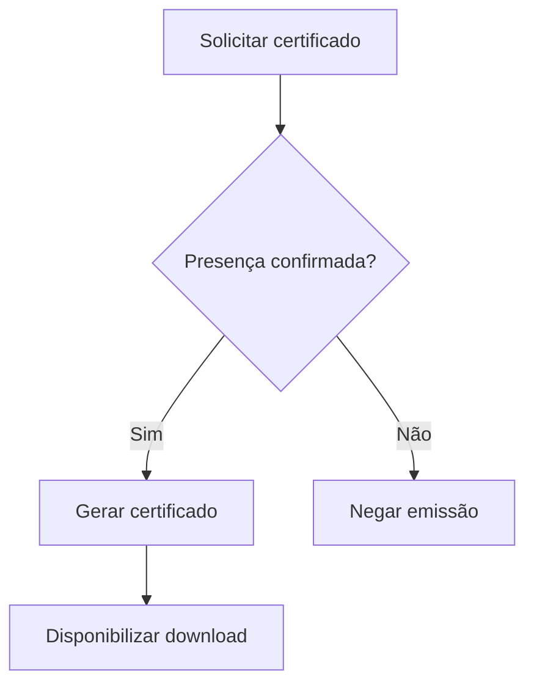

# UC-009 — Emissão de Certificado por Evento

## Objetivo

Emitir certificado para participante com presença confirmada no evento.

## Atores

- Usuário elegível
- Administrador
- Sistema

## Rastreabilidade

| Tipo | Referência |
| ---- | ---------- |
| RN   | RN13       |
| US   | US-009     |

## Pré-condições

- Presença confirmada no evento.

## Fluxo Principal

1. Ator solicita emissão do certificado.
2. Sistema valida elegibilidade por presença.
3. Sistema compõe certificado com dados do evento/participante.
4. Sistema aplica imagem de cabeçalho do certificado configurada no evento (quando disponível).
5. Sistema disponibiliza download.

## Fluxos Alternativos

- FA1: Sem presença confirmada → emissão negada.

## Regras de Negócio

| ID          | Regra                                                                            |
| ----------- | -------------------------------------------------------------------------------- |
| RN-UC009-01 | Certificado exige presença confirmada                                            |
| RN-UC009-02 | Documento usa dados oficiais do cadastro                                         |
| RN-UC009-03 | Cabeçalho do certificado deve usar imagem configurada no evento quando existente |

## Critérios de Aceite

| ID          | Critério                                                                      |
| ----------- | ----------------------------------------------------------------------------- |
| CA-UC009-01 | Certificado emitido para elegível                                             |
| CA-UC009-02 | Não elegível não emite certificado                                            |
| CA-UC009-03 | Download disponível após geração                                              |
| CA-UC009-04 | Imagem de cabeçalho do certificado é aplicada conforme configuração do evento |

## Gate UX

Este caso exige validação do UX Expert antes do aceite final.

## Subcasos Relacionados

- UC-027 — Validar Elegibilidade de Certificado por Evento
- UC-028 — Gerar e Disponibilizar Certificado por Evento

