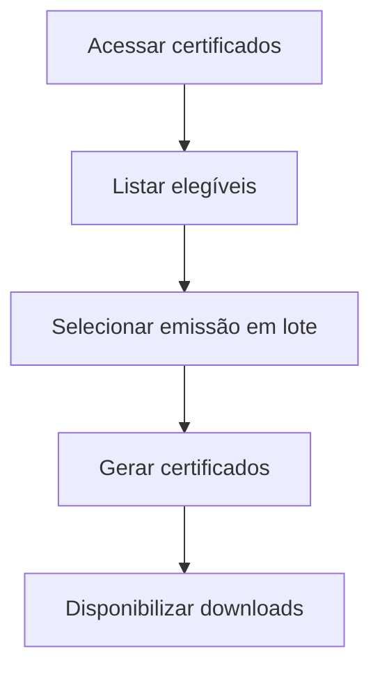

# UC-010 — Autoemissão em Lote de Certificados

## Objetivo

Permitir que o usuário emita todos os certificados elegíveis em lote.

## Atores

- Usuário autenticado
- Sistema

## Rastreabilidade

| Tipo | Referência |
| ---- | ---------- |
| RN   | RN14       |
| US   | US-010     |

## Pré-condições

- Usuário autenticado.
- Existência de eventos elegíveis.

## Fluxo Principal

1. Usuário acessa área de certificados.
2. Sistema lista eventos elegíveis.
3. Usuário escolhe emissão em lote.
4. Sistema gera certificados elegíveis.
5. Sistema disponibiliza resultados.

## Fluxos Alternativos

- FA1: Nenhum elegível → sistema informa ausência de certificados.

## Regras de Negócio

| ID          | Regra                                             |
| ----------- | ------------------------------------------------- |
| RN-UC010-01 | Emissão em lote respeita elegibilidade            |
| RN-UC010-02 | Processar somente eventos com presença confirmada |

## Critérios de Aceite

| ID          | Critério                                       |
| ----------- | ---------------------------------------------- |
| CA-UC010-01 | Lista de elegíveis é exibida                   |
| CA-UC010-02 | Emissão em lote funciona                       |
| CA-UC010-03 | Itens não elegíveis são ignorados com feedback |

## Gate UX

Este caso exige validação do UX Expert antes do aceite final.

## Subcasos Relacionados

- UC-029 — Listar Certificados Elegíveis do Usuário
- UC-030 — Emitir Certificados em Lote por Eventos

