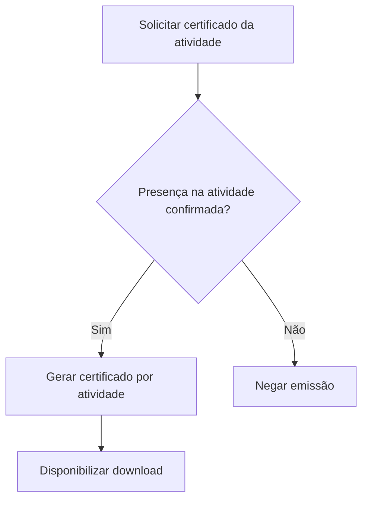

# UC-011 — Emissão de Certificado por Atividade

## Objetivo

Emitir certificado por atividade da programação com presença confirmada.

## Atores

- Usuário elegível
- Administrador
- Sistema

## Rastreabilidade

| Tipo | Referência |
| ---- | ---------- |
| RN   | RN16       |
| US   | US-011     |

## Pré-condições

- Atividade vinculada a evento.
- Presença confirmada por atividade.

## Fluxo Principal

1. Ator solicita certificado da atividade.
2. Sistema verifica presença confirmada na atividade.
3. Sistema gera certificado por atividade.
4. Sistema disponibiliza download.

## Fluxos Alternativos

- FA1: Sem presença na atividade → emissão negada.

## Regras de Negócio

| ID          | Regra                                                     |
| ----------- | --------------------------------------------------------- |
| RN-UC011-01 | Emissão independe do modo de inscrição (todas/individual) |
| RN-UC011-02 | Elegibilidade é validada por atividade                    |

## Critérios de Aceite

| ID          | Critério                                     |
| ----------- | -------------------------------------------- |
| CA-UC011-01 | Certificado é emitido por atividade elegível |
| CA-UC011-02 | Sem presença confirmada não há emissão       |
| CA-UC011-03 | Regra independe da forma de inscrição        |

## Gate UX

Este caso exige validação do UX Expert antes do aceite final.

## Subcasos Relacionados

- UC-031 — Validar Elegibilidade de Certificado por Atividade
- UC-032 — Emitir Certificados em Lote por Atividades

