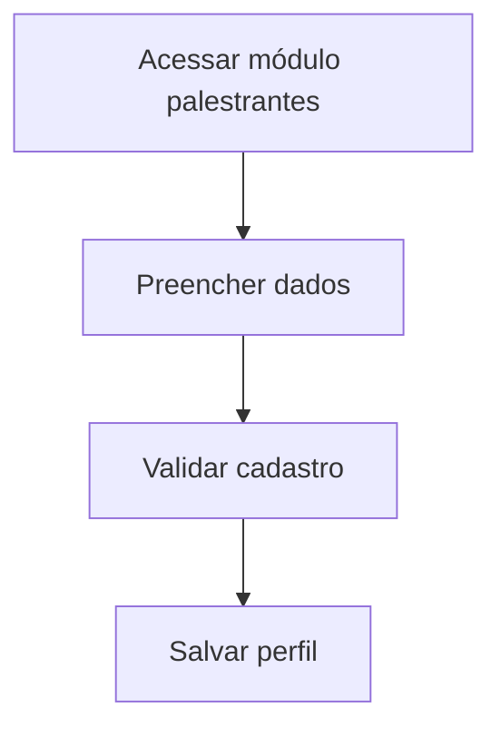

# UC-012 — Cadastro Completo de Palestrante

## Objetivo

Cadastrar palestrante com currículo, redes sociais e dados de contato.

## Atores

- Administrador
- Sistema

## Rastreabilidade

| Tipo | Referência |
| ---- | ---------- |
| RN   | RN08       |
| US   | US-012     |

## Pré-condições

- Administrador autenticado.

## Fluxo Principal

1. Administrador acessa módulo de palestrantes.
2. Informa dados pessoais e profissionais.
3. Informa currículo, redes e contato.
4. Sistema valida e salva perfil.

## Fluxos Alternativos

- FA1: Campos obrigatórios ausentes → sistema bloqueia salvamento.

## Regras de Negócio

| ID          | Regra                                                    |
| ----------- | -------------------------------------------------------- |
| RN-UC012-01 | Perfil deve manter dados profissionais e canais oficiais |
| RN-UC012-02 | Alterações no perfil devem ser persistidas               |

## Critérios de Aceite

| ID          | Critério                             |
| ----------- | ------------------------------------ |
| CA-UC012-01 | Cadastro completo funciona           |
| CA-UC012-02 | Edição de dados funciona             |
| CA-UC012-03 | Currículo/redes/contato ficam salvos |

## Gate UX

Este caso exige validação do UX Expert antes do aceite final.

## Subcasos Relacionados

- UC-033 — Cadastrar Dados Básicos do Palestrante
- UC-034 — Cadastrar Currículo, Redes e Contato
- UC-035 — Editar Perfil de Palestrante

