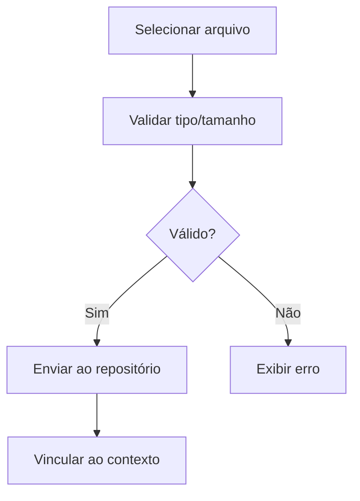

# UC-013 — Upload de Apresentações

## Objetivo

Permitir upload de arquivos de apresentação por palestrante e administrador.

## Atores

- Palestrante
- Administrador
- Sistema

## Rastreabilidade

| Tipo | Referência |
| ---- | ---------- |
| RN   | RN10       |
| US   | US-013     |

## Pré-condições

- Usuário com perfil autorizado.
- Repositório de arquivos configurado.

## Fluxo Principal

1. Ator seleciona evento/atividade.
2. Seleciona arquivo para upload.
3. Sistema valida tipo/tamanho.
4. Sistema envia arquivo ao repositório ativo.
5. Sistema vincula arquivo ao contexto.

## Fluxos Alternativos

- FA1: Tipo/tamanho inválido → upload negado.
- FA2: Falha no repositório → sistema informa erro técnico.

## Regras de Negócio

| ID          | Regra                                                        |
| ----------- | ------------------------------------------------------------ |
| RN-UC013-01 | Upload apenas para perfis autorizados                        |
| RN-UC013-02 | Arquivo deve ficar vinculado ao evento/atividade/palestrante |

## Critérios de Aceite

| ID          | Critério                            |
| ----------- | ----------------------------------- |
| CA-UC013-01 | Upload autorizado funciona          |
| CA-UC013-02 | Validação de tipo/tamanho funciona  |
| CA-UC013-03 | Arquivo fica vinculado corretamente |

## Gate UX

Este caso exige validação do UX Expert antes do aceite final.

## Subcasos Relacionados

- UC-036 — Validar Arquivo de Apresentação
- UC-037 — Enviar Arquivo ao Repositório Ativo
- UC-038 — Vincular Apresentação ao Contexto

