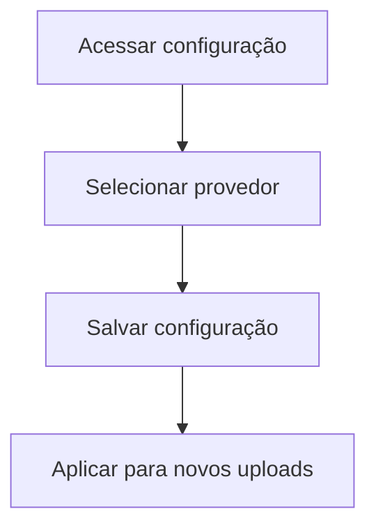

# UC-014 — Configurar Repositório de Arquivos

## Objetivo

Permitir seleção do repositório ativo para armazenamento de arquivos.

## Atores

- Administrador
- Sistema

## Rastreabilidade

| Tipo | Referência |
| ---- | ---------- |
| RN   | RN12       |
| US   | US-014     |

## Pré-condições

- Administrador autenticado.

## Fluxo Principal

1. Administrador acessa configurações de armazenamento.
2. Seleciona repositório: Local, Google Drive ou AWS S3.
3. Sistema salva repositório ativo.
4. Sistema aplica configuração para novos uploads.

## Fluxos Alternativos

- FA1: Provedor indisponível → sistema mantém configuração anterior.

## Regras de Negócio

| ID          | Regra                                  |
| ----------- | -------------------------------------- |
| RN-UC014-01 | Apenas um repositório ativo por vez    |
| RN-UC014-02 | Mudança de provedor deve ser auditável |

## Critérios de Aceite

| ID          | Critério                            |
| ----------- | ----------------------------------- |
| CA-UC014-01 | Seleção de provedor funciona        |
| CA-UC014-02 | Configuração persiste corretamente  |
| CA-UC014-03 | Upload passa a usar o novo provedor |

## Gate UX

Este caso exige validação do UX Expert antes do aceite final.

## Subcasos Relacionados

- UC-039 — Selecionar Tipo de Repositório
- UC-040 — Salvar Repositório Ativo

