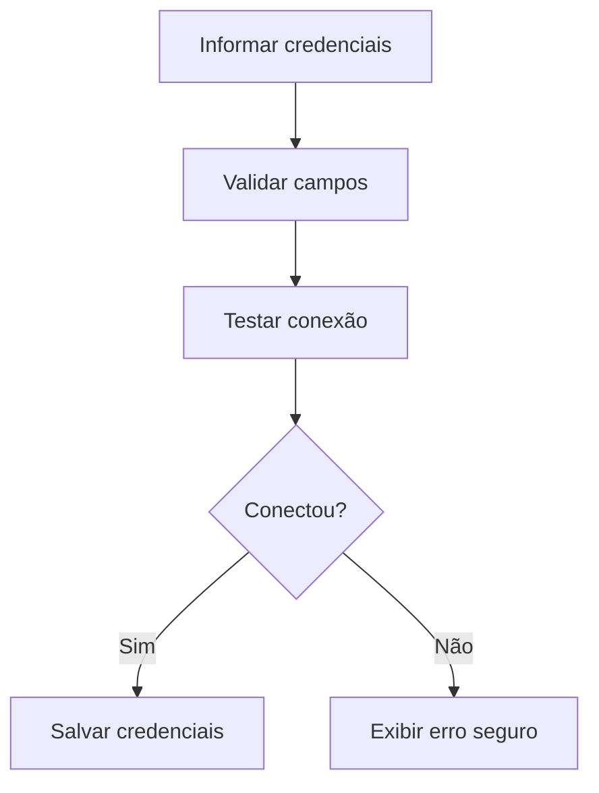

# UC-015 — Gerir Credenciais do Repositório

## Objetivo

Permitir cadastro e validação de credenciais para o provedor de armazenamento.

## Atores

- Administrador
- Sistema

## Rastreabilidade

| Tipo | Referência |
| ---- | ---------- |
| RN   | RN12       |
| US   | US-015     |

## Pré-condições

- Repositório de arquivos selecionado.

## Fluxo Principal

1. Administrador informa credenciais do provedor.
2. Sistema valida formato dos campos.
3. Sistema testa conectividade.
4. Sistema salva credenciais válidas.

## Fluxos Alternativos

- FA1: Credenciais inválidas → sistema rejeita salvamento.
- FA2: Falha de conectividade → sistema informa erro sem expor segredo.

## Regras de Negócio

| ID          | Regra                                               |
| ----------- | --------------------------------------------------- |
| RN-UC015-01 | Segredos não podem ser exibidos em texto aberto     |
| RN-UC015-02 | Salvamento depende de teste de conexão bem-sucedido |

## Critérios de Aceite

| ID          | Critério                                     |
| ----------- | -------------------------------------------- |
| CA-UC015-01 | Cadastro/atualização de credenciais funciona |
| CA-UC015-02 | Teste de conexão é executado                 |
| CA-UC015-03 | Erros são claros e seguros                   |

## Gate UX

Este caso exige validação do UX Expert antes do aceite final.

## Subcasos Relacionados

- UC-026 — Validar Conexão do Repositório de Arquivos
- UC-041 — Cadastrar Credenciais do Repositório
- UC-042 — Atualizar Credenciais do Repositório

