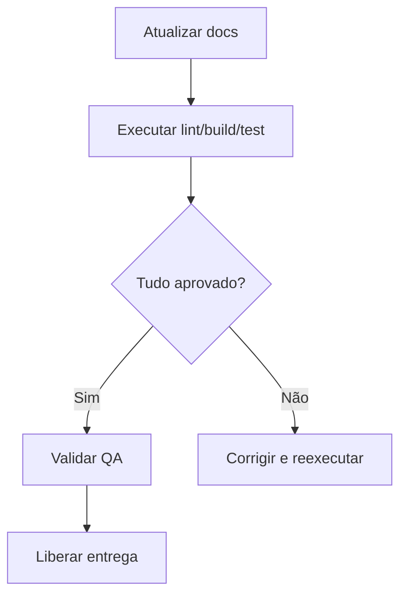

# UC-016 — Documentação e Qualidade Operacional

## Objetivo

Assegurar governança técnica com documentação atualizada e execução dos testes.

## Atores

- Time Técnico
- QA
- Sistema CI/CD

## Rastreabilidade

| Tipo | Referência |
| ---- | ---------- |
| RN   | RN06       |
| US   | US-016     |

## Pré-condições

- Ambiente de build/test configurado.

## Fluxo Principal

1. Time atualiza documentação funcional/técnica.
2. Time executa lint, build e testes.
3. QA valida critérios de qualidade.
4. Sistema é liberado para continuidade de entrega.

## Fluxos Alternativos

- FA1: Falha em lint/build/test → release bloqueada até correção.

## Regras de Negócio

| ID          | Regra                                                |
| ----------- | ---------------------------------------------------- |
| RN-UC016-01 | Rotas devem permanecer aderentes ao Swagger          |
| RN-UC016-02 | Entrega com falha bloqueante não pode ser homologada |

## Critérios de Aceite

| ID          | Critério                                           |
| ----------- | -------------------------------------------------- |
| CA-UC016-01 | Swagger atualizado e acessível                     |
| CA-UC016-02 | Execução de lint/build/test sem falhas bloqueantes |
| CA-UC016-03 | Rastreabilidade entre RN/US/UC disponível          |

