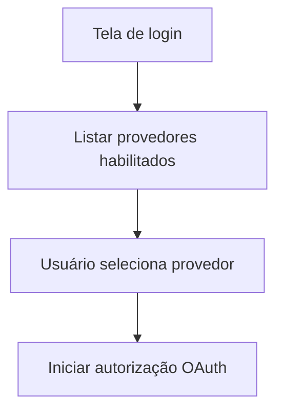

# UC-043 — Selecionar Provedor OAuth

## Objetivo

Permitir que o usuário selecione explicitamente o provedor OAuth para autenticação.

## Atores

- Usuário
- Sistema

## Rastreabilidade

| Tipo | Referência |
| ---- | ---------- |
| RN   | RN17       |
| US   | US-017     |

## Pré-condições

- Pelo menos um provedor OAuth está habilitado.

## Fluxo Principal

1. Usuário acessa tela de autenticação.
2. Sistema exibe provedores habilitados.
3. Usuário escolhe um provedor.
4. Sistema inicia fluxo OAuth para o provedor selecionado.

## Fluxos Alternativos

- FA1: Nenhum provedor habilitado → sistema exibe indisponibilidade e orienta contato com suporte.

## Critérios de Aceite

| ID          | Critério                                            |
| ----------- | --------------------------------------------------- |
| CA-UC043-01 | Apenas provedores habilitados são exibidos          |
| CA-UC043-02 | Seleção de provedor inicia fluxo OAuth corretamente |

## Gate UX

Este caso exige validação do UX Expert antes do aceite final.

