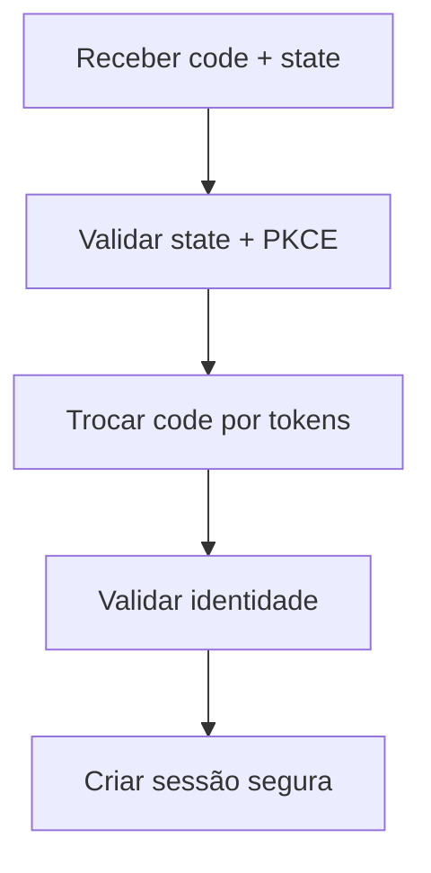

# UC-044 — Processar Callback OAuth com PKCE

## Objetivo

Validar callback OAuth com PKCE e estabelecer sessão segura de usuário.

## Atores

- Sistema
- Provedor OAuth/OIDC

## Rastreabilidade

| Tipo | Referência     |
| ---- | -------------- |
| RN   | RN17, RN18     |
| US   | US-018, US-019 |

## Pré-condições

- Fluxo de autorização iniciado com `state`, `code_challenge` e `code_verifier`.

## Fluxo Principal

1. Sistema recebe callback com `code` e `state`.
2. Sistema valida `state` e contexto PKCE.
3. Sistema troca o `code` por tokens no endpoint do provedor.
4. Sistema valida claims de identidade e vincula conta local.
5. Sistema cria sessão autenticada com refresh token rotativo.

## Fluxos Alternativos

- FA1: `state` inválido → sistema rejeita callback e registra tentativa suspeita.
- FA2: Falha no endpoint de token → sistema não cria sessão e retorna erro controlado.

## Critérios de Aceite

| ID          | Critério                                                   |
| ----------- | ---------------------------------------------------------- |
| CA-UC044-01 | Callback inválido nunca cria sessão                        |
| CA-UC044-02 | Callback válido cria sessão autenticada e vínculo federado |
| CA-UC044-03 | Refresh token é emitido com política de rotação            |

