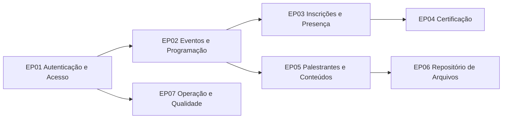

# Backlog de User Stories — Plataforma Eventos

## 1. Identificação

| Campo              | Valor                                   |
| ------------------ | --------------------------------------- |
| Documento          | User Stories do Produto                 |
| Versão             | 1.2                                     |
| Data               | 2026-02-27                              |
| Base de referência | `docs/DECLARACAO_ESCOPO.md` (v1.7)      |
| Responsáveis       | Produto, Requisitos, UX, Engenharia, QA |

## 2. Premissas de Execução

- Toda história com impacto em interface gráfica (UI) ou interação com usuário (fluxos, navegação, formulários, feedbacks e acessibilidade) **exige validação formal do UX Expert** antes de ser considerada concluída.
- Persistência principal via backend integrado ao Google Sheets.
- Emissões de certificado dependem de presença confirmada (evento ou atividade).

## 3. Visão Geral de Épicos



| Épico | Objetivo                                                         |
| ----- | ---------------------------------------------------------------- |
| EP01  | Garantir autenticação, auto cadastro e ativação segura de contas |
| EP02  | Permitir gestão de eventos, programação e atividades             |
| EP03  | Controlar inscrições e presença por evento/atividade             |
| EP04  | Emitir certificados com regra de elegibilidade                   |
| EP05  | Gerir palestrantes, perfis e apresentações                       |
| EP06  | Configurar armazenamento local, Google Drive ou AWS S3           |
| EP07  | Assegurar governança, documentação e qualidade técnica           |

## 4. User Stories

## EP01 — Autenticação e Acesso

### US-001 — Login com sessão segura

**Como** usuário autenticado
**Quero** realizar login no sistema usando OAuth 2.0
**Para** acessar funcionalidades conforme meu perfil.

| Critério    | Descrição                                          |
| ----------- | -------------------------------------------------- |
| CA-US001-01 | Login OAuth válido retorna sessão autenticada      |
| CA-US001-02 | Sessão expirada aciona refresh automático de token |
| CA-US001-03 | Falha OAuth apresenta mensagem de erro clara       |
| CA-US001-04 | Fluxo UI/UX validado pelo UX Expert                |

### US-002 — Auto cadastro de usuário final

**Como** visitante
**Quero** me auto cadastrar no sistema com primeiro login OAuth
**Para** participar dos eventos com conta própria.

| Critério    | Descrição                                                      |
| ----------- | -------------------------------------------------------------- |
| CA-US002-01 | Sistema aceita cadastro com dados mínimos obrigatórios         |
| CA-US002-02 | Primeiro login OAuth cria vínculo de identidade federada       |
| CA-US002-03 | Cadastro é ativado após callback OAuth válido com PKCE         |
| CA-US002-04 | Conta só é ativada após validação de `state` e `code_verifier` |
| CA-US002-05 | Fluxo UI/UX validado pelo UX Expert                            |

### US-003 — Ativação de conta de palestrante

**Como** administrador
**Quero** gerar conta para palestrante com ativação e vínculo OAuth
**Para** permitir acesso seguro do palestrante ao sistema.

| Critério    | Descrição                                                    |
| ----------- | ------------------------------------------------------------ |
| CA-US003-01 | Cadastro de palestrante permite geração de usuário associado |
| CA-US003-02 | Convite/início de onboarding OAuth é disparado no cadastro   |
| CA-US003-03 | Palestrante conclui primeiro acesso via provedor OAuth       |
| CA-US003-04 | Fluxo UI/UX validado pelo UX Expert                          |

### US-017 — Seleção de provedor OAuth

**Como** usuário
**Quero** escolher o provedor OAuth (Google, Microsoft, GitHub, Meta, LinkedIn, Apple)
**Para** autenticar com minha identidade federada.

| Critério    | Descrição                                              |
| ----------- | ------------------------------------------------------ |
| CA-US017-01 | Interface exibe provedores habilitados                 |
| CA-US017-02 | Redirecionamento para autorização do provedor funciona |
| CA-US017-03 | Fluxo UI/UX validado pelo UX Expert                    |

### US-018 — Callback OAuth com PKCE

**Como** sistema
**Quero** processar callback OAuth com validação de `state` e PKCE
**Para** prevenir CSRF, interceptação de código e troca indevida de token.

| Critério    | Descrição                                       |
| ----------- | ----------------------------------------------- |
| CA-US018-01 | Callback valida `state` antes da troca de token |
| CA-US018-02 | Callback valida `code_verifier` conforme PKCE   |
| CA-US018-03 | Troca de token ocorre apenas em back-channel    |

### US-019 — Rotação de refresh token

**Como** sistema
**Quero** rotacionar refresh tokens a cada renovação de sessão
**Para** reduzir risco de sequestro de sessão e reutilização indevida.

| Critério    | Descrição                                                         |
| ----------- | ----------------------------------------------------------------- |
| CA-US019-01 | Renovação de sessão invalida o refresh token anterior             |
| CA-US019-02 | Reuso de token invalidado aciona invalidação da família de tokens |
| CA-US019-03 | Sessão é mantida em cookie HttpOnly/Secure/SameSite               |

## EP02 — Eventos e Programação

### US-004 — CRUD de eventos

**Como** administrador
**Quero** criar, editar, listar e excluir eventos
**Para** manter o calendário de eventos atualizado.

| Critério    | Descrição                                                                                           |
| ----------- | --------------------------------------------------------------------------------------------------- |
| CA-US004-01 | CRUD completo disponível via API e interface                                                        |
| CA-US004-02 | Listagem suporta paginação e filtros                                                                |
| CA-US004-03 | Campos obrigatórios do evento são validados                                                         |
| CA-US004-04 | Fluxo UI/UX validado pelo UX Expert                                                                 |
| CA-US004-05 | Cadastro/edição permite informar imagem de header da aplicação e imagem de cabeçalho do certificado |

### US-005 — Cadastro opcional da programação

**Como** administrador
**Quero** cadastrar a programação do evento por atividades
**Para** estruturar agenda detalhada do evento.

| Critério    | Descrição                                           |
| ----------- | --------------------------------------------------- |
| CA-US005-01 | Programação é opcional no cadastro do evento        |
| CA-US005-02 | Atividades podem ser criadas, alteradas e removidas |
| CA-US005-03 | Programação fica vinculada ao evento correto        |
| CA-US005-04 | Fluxo UI/UX validado pelo UX Expert                 |

### US-006 — Configurar inscrição por atividade

**Como** administrador
**Quero** habilitar inscrição por atividade da programação
**Para** permitir controle granular das vagas por atividade.

| Critério    | Descrição                                                     |
| ----------- | ------------------------------------------------------------- |
| CA-US006-01 | Cada atividade permite definir se aceita inscrição específica |
| CA-US006-02 | Configuração impacta o fluxo de inscrição do usuário          |
| CA-US006-03 | Regra é persistida e auditável                                |
| CA-US006-04 | Fluxo UI/UX validado pelo UX Expert                           |

## EP03 — Inscrições e Presença

### US-007 — Inscrição no evento/atividades

**Como** usuário
**Quero** me inscrever no evento e, quando aplicável, nas atividades
**Para** participar das sessões de interesse.

| Critério    | Descrição                                                                                  |
| ----------- | ------------------------------------------------------------------------------------------ |
| CA-US007-01 | Usuário pode se inscrever no evento                                                        |
| CA-US007-02 | Se inscrição por atividade estiver habilitada, pode escolher “todas” ou seleção individual |
| CA-US007-03 | Sistema evita duplicidade de inscrição                                                     |
| CA-US007-04 | Fluxo UI/UX validado pelo UX Expert                                                        |

### US-008 — Registro de presença

**Como** administrador/operador
**Quero** registrar presença por evento ou atividade
**Para** comprovar elegibilidade para certificado.

| Critério    | Descrição                                              |
| ----------- | ------------------------------------------------------ |
| CA-US008-01 | Presença pode ser registrada por inscrição válida      |
| CA-US008-02 | Sistema impede presença duplicada inconsistente        |
| CA-US008-03 | Presença por atividade é vinculada à atividade correta |
| CA-US008-04 | Fluxo UI/UX validado pelo UX Expert                    |

## EP04 — Certificação

### US-009 — Emissão de certificado por evento

**Como** administrador ou usuário elegível
**Quero** emitir certificado de presença por evento
**Para** comprovar participação.

| Critério    | Descrição                                                                              |
| ----------- | -------------------------------------------------------------------------------------- |
| CA-US009-01 | Certificado só é emitido para presença confirmada                                      |
| CA-US009-02 | Documento usa dados do evento e do participante                                        |
| CA-US009-03 | Download do certificado é disponibilizado                                              |
| CA-US009-04 | Fluxo UI/UX validado pelo UX Expert                                                    |
| CA-US009-05 | Quando configurada, imagem de cabeçalho do certificado do evento é aplicada na emissão |

### US-010 — Autoemissão em lote de certificados

**Como** usuário autenticado
**Quero** emitir todos os meus certificados elegíveis
**Para** obter comprovantes sem intervenção administrativa.

| Critério    | Descrição                                           |
| ----------- | --------------------------------------------------- |
| CA-US010-01 | Sistema lista eventos elegíveis do usuário          |
| CA-US010-02 | Usuário pode emitir individualmente ou em lote      |
| CA-US010-03 | Emissão em lote respeita elegibilidade por presença |
| CA-US010-04 | Fluxo UI/UX validado pelo UX Expert                 |

### US-011 — Certificado por atividade

**Como** usuário elegível
**Quero** emitir certificado por atividade com presença confirmada
**Para** comprovar participação granular na programação.

| Critério    | Descrição                                                    |
| ----------- | ------------------------------------------------------------ |
| CA-US011-01 | Emissão é por atividade, não apenas por evento               |
| CA-US011-02 | Regra independe do modo de inscrição (“todas” ou individual) |
| CA-US011-03 | Apenas atividades com presença confirmada geram certificado  |
| CA-US011-04 | Fluxo UI/UX validado pelo UX Expert                          |

## EP05 — Palestrantes e Conteúdos

### US-012 — Cadastro completo de palestrante

**Como** administrador
**Quero** cadastrar palestrante com perfil completo
**Para** manter base qualificada de speakers.

| Critério    | Descrição                                                 |
| ----------- | --------------------------------------------------------- |
| CA-US012-01 | Cadastro inclui currículo, redes sociais e contatos       |
| CA-US012-02 | Dados são editáveis e versionados no repositório de dados |
| CA-US012-03 | Cadastro pode gerar conta de acesso do palestrante        |
| CA-US012-04 | Fluxo UI/UX validado pelo UX Expert                       |

### US-013 — Upload de apresentações

**Como** palestrante ou administrador
**Quero** enviar arquivos de apresentação
**Para** disponibilizar materiais do evento.

| Critério    | Descrição                                              |
| ----------- | ------------------------------------------------------ |
| CA-US013-01 | Upload disponível para perfis autorizados              |
| CA-US013-02 | Arquivo fica vinculado ao evento/atividade/palestrante |
| CA-US013-03 | Regras de tipo e tamanho são validadas                 |
| CA-US013-04 | Fluxo UI/UX validado pelo UX Expert                    |

## EP06 — Repositório de Arquivos

### US-014 — Configuração do repositório de armazenamento

**Como** administrador
**Quero** escolher o repositório de arquivos (local, Google Drive ou AWS S3)
**Para** adequar a solução à infraestrutura da organização.

| Critério    | Descrição                                              |
| ----------- | ------------------------------------------------------ |
| CA-US014-01 | Interface permite selecionar provedor de armazenamento |
| CA-US014-02 | Configuração ativa é persistida e auditável            |
| CA-US014-03 | Sistema aplica configuração para uploads subsequentes  |
| CA-US014-04 | Fluxo UI/UX validado pelo UX Expert                    |

### US-015 — Gestão de credenciais do repositório

**Como** administrador
**Quero** cadastrar e validar credenciais de acesso ao repositório
**Para** garantir operação segura de upload/download.

| Critério    | Descrição                                                 |
| ----------- | --------------------------------------------------------- |
| CA-US015-01 | Interface permite cadastro/atualização de credenciais     |
| CA-US015-02 | Sistema testa conectividade com o provedor configurado    |
| CA-US015-03 | Falhas de credencial exibem erro claro sem expor segredos |
| CA-US015-04 | Fluxo UI/UX validado pelo UX Expert                       |

## EP07 — Operação e Qualidade

### US-016 — Documentação e qualidade operacional

**Como** time técnico
**Quero** manter API documentada e testes automatizados
**Para** garantir evolução segura do sistema.

| Critério    | Descrição                                          |
| ----------- | -------------------------------------------------- |
| CA-US016-01 | Swagger disponível e aderente às rotas do backend  |
| CA-US016-02 | Pipeline local executa lint/build/test com sucesso |
| CA-US016-03 | Requisitos possuem rastreabilidade até histórias   |

---

## 5. Cenários BDD (amostra dos fluxos críticos)

### BDD-01 — Auto cadastro com ativação

```gherkin
Dado que o visitante inicia o primeiro acesso com um provedor OAuth
Quando o provedor retorna `code` válido para callback
Então o sistema deve validar `state` e `code_verifier`
E a conta deve ficar ativa apenas após callback OAuth válido
```

### BDD-02 — Inscrição por atividade

```gherkin
Dado que o administrador habilitou inscrição por atividade
Quando o usuário acessar a inscrição do evento
Então deve poder escolher todas as atividades
E também deve poder selecionar atividades individualmente
```

### BDD-03 — Certificado por atividade

```gherkin
Dado que o usuário possui presença confirmada em uma atividade
Quando solicitar emissão de certificado
Então o sistema deve emitir certificado da atividade elegível
E não deve emitir certificado para atividade sem presença confirmada
```

### BDD-04 — Configuração de repositório

```gherkin
Dado que o administrador selecionou AWS S3 como repositório
Quando informar credenciais válidas e testar conexão
Então o sistema deve confirmar conectividade
E os próximos uploads devem utilizar o S3
```

### BDD-05 — Login OAuth com PKCE

```gherkin
Dado que o usuário selecionou um provedor OAuth habilitado
Quando concluir consentimento no provedor
Então o sistema deve processar callback com validação de state e PKCE
E deve criar sessão segura sem expor tokens no navegador
```

## 6. Matriz de Rastreabilidade (RN x US)

| Requisito de Negócio                      | User Stories relacionadas |
| ----------------------------------------- | ------------------------- |
| RN01 - Gerir eventos                      | US-004, US-005            |
| RN02 - Gerir usuários                     | US-001, US-002, US-003    |
| RN03 - Controlar inscrições               | US-007                    |
| RN04 - Controlar presença                 | US-008                    |
| RN05 - Comunicação por e-mail             | US-002, US-003            |
| RN06 - Operação confiável                 | US-016                    |
| RN07 - Programar agenda do evento         | US-005                    |
| RN08 - Gerir palestrantes                 | US-012                    |
| RN09 - Habilitar acesso do palestrante    | US-003                    |
| RN10 - Gerir apresentações                | US-013                    |
| RN11 - Auto cadastro de usuário           | US-002                    |
| RN12 - Configurar repositório de arquivos | US-014, US-015            |
| RN13 - Emitir certificados de presença    | US-009                    |
| RN14 - Autoemissão de certificados        | US-010                    |
| RN15 - Inscrição por atividade            | US-006, US-007            |
| RN16 - Certificado por atividade          | US-011                    |
| RN17 - Autenticação federada segura       | US-001, US-017, US-018    |
| RN18 - Gestão de sessão OAuth             | US-019                    |

## 7. Definition of Done (DoD)

- Critérios de aceite da história aprovados por Produto/QA.
- Testes da funcionalidade implementados e aprovados.
- Documentação técnica e funcional atualizada quando aplicável.
- **Validação formal do UX Expert registrada para toda história com impacto UI/UX.**
