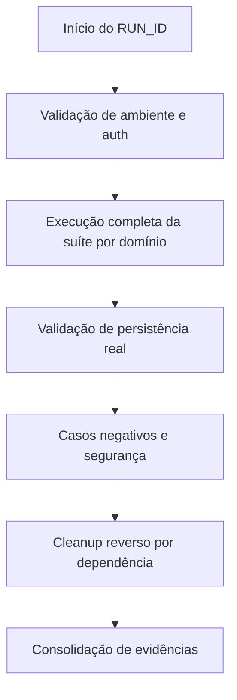

# Plano de Teste E2E — Persistência Real (sem smoke)

## 1) Contexto e objetivo
Este plano define a execução **E2E completa** para o projeto `eventos`, com validação de ponta a ponta entre frontend, backend e persistência real em Google Sheets.
A estratégia **não utiliza smoke tests**: a suíte cobre fluxos críticos e secundários por domínio funcional.

## 2) Fontes utilizadas
- `README.md`
- `docs/assets/SETUP_QUICK_START.md`
- `docs/assets/GOOGLE_SHEETS_SETUP.md`
- `docs/assets/EMAIL_SETUP.md`
- `docs/assets/API.md`
- `docs/assets/OAuth.md`
- `docs/MODELO_DADOS.md`
- `cypress.config.ts`
- `package.json` (raiz e `server/package.json`)
- Rotas backend em `server/src/presentation/http/routes/*.ts` (fonte de verdade)

## 3) Escopo
### Em escopo
- Autenticação (`/api/auth/*`)
- Eventos (`/api/events*`)
- Usuários (`/api/users*`)
- Inscrições (`/api/inscriptions*`)
- Presenças (`/api/presences*`)
- E-mails (`/api/emails`)

### Fora de escopo
- Testes unitários/integrados de camada
- Estratégias com mock/fake/in-memory para dados principais
- Abordagem smoke

## 4) Pré-requisitos e ambiente
- Node.js 22+
- Frontend em `http://localhost:5173`
- Backend em `http://localhost:4000`
- Swagger em `http://localhost:4000/api-docs`

### Variáveis obrigatórias (persistência real)
No backend (`server/.env`):
- `GOOGLE_SHEETS_ID`
- `GOOGLE_SERVICE_ACCOUNT_EMAIL`
- `GOOGLE_SERVICE_ACCOUNT_PRIVATE_KEY`

No frontend (`.env` raiz):
- `VITE_API_BASE_URL=http://localhost:4000/api`

## 5) Estratégia de dados em banco real

## 5.1 Princípios
- Persistência obrigatória em Google Sheets real
- Nenhum cenário principal deve usar mock
- Cada execução recebe `TEST_RUN_ID` único (`E2E-<timestamp>`)

## 5.2 Rastreabilidade de massa
Usar marcador em entidades criadas:
- Evento: `[E2E:<RUN_ID>]`
- Usuário: `e2e+<RUN_ID>@dominio`
- Assunto de e-mail: `[E2E:<RUN_ID>]`

## 5.3 Isolamento
- Preferir planilha exclusiva de homologação
- Execução serial para reduzir colisão
- Não reutilizar massa de runs anteriores

## 5.4 Limpeza e rollback
- Registrar IDs criados durante o run
- Cleanup em ordem reversa de dependência:
  1. presenças
  2. inscrições
  3. eventos
  4. usuários
- Revalidar limpeza por filtro `RUN_ID`

## 6) Estratégia de execução (sem smoke)
A execução deve percorrer a suíte funcional completa:
1. Setup técnico e autenticação
2. CRUD de usuários e eventos
3. Fluxos relacionais de inscrições/presenças
4. Fluxos de e-mail
5. Casos negativos e segurança
6. Cleanup + evidências finais

## 7) Matriz de cenários E2E
| ID | Domínio | Tipo | Cenário | Resultado esperado |
|---|---|---|---|---|
| E2E-AUT-01 | Auth | Crítico | Registrar usuário válido | 201 + persistência |
| E2E-AUT-02 | Auth | Crítico | Login válido | 200 + access/refresh |
| E2E-AUT-03 | Auth | Crítico | Validar token | 200 |
| E2E-AUT-04 | Auth | Crítico | Refresh token | 200 + novo access |
| E2E-AUT-05 | Auth | Crítico | Logout/revoke | 200 + token inválido após revogação |
| E2E-EVT-01 | Eventos | Crítico | Criar evento | 201 + GET por ID |
| E2E-EVT-02 | Eventos | Crítico | Atualizar evento | 200 + persistido |
| E2E-EVT-03 | Eventos | Crítico | Excluir evento | 204 + não encontrado |
| E2E-USR-01 | Usuários | Crítico | Criar usuário | 201 + persistido |
| E2E-USR-02 | Usuários | Crítico | Atualizar/excluir usuário | 200/204 |
| E2E-INS-01 | Inscrições | Crítico | Criar inscrição válida | 201 + vínculo consistente |
| E2E-INS-02 | Inscrições | Secundário | Duplicidade inscrição | 4xx esperado |
| E2E-PRS-01 | Presenças | Crítico | Registrar presença válida | 201 + persistido |
| E2E-PRS-02 | Presenças | Secundário | Duplicidade presença | 4xx esperado |
| E2E-EML-01 | E-mails | Crítico | Envio com SMTP válido | 201 |
| E2E-EML-02 | E-mails | Secundário | Envio sem SMTP | Erro explícito |
| E2E-SEC-01 | Segurança | Crítico | Rota protegida sem token | 401 |
| E2E-SEC-02 | Segurança | Crítico | Token inválido | 401 |

## 8) Critérios de entrada e saída
### Entrada
- Ambiente configurado
- Backend e frontend ativos
- Planilha acessível pela conta de serviço

### Saída
- 100% cenários críticos executados
- 100% cenários secundários executados ou bloqueio formal justificado
- Sem Sev1/Sev2 aberto
- Cleanup concluído

## 9) Severidade e evidências
### Severidade
- Sev1/P1: perda de dados, falha de segurança, indisponibilidade
- Sev2/P1: falha crítica com workaround limitado
- Sev3/P2: falha secundária
- Sev4/P3: cosmético

### Evidências mínimas
- request/response
- IDs criados
- prova de persistência via leitura posterior
- screenshot em falha
- log por `RUN_ID`

## 10) Riscos e mitigação
| Risco | Impacto | Mitigação |
|---|---|---|
| Instabilidade Google APIs | Alto | retry controlado + rerun por domínio |
| Contaminação da massa | Alto | RUN_ID + cleanup reverso |
| Divergência doc x código | Médio/Alto | rotas do código como fonte de verdade |
| Dependência SMTP/OAuth | Médio | separar cenários opcionais por configuração |

## 11) Comandos de execução
```bash
# backend
cd server && npm run dev
```

```bash
# frontend
npm run dev
```

```bash
# E2E Cypress (sem smoke; suíte completa)
npx cypress run --config-file cypress.config.ts
```

```bash
# qualidade complementar
npm run lint && npm run build
cd server && npm run build && npm test
```

## 12) Gate de UX
Qualquer cenário que valide fluxo de interface deve registrar aprovação do **UX Expert** antes do aceite final.

## 13) Diagrama (Mermaid)


## 14) Observações de alinhamento (docs x código)
- Há divergências pontuais entre documentação e rotas OAuth atuais; usar rotas em `server/src/presentation/http/routes` como fonte de verdade para execução.
- Em e-mail, validar o status real do controller implementado durante os asserts E2E.
