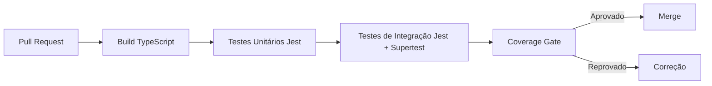
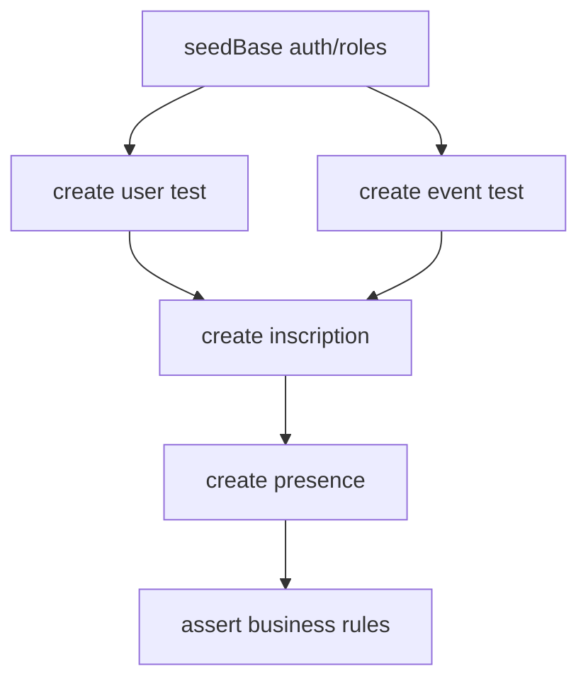

# Plano Completo de Testes de Back-end com Jest

## 1. Objetivo

Padronizar os testes do back-end (`server/`) em **Jest**, com cobertura de:

- **Testes unitários** (regras de domínio, casos de uso e mapeamentos de controller).
- **Testes de integração** (rotas HTTP, middlewares, container e integrações controladas).

Este plano substitui o uso de Cypress no back-end como estratégia principal.

---

## 2. Escopo

### Em escopo

- Código em `server/src/**`.
- Domínios/rotas: `auth`, `events`, `users`, `inscriptions`, `presences`, `emails` e `legacy sheets`.
- Cobertura de cenários positivos e negativos por módulo.
- Quality gates de cobertura e execução em CI.

### Fora de escopo

- Testes de interface/frontend (Cypress E2E do app web).
- Testes de carga/performance em produção.
- Mudanças de contrato de API sem governança de versionamento.

---

## 3. Estado atual e diretriz oficial

- **Estado atual**: existem testes legados no back-end em `server/tests-cypress/**`.
- **Diretriz oficial**: novos testes de back-end devem ser escritos em **Jest**.
- **Meta**: migrar progressivamente os cenários legados para Jest sem perda de cobertura funcional.

---

## 4. Estratégia de migração (Cypress back-end -> Jest)

### Fase 1 - Baseline e inventário

1. Mapear todos os specs legados por módulo.
2. Classificar cenários por criticidade de negócio.
3. Definir equivalência: `spec legado` -> `spec Jest`.

**Critério de saída**: matriz de migração completa e priorizada.

### Fase 2 - Estrutura Jest e setup

1. Configurar Jest no `server/` (`jest`, `ts-jest`, `@types/jest`).
2. Adicionar `supertest` para integração HTTP.
3. Criar setup de testes (`tests/setup`), fixtures e factories.

**Critério de saída**: suíte unitária e de integração executando em ambiente local/CI.

### Fase 3 - Migração unitária por domínio crítico

Prioridade:

1. `auth`
2. `events`
3. `users`
4. `inscriptions`
5. `presences`
6. `emails`
7. `legacy sheets`

**Critério de saída**: casos críticos de negócio migrados com asserts equivalentes.

### Fase 4 - Migração de integração HTTP

1. Validar rotas REST e tratamento de erros.
2. Validar autenticação/autorização em endpoints protegidos.
3. Validar contratos de resposta essenciais.

**Critério de saída**: cobertura de integração para todos os recursos principais.

### Fase 5 - Desativação da suíte legada

1. Tornar `server/tests-cypress/**` somente leitura/legado.
2. Atualizar pipeline para usar apenas Jest no back-end.

**Critério de saída**: Jest como padrão oficial em CI.

---

## 5. Estratégia de testes unitários por camada

## 5.1 Domain (`server/src/domain/**`)

- Entidades e invariantes.
- Regras de validação.
- Erros de domínio (`ApplicationError` e derivados).

## 5.2 Application/Use Cases (`server/src/application/usecases/**`)

- Fluxo feliz de cada caso de uso.
- Regras de negócio e pré-condições.
- Tratamento de falhas de dependências (repos, token, mail, OAuth).

## 5.3 Presentation/Controllers (`server/src/presentation/http/controllers/**`)

- Mapeamento request -> DTO/use case.
- Códigos HTTP esperados.
- Mapeamento de erro para resposta pública.

## 5.4 Infrastructure (`server/src/infrastructure/**`)

- Adaptadores de integração externa.
- Mapeamento para/desde modelos persistidos.
- Tratamento de timeout/falha de serviço externo.

---

## 6. Estratégia de testes de integração

## 6.1 Escopo de integração

- Aplicação HTTP real (Express) com middlewares.
- Rotas registradas via `registerRoutes`.
- `authMiddleware` e `errorHandler`.

## 6.2 Padrão de execução

- `supertest` para chamadas HTTP.
- Dados de teste controlados com fixtures/factories.
- Dependências externas instáveis com doubles previsíveis (SMTP/OAuth/Google APIs).

## 6.3 Casos mínimos por endpoint

- `2xx` (sucesso)
- `400` (payload inválido)
- `401/403` (acesso não autorizado)
- `404` (recurso inexistente)
- `409` (conflito de regra)
- `500` (erro inesperado tratado)

---

## 7. Matriz de cenários de teste por módulo

| Módulo | Unitários (foco) | Integração (foco) | Prioridade |
| --- | --- | --- | --- |
| Auth | login, refresh, revoke, providers, validação token | `/api/auth/*` com sucesso/falha e autorização | Alta |
| Events | criar/atualizar/excluir/listar/obter por id | CRUD `/api/events*` + paginação + 404/409 | Alta |
| Users | criação, duplicidade de e-mail, atualização/exclusão | CRUD `/api/users*` + autorização | Alta |
| Inscriptions | criação, duplicidade e consistência de vínculo | CRUD `/api/inscriptions*` + conflito de regra | Alta |
| Presences | criação, duplicidade e exclusão | `/api/presences*` + regras de acesso | Média/Alta |
| Emails | validação de payload e falha SMTP | `POST /api/emails` sucesso/falha controlada | Média |
| Legacy Sheets | mapeamentos e erros de integração | `/api/sheets/*` compatibilidade e erros | Média |

---

## 8. Organização de pastas e nomenclatura (Jest)

```text
server/
  tests/
    unit/
      domain/
      application/
      presentation/
      infrastructure/
    integration/
      http/
        auth/
        events/
        users/
        inscriptions/
        presences/
        emails/
        legacy/
    fixtures/
    factories/
    setup/
```

Padrão de nomes:

- Unitário: `*.unit.spec.ts`
- Integração: `*.int.spec.ts`

---

## 9. Convenções de mocks, fixtures e dados de teste

- Usar `jest.fn()` com tipagem explícita.
- Mockar somente fronteiras externas (ex.: serviços terceiros).
- Evitar mockar o alvo direto do teste.
- Centralizar fixtures em `tests/fixtures`.
- Usar factories para reduzir duplicação de payloads.
- Congelar relógio em cenários sensíveis a data/hora (`jest.useFakeTimers()` quando necessário).

---

## 10. Cobertura mínima e quality gates (CI)

Metas mínimas:

- Statements: **>= 90%**
- Lines: **>= 90%**
- Functions: **>= 90%**
- Branches: **>= 85%**

Gates obrigatórios:

1. Build TypeScript sem erros.
2. Testes unitários verdes.
3. Testes de integração verdes.
4. Threshold de coverage atendido.
5. Proibição de `it.only`/`describe.only` em PR.

---

## 11. Comandos recomendados (padrão desejado)

```bash
# suíte completa backend
npm test

# unitários
npm run test:unit

# integração
npm run test:integration

# cobertura
npm run test:coverage
```

> **Ação de implementação pendente**: adicionar/ajustar scripts acima em `server/package.json` e configuração `jest.config.ts`.

---

## 12. Riscos e mitigação

| Risco | Impacto | Mitigação |
| --- | --- | --- |
| Migração parcial reduzir cobertura | Regressão funcional | Matriz de equivalência e migração por prioridade |
| Acoplamento alto dificultar testes | Atraso de entrega | Introduzir factories, setup isolado e doubles controlados |
| Instabilidade de dependências externas | Flaky tests | Isolar integrações externas em testes determinísticos |
| Execução lenta em CI | Baixa produtividade | Separar suites (`unit`/`integration`) e paralelizar |

---

## 13. Diagrama de pipeline de testes (Mermaid)



---

## 14. Critérios de conclusão

Este plano será considerado adotado quando:

1. Jest estiver configurado e executando no back-end.
2. Suites unitária e de integração estiverem ativas em CI.
3. Cobertura mínima estiver aplicada como gate.
4. Suíte legada em Cypress do back-end estiver oficialmente descontinuada.

---

## 15. Plano de precedência de testes (com garantias de dados em banco)

Objetivo desta seção: garantir que cada teste execute com as pré-condições de dados atendidas, sem depender de ordem implícita ou estado residual de execução anterior.

### 15.1 Princípios obrigatórios de precedência

1. **Unitários não dependem de banco**: usar mocks/fakes e factories em memória.
2. **Integração com banco isolada por suíte**: cada arquivo de integração cria o próprio estado mínimo necessário.
3. **Nada depende de `it` anterior**: dependências entre cenários devem ser resolvidas em `beforeEach`/`beforeAll` da própria suíte.
4. **Ordem entre módulos é de pipeline, não de acoplamento interno**: a precedência organiza execução e seed base, mas cada suíte continua autossuficiente.
5. **Reset determinístico**: limpar dados de teste por suíte (transação rollback, truncate seletivo ou banco efêmero).

### 15.2 Camadas de dados de teste

- **Seed base global** (executada uma vez no bootstrap de integração):
  - perfis de autorização mínimos (`admin`, `participant`);
  - configuração base de autenticação (issuer/audience de teste);
  - metadados obrigatórios para compatibilidade de rotas.
- **Seed de domínio** (executada por suíte):
  - dados específicos para o domínio testado (`events`, `users`, etc.).
- **Dados de cenário** (executada por teste):
  - variações específicas para casos `2xx/4xx/5xx`.

### 15.3 Ordem de precedência recomendada (pipeline)

1. **Auth**
2. **Users**
3. **Events**
4. **Inscriptions**
5. **Presences**
6. **Emails**
7. **Legacy Sheets**

Justificativa: `inscriptions` dependem de `users` e `events`; `presences` dependem de inscrições/eventos válidos; os demais podem ser isolados com doubles.

### 15.4 Matriz de pré-condições por módulo

| Módulo | Pré-condição mínima no banco | Como garantir no teste |
| --- | --- | --- |
| Auth | usuário ativo + client/provider configurado | factory `authUserFactory` + seed auth em `beforeAll` |
| Users | seed base de permissões/roles | criar usuário por factory por teste; limpar após teste |
| Events | usuário autenticado com papel permitido | gerar token de teste + criar evento via factory/repositório |
| Inscriptions | `user` existente + `event` existente e aberto | helper `createUserAndEventForInscription()` em `beforeEach` |
| Presences | `inscription` válida (ou vínculo user-event conforme regra) | helper `createPresencePreconditions()` por cenário |
| Emails | remetente/config SMTP fake | mock de mail client e payload mínimo válido |
| Legacy Sheets | contrato de planilha e headers esperados | fake adapter de sheets + fixture de linhas válidas/invalidas |

### 15.5 Contrato de setup por suíte de integração

Cada arquivo `*.integration.test.ts` deve seguir este contrato:

1. Executar `seedBase()` no `beforeAll`.
2. Executar `resetDomainData()` no `beforeEach` (ou rollback transacional).
3. Executar `seedDomainPreconditions()` no `beforeEach`.
4. Criar apenas dados específicos do cenário dentro do próprio teste.
5. Executar `cleanupDomainData()` no `afterAll`.

### 15.6 Estratégia para evitar dependência de ordem entre arquivos

- Rodar integração com possibilidade de ordem aleatória sem quebrar (`jest --selectProjects integration --runInBand` no início da migração; depois paralelo).
- Não compartilhar IDs gerados entre arquivos.
- Não usar dados estáticos globais que possam colidir (e-mails, slug, código de evento).
- Padronizar factories com sufixo único por execução (`timestamp`/`randomUUID`).

### 15.7 Exemplo de precedência de criação de dados (Inscriptions/Presences)



### 15.8 Gate de aceite para precedência

O plano de precedência será considerado atendido quando:

1. Todas as suítes de integração declararem explicitamente seu `seedDomainPreconditions()`.
2. Nenhum teste falhar ao executar isoladamente (`jest <arquivo>`).
3. Nenhum teste falhar por ordem de execução diferente.
4. O pipeline CI executar `unit` e `integration` sem dependência de estado prévio.

