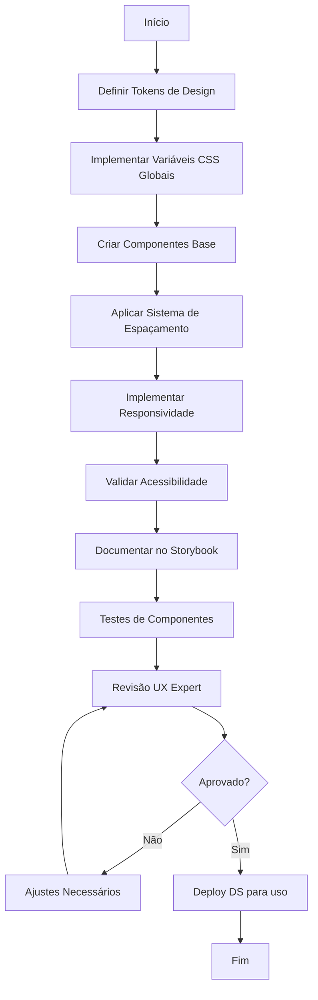
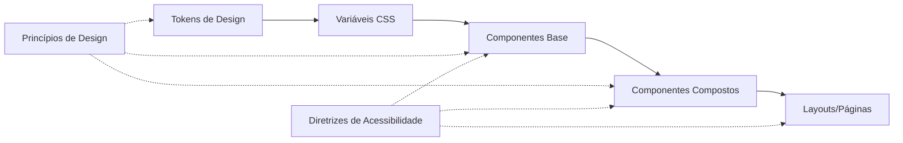
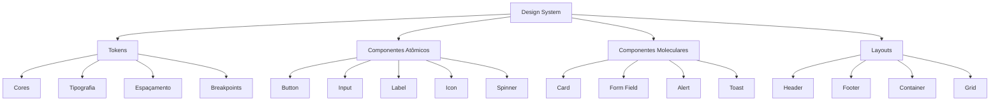

# [FEATURE]: Frontend — Implementação do Design System e Identidade Visual

## Template Utilizado

- .github/ISSUE_TEMPLATE/01-feature-request.yml

## Prioridade

- P0 - Crítica (bloqueante)

## Módulo

- UI/UX

## Epic / Fase do Roadmap

- Fase 0: Fundação — Design System e Componentes Base

## História de Usuário

Como desenvolvedor frontend e designer UX
Eu quero um Design System completo e consistente implementado em código
Para que todas as funcionalidades da plataforma sigam os mesmos padrões visuais, garantindo consistência, acessibilidade e eficiência no desenvolvimento.

## Descrição Detalhada

Implementar o Design System completo da Plataforma Eventos conforme especificado na seção 10 do documento `docs/DEFINICAO_LAYOUTS_PAGINAS.md`, estabelecendo a fundação visual e de componentes para toda a aplicação.

### Escopo de Implementação

O Design System inclui:

1. **Princípios de Design**: Documentação e aplicação dos 7 princípios fundamentais (Clareza, Eficiência, Consistência, Acessibilidade, Responsividade, Foco no Evento, Confiança).

2. **Sistema de Cores**: Implementação das variáveis CSS globais com paleta institucional completa:
   - `--brand-primary`: Azul vibrante (#1877F2 ou similar)
   - `--brand-secondary`: Tom complementar (verde/ciano #4CAF50 ou #00BCD4)
   - `--surface`: Branco/cinza claro (#FFFFFF, #F9FAFB)
   - `--text-primary`: Preto/cinza escuro (#212121, #424242)
   - `--muted`: Cinza médio para textos secundários (#757575, #BDBDBD)
   - `--border`: Cinza claro para divisórias (#E0E0E0)
   - `--danger`: Vermelho para ações destrutivas (#F44336)
   - `--success`: Verde para validações (#4CAF50)
   - `--background-institutional`: Gradiente radial suave

3. **Tipografia**: Definição de sistema tipográfico com hierarquia clara:
   - Fontes base (sistema ou web fonts)
   - Escalas de tamanho (heading 1-6, body, caption, eyebrow)
   - Pesos (regular, medium, semibold, bold)
   - Altura de linha e espaçamento
   - Classes utilitárias (`eyebrow`, `muted`)

4. **Espaçamento e Grid**: Sistema de espaçamento responsivo:
   - Grid fluido com `repeat(auto-fit, minmax(...))`
   - Padding lateral responsivo usando `clamp(1rem, 4vw, 4rem)`
   - Espaçamento vertical consistente entre seções
   - Sistema de tokens de espaçamento (4px, 8px, 12px, 16px, 24px, 32px, 48px, 64px)

5. **Componentes Base**: Biblioteca de componentes reutilizáveis:
   - **Botões**: Variações `primary`, `secondary`, `ghost`, `danger` com estados (hover, active, disabled, loading) e tamanhos (default, full-width)
   - **Cards**: Componente `panel-card` com cantos arredondados, sombra sutil e variações
   - **Formulários**:
     - Campos de input com label superior
     - Estados de validação (sucesso, erro, warning)
     - Área de mensagem de erro textual
     - Placeholders e helper text
   - **Loading States**: Skeleton screens e spinners
   - **Feedback**: Toasts, alerts, mensagens de sucesso/erro
   - **Navegação**: Header institucional, breadcrumbs, tabs

6. **Responsividade**: Sistema de breakpoints e comportamentos adaptativos:
   - Breakpoint principal: 768px
   - Reorganização de layouts (coluna única em mobile)
   - Comportamento de grids fluidos
   - Botões full-width em mobile

7. **Acessibilidade**: Implementação de padrões WCAG 2.1 AA:
   - Contraste de cores adequado (mínimo 4.5:1 para texto normal)
   - Estados de foco visíveis
   - Suporte a navegação por teclado
   - Labels e atributos ARIA adequados
   - Textos alternativos para elementos não-textuais

8. **Documentação Técnica**: Storybook ou documentação equivalente com:
   - Showcase de todos os componentes
   - Variações e estados
   - Código de exemplo
   - Diretrizes de uso
   - Tokens de design

### Estrutura de Arquivos Proposta

```
src/
├── presentation/
│   ├── design-system/
│   │   ├── tokens/
│   │   │   ├── colors.ts
│   │   │   ├── spacing.ts
│   │   │   ├── typography.ts
│   │   │   └── breakpoints.ts
│   │   ├── components/
│   │   │   ├── Button/
│   │   │   │   ├── Button.tsx
│   │   │   │   ├── Button.module.css
│   │   │   │   ├── Button.stories.tsx
│   │   │   │   └── Button.test.tsx
│   │   │   ├── Card/
│   │   │   ├── Input/
│   │   │   ├── LoadingState/
│   │   │   └── ...
│   │   ├── layouts/
│   │   │   ├── Header/
│   │   │   ├── Footer/
│   │   │   └── Container/
│   │   └── styles/
│   │       ├── global.css
│   │       ├── variables.css
│   │       └── utilities.css
```

### Fluxo de Implementação



### Dependências entre Componentes



## Guia Visual Obrigatório

Esta issue **DEVE** ser implementada seguindo a especificação visual e estrutural definida em:

- **Arquivo de referência**: [docs/images/DesignSystem.png](docs/DEFINICAO_LAYOUTS_PAGINAS.md#10-design-system-da-plataforma-eventos)
- **Seção do documento**: `docs/DEFINICAO_LAYOUTS_PAGINAS.md` — Seção 10 (Design System da Plataforma)
- **Paleta de cores**: Seção 10.2 (Identidade Visual)
- **Mockups de implementação**: Todos os mockups em `docs/images/*.png` devem aderir às variáveis e componentes definidos

Qualquer implementação que desviar da especificação visual do Design System **DEVE** ser:

1. Explicitamente documentada como exceção
2. Validada e aprovada pelo **UX Expert** antes de aceitar a issue
3. Incluir justificativa técnica ou de negócio para o desvio

## Critérios de Aceitação

### CA01 - Sistema de Cores

- [ ] Todas as variáveis CSS de cor estão definidas em arquivo global
- [ ] Paleta completa implementada (primary, secondary, surface, text, muted, border, danger, success)
- [ ] Gradiente institucional de fundo aplicável
- [ ] Contraste de cores valida WCAG 2.1 AA (mínimo 4.5:1 para texto)

### CA02 - Tipografia

- [ ] Sistema tipográfico completo com hierarquia definida (H1-H6, body, caption, eyebrow)
- [ ] Classes utilitárias para variações tipográficas implementadas
- [ ] Altura de linha e espaçamento consistentes
- [ ] Fontes carregam corretamente e têm fallbacks

### CA03 - Espaçamento e Grid

- [ ] Sistema de tokens de espaçamento implementado (escala de 4px)
- [ ] Grid fluido funcional com `auto-fit` e `minmax`
- [ ] Padding lateral responsivo com `clamp` aplicado
- [ ] Espaçamento vertical consistente entre seções

### CA04 - Componentes Base — Botões

- [ ] Variações implementadas: `primary`, `secondary`, `ghost`, `danger`
- [ ] Estados visuais: hover, active, disabled, loading
- [ ] Tamanhos: default e full-width
- [ ] Acessibilidade: navegação por teclado, estados de foco visíveis
- [ ] Testes unitários cobrem todos os estados

### CA05 - Componentes Base — Cards

- [ ] Componente `panel-card` implementado
- [ ] Cantos arredondados e sombra sutil aplicados
- [ ] Variações de card disponíveis (se aplicável)
- [ ] Responsivo e adaptável

### CA06 - Componentes Base — Formulários

- [ ] Campos com label superior implementados
- [ ] Estados de validação: sucesso, erro, warning
- [ ] Área de mensagem de erro textual
- [ ] Placeholders e helper text funcionais
- [ ] Acessibilidade: labels associados, atributos ARIA

### CA07 - Loading States

- [ ] Skeleton screens implementados
- [ ] Spinners/loaders com variações de tamanho
- [ ] Estados de carregamento aplicáveis a componentes

### CA08 - Feedback Visual

- [ ] Sistema de toasts/notificações implementado
- [ ] Alerts com variações (info, success, warning, error)
- [ ] Mensagens de feedback posicionadas consistentemente

### CA09 - Layouts Base

- [ ] Header institucional implementado
- [ ] Footer institucional implementado
- [ ] Container principal com estrutura vertical (`min-height: 100vh`)
- [ ] Navegação âncora funcional no header

### CA10 - Responsividade

- [ ] Breakpoint principal (768px) implementado
- [ ] Layouts reorganizam para coluna única em mobile
- [ ] Botões ocupam largura total em mobile
- [ ] Grids fluidos adaptam sem layout fixo
- [ ] Testado em dispositivos móveis, tablets e desktop

### CA11 - Acessibilidade WCAG 2.1 AA

- [ ] Contraste de cores validado (ferramentas: Lighthouse, axe DevTools)
- [ ] Estados de foco visíveis em todos os elementos interativos
- [ ] Navegação por teclado funcional (Tab, Enter, Esc)
- [ ] Leitores de tela navegam corretamente (testado com NVDA/VoiceOver)
- [ ] Atributos ARIA adequados em componentes interativos
- [ ] Textos alternativos presentes em elementos não-textuais

### CA12 - Documentação

- [x] Storybook (ou equivalente) configurado
- [ ] Todos os componentes documentados com exemplos
- [ ] Variações e estados demonstrados
- [ ] Código de exemplo para cada componente
- [ ] Diretrizes de uso claras
- [ ] Tokens de design documentados

### CA13 - Testes

- [ ] Testes unitários para todos os componentes base (mínimo 80% de cobertura)
- [ ] Testes de acessibilidade automatizados (jest-axe ou similar)
- [ ] Testes visuais de regressão (Chromatic ou similar - opcional)
- [ ] Testes de responsividade em diferentes viewports

### CA14 - Gate UX Obrigatório

- [ ] **Todas as implementações visuais foram revisadas e aprovadas pelo UX Expert**
- [ ] Feedback do UX Expert documentado e integrado
- [ ] Componentes seguem os princípios de design estabelecidos

### CA15 - Integração com Código Existente

- [ ] Design System não quebra componentes existentes
- [ ] Migração gradual de componentes antigos para DS (planejada)
- [ ] Guia de migração documentado

## Notas Técnicas

### Stack Técnico

- React 18+ com TypeScript
- CSS Modules ou Styled Components (a definir)
- Vite (build tool existente)
- Storybook 7+ para documentação
- Testing Library para testes de componentes
- jest-axe para testes de acessibilidade

### Boas Práticas de Implementação

1. **Atomic Design**: Seguir metodologia Atomic Design (átomos → moléculas → organismos)
2. **CSS-in-JS vs CSS Modules**: Avaliar trade-offs e padronizar
3. **Props Consistency**: Manter padrões de props entre componentes (variant, size, disabled, etc.)
4. **Composition over Configuration**: Preferir composição de componentes
5. **TypeScript Strict**: Utilizar tipagem forte em todos os componentes
6. **Performance**: Lazy loading de componentes pesados, memoization quando aplicável
7. **Tree Shaking**: Garantir que apenas componentes usados sejam incluídos no bundle

### Tokens de Design (Exemplos)

```typescript
// colors.ts
export const colors = {
  brand: {
    primary: "#1877F2",
    secondary: "#4CAF50",
  },
  surface: {
    base: "#FFFFFF",
    secondary: "#F9FAFB",
  },
  text: {
    primary: "#212121",
    secondary: "#757575",
    muted: "#BDBDBD",
  },
  border: {
    default: "#E0E0E0",
  },
  semantic: {
    danger: "#F44336",
    success: "#4CAF50",
    warning: "#FFC107",
    info: "#2196F3",
  },
};

// spacing.ts
export const spacing = {
  xs: "4px",
  sm: "8px",
  md: "16px",
  lg: "24px",
  xl: "32px",
  "2xl": "48px",
  "3xl": "64px",
};

// breakpoints.ts
export const breakpoints = {
  mobile: "768px",
  tablet: "1024px",
  desktop: "1280px",
};
```

### Exemplo de Componente Button

```tsx
// Button.tsx
import React from "react";
import styles from "./Button.module.css";

export interface ButtonProps extends React.ButtonHTMLAttributes<HTMLButtonElement> {
  variant?: "primary" | "secondary" | "ghost" | "danger";
  size?: "default" | "full";
  isLoading?: boolean;
  children: React.ReactNode;
}

export const Button: React.FC<ButtonProps> = ({
  variant = "primary",
  size = "default",
  isLoading = false,
  disabled,
  children,
  className,
  ...props
}) => {
  const classes = [
    styles.button,
    styles[`button--${variant}`],
    styles[`button--${size}`],
    isLoading && styles["button--loading"],
    className,
  ]
    .filter(Boolean)
    .join(" ");

  return (
    <button
      className={classes}
      disabled={disabled || isLoading}
      aria-busy={isLoading}
      {...props}
    >
      {isLoading ? <span className={styles.spinner} /> : children}
    </button>
  );
};
```

### Integração com Código Existente

Atualmente, a aplicação possui componentes em:

- `src/presentation/components/`
- Estilos em `src/App.css` e `src/index.css`

**Estratégia de Migração:**

1. Implementar Design System sem quebrar código existente
2. Criar novos componentes usando DS
3. Documentar mapeamento de componentes antigos → novos
4. Migrar progressivamente páginas para usar DS
5. Deprecar componentes antigos gradualmente

### Considerações de Acessibilidade

- **SR-Only Classes**: Classes para conteúdo visível apenas para leitores de tela
- **Focus Management**: Gerenciamento de foco em modais e interações complexas
- **Color Contrast**: Validar contraste em todas as combinações de cor
- **Motion Preferences**: Respeitar `prefers-reduced-motion`
- **Semantic HTML**: Priorizar elementos HTML semânticos

## Mockups / Diagramas

### Referências Visuais

- Seção 10 completa: `docs/DEFINICAO_LAYOUTS_PAGINAS.md#10-design-system-da-plataforma-eventos`
- Imagem do Design System: `docs/images/DesignSystem.png`
- Layouts de referência: Todas as páginas especificadas nas seções 9.1 a 9.8

### Hierarquia de Implementação



## Estimativa de Esforço

- **XXL (3-4 semanas)** — Implementação completa de fundação crítica

### Breakdown de Tempo Estimado

- Semana 1: Setup + Tokens + Componentes Atômicos (Button, Input, Label, etc.)
- Semana 2: Componentes Moleculares (Card, FormField, etc.) + Layouts Base
- Semana 3: Documentação (Storybook) + Testes + Acessibilidade
- Semana 4: Validação UX + Ajustes + Integração

## Requisitos Relacionados

### Requisitos Funcionais

- [x] **RF-001 a RF-022**: Todos os requisitos funcionais dependem do Design System para implementação visual consistente

### Requisitos Não Funcionais

- [x] **RNF-001 (Usabilidade)**: Interfaces intuitivas e semânticas
- [x] **RNF-002 (Acessibilidade)**: WCAG 2.1 nível AA
- [x] **RNF-003 (Responsividade)**: Adaptável a dispositivos móveis, tablets e desktops
- [x] **RNF-004 (Performance)**: Tempo de carregamento < 3s
- [x] **RNF-010 (Manutenibilidade)**: Código organizado e documentado

### Casos de Uso Relacionados

Todos os casos de uso com interface visual (UC-001 a UC-044) dependem do Design System.

## Referências

### Documentação do Projeto

- `docs/DEFINICAO_LAYOUTS_PAGINAS.md` — Especificação completa de layouts e Design System
- `docs/DECLARACAO_ESCOPO.md` — Requisitos Não Funcionais

### Imagens de Referência

- `docs/images/DesignSystem.png` — Especificação visual do Design System
- `docs/images/*.png` — Mockups de todas as páginas

### Padrões e Guidelines Externas

- [WCAG 2.1 Guidelines](https://www.w3.org/WAI/WCAG21/quickref/)
- [Material Design 3](https://m3.material.io/) — Referência de padrões (não para cópia literal)
- [Atomic Design Methodology](https://atomicdesign.bradfrost.com/)
- [Inclusive Components](https://inclusive-components.design/)

### Casos de Uso Base (Exemplos de Fluxos Visuais)

- `docs/case/UC-001-login-sessao-segura.md` — Login flow
- `docs/case/UC-004-crud-eventos.md` — CRUD de eventos
- Todos os demais UCs com interação visual

## Dependências e Bloqueios

### Esta Issue Bloqueia

- **FE-01**: Frontend OAuth (depende de componentes de formulário e botões)
- **FE-02**: Gestão de Eventos (depende de cards, formulários, paginação)
- **FE-03**: Inscrições e Certificados (depende de todos os componentes base)
- **FE-04**: Palestrantes e Upload (depende de formulários e feedback visual)

### Esta Issue Depende De

- Nenhuma dependência crítica — **Issue fundacional**

## Checklist do Solicitante

- [x] Verifiquei que esta funcionalidade não está duplicada em outra issue
- [x] Consultei a documentação do projeto em `/docs`
- [x] Esta funcionalidade está alinhada com o roadmap do projeto
- [x] Identifiquei claramente as dependências e bloqueios
- [x] Esta issue tem revisão UX obrigatória (Gate de UX)

## Checklist de Revisão UX (a ser preenchido pelo UX Expert)

- [ ] Princípios de Design estão claros e aplicáveis
- [ ] Sistema de cores atende contraste e identidade visual
- [ ] Tipografia é legível e hierárquica
- [ ] Componentes seguem padrões de usabilidade
- [ ] Responsividade preserva experiência em todos os dispositivos
- [ ] Acessibilidade está garantida (WCAG 2.1 AA)
- [ ] Documentação visual é suficiente para implementação
- [ ] Aprovação final para implementação

---

**Notas Finais:**
Esta é uma issue **fundacional e bloqueante** para todas as demais features de frontend. A implementação correta e completa do Design System é crítica para:

1. Velocidade de desenvolvimento futuro
2. Consistência visual da plataforma
3. Experiência do usuário de alta qualidade
4. Manutenibilidade do código
5. Acessibilidade e inclusão

**Recomendação:** Priorizar como P0 e alocar recursos experientes em UI/UX e acessibilidade.
