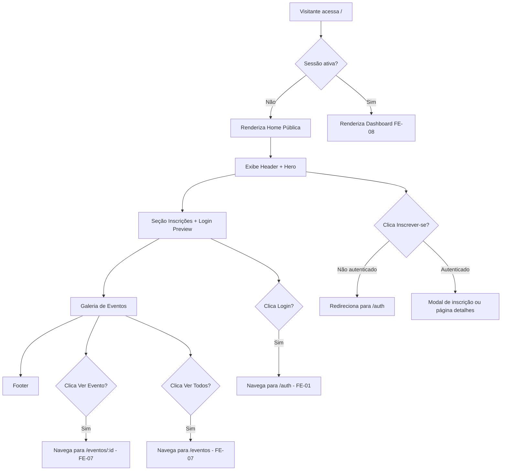
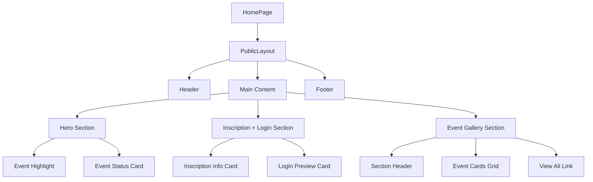

# [FEATURE]: Frontend — Página Inicial Pública e Hero de Evento

## Template Utilizado

- .github/ISSUE_TEMPLATE/01-feature-request.yml

## Prioridade

- P1 - Alta (importante)

## Módulo

- UI/UX

## Epic / Fase do Roadmap

- Fase 1: Core - Páginas Públicas e Navegação

## História de Usuário

Como visitante não autenticado
Eu quero visualizar a página inicial com eventos em destaque e informações institucionais
Para que eu possa conhecer a plataforma, eventos disponíveis e me interessar em participar.

## Descrição Detalhada

Implementar a **Página Inicial Pública** conforme especificação da seção 9.1 do documento `docs/DEFINICAO_LAYOUTS_PAGINAS.md`, criando a primeira impressão e porta de entrada da plataforma para visitantes.

### Escopo de Implementação

#### Componentes da Página (Seção 5.1 e 9.1 do documento)

1. **Header Institucional**
   - Branding: Logo + órgão (ex: "Portal CGEAC")
   - Navegação âncora: Links para seções ("O evento", "Inscrições", "Painel")
   - Ação secundária: "Contate a equipe" (link ou modal)
   - Responsivo: reorganiza para coluna em mobile (<768px)

2. **Hero do Evento** (layout de 2 colunas adaptativas)
   - **Coluna 1 (Principal)**:
     - Título do evento em destaque
     - Tema/subtítulo
     - Metadados: local, data, horário
     - CTAs primários: "Inscrever-se", "Ver programação"
   - **Coluna 2 (Status)**:
     - Status do evento (Aberto/Encerrado/Em breve)
     - Card de localização (mapa opcional ou endereço destacado)
   - Comportamento: torna-se coluna única em mobile

3. **Seção Inscrições + Painel** (`content-grid` 2 colunas)
   - **Coluna Esquerda**: Card de informações de inscrição
     - Passos para inscrição (timeline ou lista numerada)
     - Alerta/aviso importante (se aplicável)
   - **Coluna Direita**: Card de Login/Autocadastro
     - Preview do formulário de login
     - Link para página de autenticação completa
     - Mensagem motivacional para cadastro

4. **Galeria de Eventos**
   - Cabeçalho da seção:
     - Título: "Eventos Disponíveis" ou similar
     - Contador de itens: "X eventos encontrados"
   - Grade de cards de eventos (até 3 na visão resumida):
     - Cada card: imagem, título, data, local, status, botão "Ver mais"
   - Estados:
     - **Carregando**: skeleton/placeholders textuais
     - **Vazio**: mensagem "Nenhum evento disponível no momento"
     - **Erro**: mensagem de erro com opção de retry
   - Link "Ver todos os eventos" → redireciona para FE-07 (listagem completa)

5. **Footer Institucional**
   - Informações de contato/endereço
   - Links para políticas (privacidade, termos de uso)
   - Redes sociais (se aplicável)
   - Créditos e copyright

### Fluxo de Navegação



### Estados de Carregamento (Seção 5.4)

Quando `isLoading` estiver ativo (validação de sessão):

- Exibir cartão centralizado (`loading-state`)
- Marca textual: "Portal CGEAC" ou nome da plataforma
- Título: "Carregando..."
- Mensagem: "Validando sua sessão, aguarde..."

### Comportamento de Responsividade (Seção 6)

**Breakpoint 768px:**

- Header: coluna única, navegação permite quebra
- Hero: coluna única (status abaixo do título)
- Content-grid: coluna única (login abaixo de inscrições)
- Events-grid: `repeat(auto-fit, minmax(280px, 1fr))`
- Botões: largura total

### Integração com Design System (FE-05)

Componentes necessários:

- `Header` (layout)
- `Footer` (layout)
- `Container` (layout com padding responsivo)
- `Button` (primary, secondary variants)
- `Card` (panel-card para eventos e seções)
- `LoadingState` (skeleton e spinners)
- `Alert` (para avisos de inscrição)
- Sistema de grid fluido
- Tokens de cor e espaçamento

## Guia Visual Obrigatório

Esta issue **DEVE** ser implementada seguindo o mockup visual definido em:

- **Arquivo de referência principal**: [docs/images/home.png](docs/DEFINICAO_LAYOUTS_PAGINAS.md#91-página-inicial-pública--não-autenticado)
- **Seção do documento**: `docs/DEFINICAO_LAYOUTS_PAGINAS.md` — Seções 5.1 e 9.1 (Página Inicial Pública)
- **Design System**: `docs/images/DesignSystem.png` (Seção 10)
- **Responsividade**: Seção 6 (Responsividade)
- **Estado de carregamento**: Seção 5.4 (Estado de Carregamento de Autenticação)

Qualquer implementação que desviar da estrutura visual definida no mockup **DEVE** ser:

1. Explicitamente documentada como exceção
2. Validada e aprovada pelo **UX Expert** antes de aceitar a issue
3. Incluir justificativa técnica ou de negócio para o desvio

## Critérios de Aceitação

### Obrigatoriedade de Conformidade Visual

> **⚠️ VINCULANTE:** Toda a implementação **DEVE** seguir rigorosamente o mockup visual `docs/images/home.png` conforme especificado na Seção 9.1 de `docs/DEFINICAO_LAYOUTS_PAGINAS.md`.

- [ ] Header exibe branding (logo + nome do órgão) consistente
- [ ] Navegação âncora funciona com scroll suave para seções
- [ ] Ação "Contate a equipe" implementada (link ou modal)
- [ ] Em mobile (<768px), header reorganiza para coluna
- [ ] Link "Painel" visível e redireciona para `/auth` se não autenticado

### CA02 - Hero do Evento

- [ ] **[VISUAL]** Hero segue exatamente o layout do mockup `docs/images/home.png` (coluna esquerda/direita ou adaptável).
- [ ] Hero exibe evento em destaque com título, tema, metadados
- [ ] Layout de 2 colunas em desktop, 1 coluna em mobile
- [ ] Status do evento (Aberto/Encerrado/Em breve) visível e destacado
- [ ] Card de localização implementado (endereço ou mapa)
- [ ] CTAs primários ("Inscrever-se", "Ver programação") funcionais
- [ ] CTA "Inscrever-se" redireciona para `/auth` se não autenticado
- [ ] Design alinhado com mockup `docs/images/home.png`

### CA03 - Seção Inscrições + Painel

- [ ] Layout de 2 colunas (content-grid) implementado
- [ ] Card esquerdo: passos de inscrição exibidos de forma clara
- [ ] Card esquerdo: alerta/aviso destacado quando aplicável
- [ ] Card direito: preview de login com link para `/auth`
- [ ] Card direito: mensagem motivacional para cadastro
- [ ] Em mobile, cards empilham (login abaixo de inscrições)

### CA04 - Galeria de Eventos

- [ ] Cabeçalho da seção com título e contador de itens
- [ ] Grade de até 3 cards de eventos na visão resumida
- [ ] Cada card exibe: imagem, título, data, local, status, botão
- [ ] **Estado Carregando**: skeleton/placeholders visuais
- [ ] **Estado Vazio**: mensagem "Nenhum evento disponível"
- [ ] **Estado Erro**: mensagem de erro com botão "Tentar novamente"
- [ ] Link "Ver todos os eventos" redireciona para `/eventos`
- [ ] Grid responsivo: adapta conforme largura da tela

### CA05 - Footer Institucional

- [ ] Footer exibe informações de contato e endereço
- [ ] Links para políticas (privacidade, termos) funcionais
- [ ] Redes sociais exibidas (se aplicável)
- [ ] Créditos e copyright presentes
- [ ] Design consistente com identidade visual

### CA06 - Estados de Carregamento de Sessão

- [ ] Loading state centralizado quando `isLoading` ativo
- [ ] Exibe marca "Portal CGEAC"
- [ ] Título e mensagem de validação de sessão
- [ ] Transição suave após validação

### CA07 - Responsividade

- [ ] Layout testado e funcional em mobile (320px - 767px)
- [ ] Layout testado e funcional em tablet (768px - 1023px)
- [ ] Layout testado e funcional em desktop (1024px+)
- [ ] Todos os blocos permanecem legíveis sem sobreposição
- [ ] Navegação funcional em touch e teclado

### CA08 - Integração de Dados

- [ ] Galeria de eventos consome API de listagem de eventos
- [ ] Hero exibe evento em destaque configurado (ou mais recente)
- [ ] Tratamento de erro de API implementado
- [ ] Loading states durante requisições

### CA09 - Navegação e Direcionamento

- [ ] Links de navegação âncora funcionam com scroll suave
- [ ] Usuário não autenticado ao clicar "Inscrever-se" é redirecionado para `/auth`
- [ ] Clique em card de evento redireciona para `/eventos/:id` (FE-07)
- [ ] Link "Ver todos" redireciona para `/eventos` (FE-07)

### CA10 - Acessibilidade

- [ ] Navegação via teclado funcional (Tab, Enter)
- [ ] Estados de foco visíveis
- [ ] Contraste de cores validado (WCAG 2.1 AA)
- [ ] Atributos ARIA adequados em componentes interativos
- [ ] Textos alternativos em imagens

### CA11 - Gate UX Obrigatório

- [ ] **Design validado e aprovado pelo UX Expert**
- [ ] Feedback de UX integrado
- [ ] Alinhamento com mockup de referência
- [ ] Princípios de design (clareza, eficiência, foco no evento) aplicados

## Notas Técnicas

### Stack Técnico

- React + TypeScript
- React Router para navegação
- Hooks customizados para busca de eventos
- Service layer para API calls (`EventService`)
- Design System (FE-05) para componentes

### Estrutura de Arquivos Sugerida

```
src/presentation/
├── pages/
│   ├── Home/
│   │   ├── HomePage.tsx
│   │   ├── HomePage.module.css
│   │   ├── components/
│   │   │   ├── Hero.tsx
│   │   │   ├── EventGallery.tsx
│   │   │   ├── InscriptionInfo.tsx
│   │   │   └── LoginPreview.tsx
├── layouts/
│   ├── PublicLayout/
│   │   ├── PublicLayout.tsx
│   │   ├── Header.tsx
│   │   └── Footer.tsx
```

### Boas Práticas

- Separar página em componentes reutilizáveis
- Usar hooks para lógica de negócio (ex: `useEvents`, `useFeaturedEvent`)
- Implementar lazy loading de imagens
- Otimizar renderização com `React.memo` quando aplicável
- Manter acessibilidade (semântica HTML, ARIA)

### Integração com Backend

- GET `/api/events` - listar eventos (paginado)
- GET `/api/events/:id` - detalhes do evento em destaque
- Utilizar `apiClient` existente

### Considerações de Performance

- Lazy loading de seção de galeria
- Otimização de imagens (WebP, dimensões adequadas)
- Prefetch de página de detalhes em hover sobre card
- Cache de eventos em contexto/estado global

### Variáveis CSS do Layout (Seção 4 e 7)

```css
.home-page {
  min-height: 100vh;
  background: var(--background-institutional);
  display: flex;
  flex-direction: column;
}

.main-content {
  padding: 0 clamp(1rem, 4vw, 4rem);
  flex: 1;
}

.hero {
  display: grid;
  grid-template-columns: repeat(auto-fit, minmax(320px, 1fr));
  gap: var(--spacing-xl);
  margin-bottom: var(--spacing-3xl);
}

.content-grid {
  display: grid;
  grid-template-columns: repeat(auto-fit, minmax(300px, 1fr));
  gap: var(--spacing-lg);
}

.events-grid {
  display: grid;
  grid-template-columns: repeat(auto-fit, minmax(280px, 1fr));
  gap: var(--spacing-lg);
}
```

## Mockups / Diagramas

### Referências Visuais

- **Mockup principal**: `docs/images/home.png` (Seção 9.1)
- **Especificação completa**: `docs/DEFINICAO_LAYOUTS_PAGINAS.md` (Seções 4, 5.1, 6, 7, 9.1)
- **Design System**: `docs/images/DesignSystem.png`

### Hierarquia de Componentes



## Estimativa de Esforço

- **L (1 semana)** — Página pública de entrada, componentes relativamente simples

### Breakdown de Tempo

- Dia 1-2: Header, Footer, PublicLayout + integração Design System
- Dia 3-4: Hero Section + Seção Inscrições/Login
- Dia 5: Galeria de Eventos + estados (loading, erro, vazio)
- Dia 6: Responsividade + Acessibilidade + Testes
- Dia 7: Gate UX + Ajustes + Documentação

## Requisitos Relacionados

### Requisitos Funcionais

- [x] **RF-001**: Cadastro e visualização de eventos
- [x] **RF-014**: Acesso público à listagem de eventos

### Requisitos Não Funcionais

- [x] **RNF-001**: Usabilidade - Interface intuitiva
- [x] **RNF-002**: Acessibilidade - WCAG 2.1 AA
- [x] **RNF-003**: Responsividade - Mobile, tablet, desktop
- [x] **RNF-004**: Performance - Carregamento < 3s

## Referências

### Documentação do Projeto

- `docs/DEFINICAO_LAYOUTS_PAGINAS.md` (Seções 4, 5.1, 6, 7, 8, 9.1)
- `docs/DECLARACAO_ESCOPO.md`

### Imagens de Referência

- `docs/images/home.png` — Mockup da página inicial pública
- `docs/images/DesignSystem.png` — Especificação do Design System

### Casos de Uso Relacionados

- `docs/case/UC-021-listar-filtrar-eventos.md` — Listagem de eventos

## Dependências e Bloqueios

### Esta Issue Depende De

- **FE-05**: Design System (Header, Footer, Container, Button, Card, LoadingState, grid system, tokens)

### Esta Issue Bloqueia

- Nenhuma issue crítica (página de entrada independente)

### Relação com Outras Issues

- **FE-01**: Integração com fluxo de autenticação (link para `/auth`)
- **FE-07**: Navegação para listagem e detalhes de eventos
- **FE-08**: Redirecionamento para dashboard quando autenticado

## Checklist do Solicitante

- [x] Verifiquei que esta funcionalidade não está duplicada em outra issue
- [x] Consultei a documentação do projeto em `/docs`
- [x] Esta funcionalidade está alinhada com o roadmap do projeto
- [x] Identifiquei claramente as dependências e bloqueios
- [x] Esta issue tem revisão UX obrigatória (Gate de UX)

## Checklist de Revisão UX (a ser preenchido pelo UX Expert)

- [ ] Layout segue o mockup `docs/images/home.png`
- [ ] Hierarquia visual está clara (Hero → Inscrições → Galeria)
- [ ] CTAs são visíveis e acionáveis
- [ ] Estados de loading e erro são compreensíveis
- [ ] Responsividade preserva usabilidade em todos os dispositivos
- [ ] Navegação é intuitiva e sem fricção
- [ ] Acessibilidade garante inclusão
- [ ] Aprovação final para implementação

---

**Nota:** Esta é a **porta de entrada principal** da plataforma. A primeira impressão é crítica para engajamento e conversão de visitantes em participantes.
