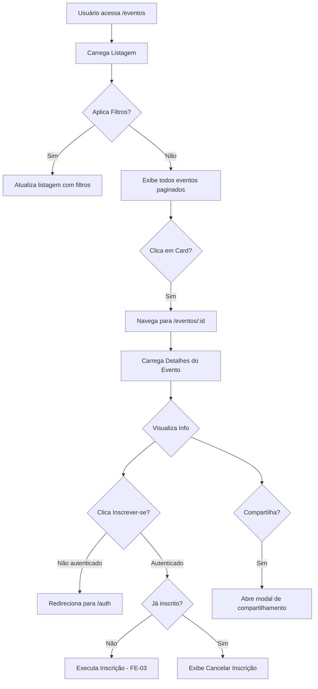
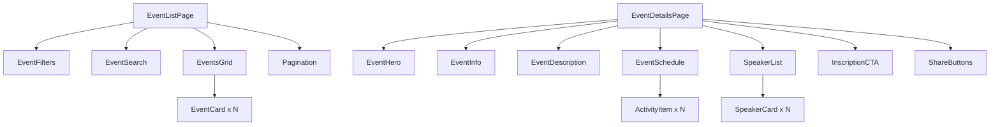

# [FEATURE]: Frontend — Listagem e Detalhes de Eventos (Visão Participante)

## Template Utilizado

- .github/ISSUE_TEMPLATE/01-feature-request.yml

## Prioridade

- P1 - Alta (importante)

## Módulo

- UI/UX

## Epic / Fase do Roadmap

- Fase 1: Core - Descoberta e Inscrição de Eventos

## História de Usuário

Como visitante ou participante
Eu quero explorar eventos disponíveis com filtros e visualizar detalhes completos de cada evento
Para que eu possa encontrar eventos de meu interesse e decidir me inscrever.

## Descrição Detalhada

Implementar as páginas de **Listagem de Eventos** (Seção 9.4) e **Detalhes do Evento** (Seção 9.5) conforme especificação do documento `docs/DEFINICAO_LAYOUTS_PAGINAS.md`, permitindo que usuários descubram e conheçam eventos para inscrição.

### Escopo de Implementação

Esta issue cobre **duas páginas fundamentais**:

#### 1. Página de Listagem de Eventos (`/eventos`) — Seção 9.4

Página de exploração com recursos robustos de busca e filtro.

**Componentes:**

1. **Cabeçalho**: Header padrão (mesmo da Home)

2. **Título da Página**: "Explore Nossos Eventos"

3. **Sistema de Filtros** (barra lateral ou superior)
   - **Categoria**: Conferência, Workshop, Show, Esporte, etc.
   - **Data**: Hoje, Esta Semana, Este Mês, Próximos 3 Meses, Personalizado
   - **Localização**: Cidade, Estado, Presencial/Online
   - **Preço**: Gratuito, Pago, Faixa de Preço (slider)
   - **Ordenar por**: Mais Recentes, Mais Populares, Data Asc/Desc
   - Botões: "Aplicar Filtros", "Limpar Filtros"

4. **Barra de Busca**
   - Campo de texto com placeholder "Buscar eventos..."
   - Busca por título, descrição, local
   - Ícone de pesquisa
   - Debounce de 300ms

5. **Resultados da Busca/Listagem**
   - **Cabeçalho de Resultados**: "X eventos encontrados"
   - **Grid de Cards de Eventos**: Similar aos da Home, com mais detalhes
     - Imagem de destaque
     - Título do evento
     - Data e hora
     - Local (endereço ou "Online")
     - Categoria/tags
     - Preço (ou "Gratuito")
     - Status (Aberto/Encerrado/Em breve)
     - Botão "Ver detalhes"
   - **Paginação**:
     - Exibir 12 eventos por página (configurável)
     - Controles: Anterior, números de página, Próximo
     - Indicador: "Página X de Y"

6. **Estados**
   - **Carregando**: Skeleton cards
   - **Vazio**: "Nenhum evento encontrado com os filtros aplicados"
   - **Erro**: Mensagem de erro com botão "Tentar novamente"

7. **Rodapé**: Footer padrão (mesmo da Home)

#### 2. Página de Detalhes do Evento (`/eventos/:id`) — Seção 9.5

Página detalhada para fornecer todas as informações necessárias sobre um evento específico e permitir inscrição.

**Componentes:**

1. **Cabeçalho**: Header padrão

2. **Imagem de Cabeçalho do Evento**
   - Banner full-width ou hero com imagem do evento (CA17)
   - Opcional: overlay com título do evento

3. **Título do Evento**
   - H1 com o nome completo do evento
   - Subtítulo/tema (se aplicável)

4. **Informações Básicas** (sidebar ou cards destacados)
   - **Data e Hora**: Início e fim
   - **Local**: Endereço completo ou "Evento Online"
   - **Preço**: Valor ou "Gratuito"
   - **Organizador**: Nome da entidade/organizador
   - **Categoria**: Badge ou tag visual
   - **Status**: Badge de status (Aberto/Encerrado/Lotado)

5. **Descrição Detalhada do Evento**
   - Texto completo formatado (markdown ou rich text)
   - Seção "Sobre este evento"
   - Objetivos, público-alvo, etc.

6. **Programação/Agenda** (opcional - RF07)
   - Seção "Programação" ou "Agenda"
   - Lista de sessões/atividades com:
     - Horário de início e fim
     - Nome da atividade/sessão
     - Descrição breve
     - Palestrante(s) associado(s)
     - **SE RF15 habilitado**: Checkbox "Inscrever-me nesta atividade"
   - Visualização em timeline ou tabela

7. **Palestrantes** (RF08)
   - Seção "Palestrantes" ou "Quem vai falar"
   - Cards ou lista de palestrantes:
     - Foto de perfil
     - Nome completo
     - Breve biografia (mini currículo)
     - Links para redes sociais (LinkedIn, Twitter, etc.)

8. **Botão CTA Principal: "Inscrever-se Agora"**
   - Fixo ou destacado visualmente
   - **Lógica condicional**:
     - Se não autenticado: redireciona para `/auth` com `returnTo=/eventos/:id`
     - Se autenticado: abre modal de inscrição ou executa inscrição
     - Se já inscrito: exibe badge "Você está inscrito" + botão "Cancelar inscrição"
     - Se evento encerrado/lotado: botão desabilitado com mensagem

9. **Compartilhamento Social**
   - Botões/ícones para compartilhar:
     - Facebook, Twitter, LinkedIn, WhatsApp, Email, Link (copiar)
   - Texto pré-formatado: "Confira este evento: [título]"

10. **Rodapé**: Footer padrão

### Fluxos de Navegação



### Estados de UI por Contexto

**Listagem:**

- Carregando initial: skeleton de 12 cards
- Carregando paginação: overlay de loading
- Filtros ativos: badges de filtros ativos com opção de remover
- Sem resultados: ilustração + mensagem + botão "Limpar filtros"

**Detalhes:**

- Carregando: skeleton do layout completo
- Evento não encontrado: página 404 customizada
- Inscrição bem-sucedida: toast de sucesso + atualiza estado do botão
- Erro de inscrição: toast de erro com mensagem

### Comportamento de Responsividade

**Listagem (768px):**

- Filtros: colapsam em drawer lateral (mobile) ou dropdown superior
- Grid de eventos: 1 coluna em mobile, 2 em tablet, 3-4 em desktop
- Paginação: simplificada em mobile (apenas Anterior/Próximo)

**Detalhes (768px):**

- Layout: coluna única empilhada
- Sidebar de info básicas: move para topo (abaixo do título)
- Botão CTA: fixo no bottom em mobile (sticky)
- Programação: tabela → lista de acordeões em mobile

### Integração com Design System (FE-05)

Componentes necessários:

- `Header`, `Footer` (layouts)
- `Container` (padding responsivo)
- `Button` (primary, secondary, ghost variants)
- `Card` (event-card)
- `Input` (busca, filtros)
- `Select`, `Checkbox`, `Radio` (filtros)
- `Badge` (status, categoria)
- `Pagination` (controles de paginação)
- `Modal` (compartilhamento, inscrição)
- `Toast` (feedback de ações)
- `LoadingState` (skeleton)
- `Drawer` (filtros mobile)
- Grid system e tokens

## Guia Visual Obrigatório

Esta issue **DEVE** ser implementada seguindo os mockups visuais definidos em:

- **Arquivo de referência 1 (Listagem)**: [docs/images/lista_eventos.png](docs/DEFINICAO_LAYOUTS_PAGINAS.md#94-página-de-listagem-de-eventos)
- **Arquivo de referência 2 (Detalhes)**: [docs/images/inscrição.png](docs/DEFINICAO_LAYOUTS_PAGINAS.md#95-página-de-detalhes-do-evento-para-participantes)
- **Seção do documento**: `docs/DEFINICAO_LAYOUTS_PAGINAS.md` — Seções 9.4 (Listagem) e 9.5 (Detalhes)
- **Design System**: `docs/images/DesignSystem.png` (Seção 10)

Qualquer implementação que desviar da estrutura visual definida nos mockups **DEVE** ser:

1. Explicitamente documentada como exceção
2. Validada e aprovada pelo **UX Expert** antes de aceitar a issue
3. Incluir justificativa técnica ou de negócio para o desvio

## Critérios de Aceitação

### Obrigatoriedade de Conformidade Visual

> **⚠️ VINCULANTE:** Toda a implementação **DEVE** seguir rigorosamente os mockups visuais `docs/images/lista_eventos.png` (Listagem) e `docs/images/inscrição.png` (Detalhes) conforme especificado nas Seções 9.4 e 9.5 de `docs/DEFINICAO_LAYOUTS_PAGINAS.md`.

### CA01 - Listagem: Layout e Estrutura

- [ ] **[VISUAL]** Layout segue exatamente o mockup `docs/images/lista_eventos.png` (Seção 9.4).
- [ ] Header e Footer padrão implementados
- [ ] Título "Explore Nossos Eventos" visível
- [ ] Grid de eventos responsivo (1/2/3-4 colunas conforme viewport)
- [ ] Design alinhado com mockup `docs/images/lista_eventos.png`

### CA02 - Listagem: Sistema de Filtros

- [ ] Filtros implementados: Categoria, Data, Localização, Preço, Ordenar
- [ ] Aplicação de filtros atualiza a listagem
- [ ] Badges de filtros ativos exibidos com opção de remover
- [ ] Botão "Limpar Filtros" reseta todos os filtros
- [ ] Filtros persistem em query params da URL (bookmarkable)
- [ ] Em mobile, filtros abrem em drawer lateral ou dropdown

### CA03 - Listagem: Busca

- [ ] Campo de busca implementado com debounce de 300ms
- [ ] Busca por título, descrição e local funcional
- [ ] Resultados atualizam dinamicamente
- [ ] Query de busca persiste na URL

### CA04 - Listagem: Cards de Eventos

- [ ] Cada card exibe: imagem, título, data, local, categoria, preço, status
- [ ] Botão "Ver detalhes" redireciona para `/eventos/:id`
- [ ] Hover/focus states implementados
- [ ] Cards responsivos e acessíveis

### CA05 - Listagem: Paginação

- [ ] Paginação funcional com 12 eventos por página
- [ ] Controles: Anterior, números, Próximo
- [ ] Indicador "Página X de Y" visível
- [ ] Navegação de página atualiza URL (query param `page`)
- [ ] Em mobile, paginação simplificada (Anterior/Próximo)

### CA06 - Listagem: Estados

- [ ] **Carregando**: Skeleton de 12 cards
- [ ] **Vazio**: Mensagem clara + botão "Limpar filtros"
- [ ] **Erro**: Mensagem de erro + botão "Tentar novamente"
- [ ] Transições suaves entre estados

### CA07 - Detalhes: Layout e Informações Básicas

- [ ] **[VISUAL]** Layout segue exatamente o mockup `docs/images/inscrição.png` (Seção 9.5).
- [ ] Header e Footer padrão implementados
- [ ] Imagem de cabeçalho do evento exibida (CA17)
- [ ] Título do evento (H1) visível
- [ ] Info básicas: data, hora, local, preço, organizador, categoria, status
- [ ] Design alinhado com mockup `docs/images/inscrição.png`

### CA08 - Detalhes: Descrição e Conteúdo

- [ ] Descrição detalhada do evento formatada corretamente
- [ ] Seção "Sobre este evento" implementada
- [ ] Suporte a markdown ou rich text (se aplicável)

### CA09 - Detalhes: Programação (RF07)

- [ ] Seção "Programação" implementada (se evento tiver programação)
- [ ] Lista de atividades com horário, nome, descrição, palestrantes
- [ ] Se RF15 habilitado: opção de inscrição por atividade (checkbox)
- [ ] Visualização responsiva (timeline desktop, lista mobile)

### CA10 - Detalhes: Palestrantes (RF08)

- [ ] Seção "Palestrantes" implementada
- [ ] Cards de palestrantes: foto, nome, bio, redes sociais
- [ ] Links para redes sociais funcionais
- [ ] Design claro e scannable

### CA11 - Detalhes: CTA de Inscrição

- [ ] Botão "Inscrever-se Agora" destacado e visível
- [ ] **Não autenticado**: redireciona para `/auth` com `returnTo`
- [ ] **Autenticado não inscrito**: executa inscrição (integração FE-03)
- [ ] **Já inscrito**: exibe badge "Você está inscrito" + opção cancelar
- [ ] **Evento encerrado/lotado**: botão desabilitado com mensagem
- [ ] Em mobile, botão fixo no bottom (sticky)

### CA12 - Detalhes: Compartilhamento Social

- [ ] Botões de compartilhamento implementados (Facebook, Twitter, LinkedIn, WhatsApp, Email, Copiar link)
- [ ] Texto pré-formatado para compartilhamento
- [ ] Modal ou sheet de compartilhamento (opcional)
- [ ] Feedback visual ao copiar link (toast "Link copiado!")

### CA13 - Detalhes: Estados

- [ ] **Carregando**: Skeleton do layout completo
- [ ] **Evento não encontrado**: Página 404 customizada com link para `/eventos`
- [ ] **Inscrição bem-sucedida**: Toast de sucesso + atualiza botão
- [ ] **Erro de inscrição**: Toast de erro com mensagem descritiva

### CA14 - Responsividade Geral

- [ ] Listagem testada em mobile (320px - 767px)
- [ ] Listagem testada em tablet (768px - 1023px)
- [ ] Listagem testada em desktop (1024px+)
- [ ] Detalhes testados em mobile, tablet, desktop
- [ ] Filtros adaptam para mobile (drawer/dropdown)
- [ ] Botão CTA sticky em mobile (detalhes)

### CA15 - Integração de Dados

- [ ] Listagem consome `GET /api/events` com filtros, busca e paginação
- [ ] Detalhes consome `GET /api/events/:id`
- [ ] Programação e palestrantes carregados corretamente
- [ ] Tratamento de erro de API implementado
- [ ] Loading states durante requisições

### CA16 - SEO e Performance

- [ ] Meta tags dinâmicas (título, descrição) por evento
- [ ] Open Graph tags para compartilhamento social
- [ ] Imagens otimizadas (lazy loading, WebP)
- [ ] Prefetch de eventos na listagem (optional)
- [ ] Tempo de carregamento < 3s

### CA17 - Acessibilidade

- [ ] Navegação via teclado funcional
- [ ] Estados de foco visíveis
- [ ] Contraste de cores validado (WCAG 2.1 AA)
- [ ] Atributos ARIA adequados
- [ ] Textos alternativos em imagens
- [ ] Leitores de tela navegam corretamente

### CA18 - Gate UX Obrigatório

- [ ] **Design validado e aprovado pelo UX Expert**
- [ ] Feedback de UX integrado
- [ ] Alinhamento com mockups de referência
- [ ] Princípios de design (clareza, eficiência, foco no evento) aplicados

## Notas Técnicas

### Stack Técnico

- React + TypeScript
- React Router (rotas dinâmicas)
- Custom hooks: `useEvents`, `useEventDetails`, `useEventFilters`
- Service layer: `EventService`
- State management: Context API ou Zustand (para filtros)
- Design System (FE-05)

### Estrutura de Arquivos Sugerida

```
src/presentation/
├── pages/
│   ├── Events/
│   │   ├── EventListPage.tsx
│   │   ├── EventListPage.module.css
│   │   ├── EventDetailsPage.tsx
│   │   ├── EventDetailsPage.module.css
│   │   ├── components/
│   │   │   ├── EventCard.tsx
│   │   │   ├── EventFilters.tsx
│   │   │   ├── EventSearch.tsx
│   │   │   ├── Pagination.tsx
│   │   │   ├── EventHero.tsx
│   │   │   ├── EventInfo.tsx
│   │   │   ├── EventSchedule.tsx
│   │   │   ├── SpeakerList.tsx
│   │   │   └── ShareButtons.tsx
├── hooks/
│   ├── useEvents.ts
│   ├── useEventDetails.ts
│   ├── useEventFilters.ts
│   └── useInscription.ts
```

### Boas Práticas

- URL query params para filtros e paginação (bookmarkable, shareable)
- Debounce em busca (300ms)
- Skeleton screens para melhor UX de loading
- Lazy loading de imagens
- Prefetch de detalhes em hover (opcional)
- Validação de ID de evento (404 para IDs inválidos)

### Integração com Backend

- `GET /api/events` - listagem com query params: `?page=1&limit=12&search=&category=&date=&location=&price=&sort=`
- `GET /api/events/:id` - detalhes do evento
- `GET /api/events/:id/schedule` - programação (se separado)
- `GET /api/events/:id/speakers` - palestrantes (se separado)
- `POST /api/inscriptions` - inscrição (FE-03)

### Considerações de Performance

- Paginação server-side (não carregar todos os eventos)
- Cache de listagem (5 minutos)
- Otimização de imagens (lazy loading, srcset)
- Code splitting por página (React.lazy)
- Virtual scrolling para listas muito grandes (opcional)

### Exemplo de Hook de Filtros

```typescript
// useEventFilters.ts
import { useState, useEffect } from "react";
import { useSearchParams } from "react-router-dom";

export function useEventFilters() {
  const [searchParams, setSearchParams] = useSearchParams();

  const filters = {
    search: searchParams.get("search") || "",
    category: searchParams.get("category") || "",
    date: searchParams.get("date") || "",
    location: searchParams.get("location") || "",
    price: searchParams.get("price") || "",
    sort: searchParams.get("sort") || "recent",
    page: parseInt(searchParams.get("page") || "1"),
  };

  const updateFilters = (newFilters: Partial<typeof filters>) => {
    const params = new URLSearchParams(searchParams);
    Object.entries(newFilters).forEach(([key, value]) => {
      if (value) {
        params.set(key, String(value));
      } else {
        params.delete(key);
      }
    });
    setSearchParams(params);
  };

  const clearFilters = () => {
    setSearchParams({});
  };

  return { filters, updateFilters, clearFilters };
}
```

## Mockups / Diagramas

### Referências Visuais

- **Listagem**: `docs/images/lista_eventos.png` (Seção 9.4)
- **Detalhes**: `docs/images/inscrição.png` (Seção 9.5)
- **Especificação completa**: `docs/DEFINICAO_LAYOUTS_PAGINAS.md` (Seções 9.4, 9.5)
- **Design System**: `docs/images/DesignSystem.png`

### Arquitetura de Componentes



## Estimativa de Esforço

- **XL (1-2 semanas)** — Duas páginas complexas com múltiplas integrações

### Breakdown de Tempo

- Dia 1-2: Página de Listagem (layout, filtros, busca)
- Dia 3-4: Paginação + Estados + Responsividade (listagem)
- Dia 5-6: Página de Detalhes (layout, info básicas, descrição)
- Dia 7-8: Programação + Palestrantes + CTA de inscrição
- Dia 9: Compartilhamento social + SEO + Meta tags
- Dia 10: Testes + Acessibilidade + Responsividade
- Dia 11: Gate UX + Ajustes + Documentação

## Requisitos Relacionados

### Requisitos Funcionais

- [x] **RF-001**: Visualização de eventos
- [x] **RF-007**: Visualização de programação de eventos (RF07)
- [x] **RF-008**: Visualização de palestrantes (RF08)
- [x] **RF-014**: Acesso público à listagem de eventos
- [x] **RF-015**: Inscrição em atividades específicas (RF15)

### Requisitos Não Funcionais

- [x] **RNF-001**: Usabilidade
- [x] **RNF-002**: Acessibilidade - WCAG 2.1 AA
- [x] **RNF-003**: Responsividade
- [x] **RNF-004**: Performance - Carregamento < 3s
- [x] **RNF-009**: SEO - Meta tags e Open Graph

## Referências

### Documentação do Projeto

- `docs/DEFINICAO_LAYOUTS_PAGINAS.md` (Seções 9.4, 9.5)
- `docs/DECLARACAO_ESCOPO.md`

### Imagens de Referência

- `docs/images/lista_eventos.png` — Mockup da listagem
- `docs/images/inscrição.png` — Mockup dos detalhes
- `docs/images/DesignSystem.png` — Design System

### Casos de Uso Relacionados

- `docs/case/UC-021-listar-filtrar-eventos.md`
- `docs/case/UC-007-inscricao-evento-atividades.md`

## Dependências e Bloqueios

### Esta Issue Depende De

- **FE-05**: Design System (Button, Card, Input, Select, Badge, Pagination, Modal, Toast, Drawer, grid system)
- **FE-06**: Página Inicial (referência de navegação)

### Esta Issue Bloqueia

- **FE-03**: Fluxo de inscrição (depende da página de detalhes para contexto)

### Relação com Outras Issues

- **FE-01**: Redirecionamento para autenticação antes de inscrição
- **FE-03**: Integração com fluxo de inscrição
- **FE-06**: Navegação da home para listagem/detalhes

## Checklist do Solicitante

- [x] Verifiquei que esta funcionalidade não está duplicada em outra issue
- [x] Consultei a documentação do projeto em `/docs`
- [x] Esta funcionalidade está alinhada com o roadmap do projeto
- [x] Identifiquei claramente as dependências e bloqueios
- [x] Esta issue tem revisão UX obrigatória (Gate de UX)

## Checklist de Revisão UX (a ser preenchido pelo UX Expert)

- [ ] Listagem segue mockup `docs/images/lista_eventos.png`
- [ ] Detalhes seguem mockup `docs/images/inscrição.png`
- [ ] Sistema de filtros é intuitivo e eficiente
- [ ] Navegação entre listagem e detalhes é fluida
- [ ] CTA de inscrição é claro e destacado
- [ ] Estados de loading e erro são compreensíveis
- [ ] Responsividade preserva usabilidade
- [ ] Acessibilidade garante inclusão
- [ ] Aprovação final para implementação

---

**Nota:** Estas páginas são **críticas para conversão** — permitir que visitantes descubram eventos e tomem a decisão de se inscrever. A experiência de busca, filtro e apresentação de informações deve ser excepcional.
