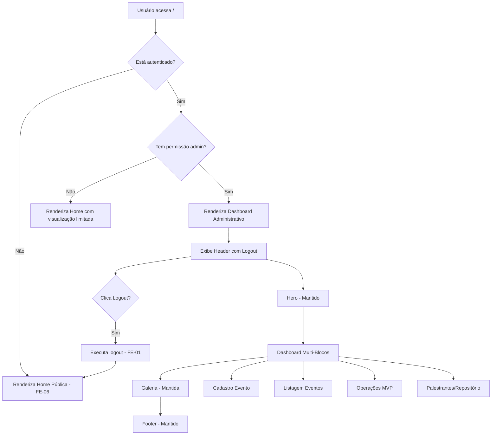
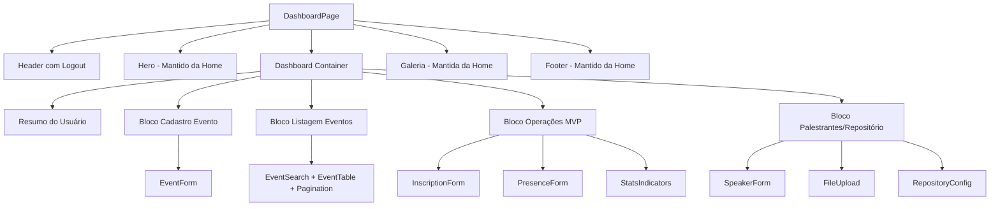

# [FEATURE]: Frontend — Dashboard Administrativo (Painel Interno)

## Template Utilizado

- .github/ISSUE_TEMPLATE/01-feature-request.yml

## Prioridade

- P1 - Alta (importante)

## Módulo

- Admin/Dashboard

## Epic / Fase do Roadmap

- Fase 2: Gestão - Admin e Relatórios

## História de Usuário

Como administrador ou operador autenticado
Eu quero acessar um dashboard administrativo centralizado na página inicial
Para que eu possa gerenciar eventos, inscrições, presenças, palestrantes e repositórios em um único local.

## Descrição Detalhada

Implementar o **Dashboard Administrativo (Painel Interno)** conforme especificação da seção 9.3 do documento `docs/DEFINICAO_LAYOUTS_PAGINAS.md`, que substitui o card de login na página inicial quando o usuário está autenticado.

### Escopo de Implementação

#### Contexto de Exibição (Seção 5.2)

A página inicial (`/`) exibe diferentes conteúdos baseados no estado de autenticação:

- **Não autenticado**: Home pública (FE-06) com card de login
- **Autenticado**: Home com Dashboard Administrativo (esta issue)

**Shell visual compartilhado:**

- Header (com contexto do usuário + logout)
- Hero do evento (mantido)
- **[MUDANÇA]** Card de login → Dashboard Administrativo
- Galeria de eventos (mantida)
- Footer (mantido)

#### Componentes do Dashboard (Seção 5.2 e 9.3)

O Dashboard é um painel extenso e multi-funcional com 6 blocos principais:

### 1. Cabeçalho do Painel

- Título contextual: "Painel Administrativo" ou "Dashboard"
- Ação de logout destacada (botão ou link)
- Breadcrumb ou indicador de contexto

### 2. Resumo do Usuário Autenticado

- **Nome completo** do usuário logado
- **Perfil/Papel**: Administrador, Operador, Palestrante, etc.
- **E-mail** do usuário
- Avatar/foto (opcional)
- Badge de status (ativo, pendente, etc.)

### 3. Formulário de Cadastro de Evento (MVP)

**Seção:** "Cadastrar Novo Evento"

**Campos:**

- Nome do evento (input text)
- Descrição (textarea)
- Data e hora de início (datetime-local)
- Data e hora de fim (datetime-local)
- Local (input text ou endereço completo)
- Período de inscrição:
  - Data de início de inscrições (date)
  - Data de fim de inscrições (date)
- URLs de identidade visual (CA17):
  - URL da imagem para header da aplicação (input url)
  - URL da imagem para cabeçalho do certificado (input url)
- Categoria (select: Conferência, Workshop, Seminário, etc.)
- Preço (input number ou "Gratuito")

**Botões:**

- "Salvar Evento" (primary button)
- "Limpar" (secondary/ghost button)

**Estados:**

- Salvando: botão com indicador de progresso ("Salvando...")
- Sucesso: toast de confirmação + limpa formulário
- Erro: mensagem de erro abaixo do formulário ou toast

### 4. Filtro + Listagem Paginada de Eventos

**Seção:** "Gerenciar Eventos"

**Filtro/Busca:**

- Campo de busca: título ou local (debounce 300ms)
- Botão "Buscar"

**Listagem:**

- Tabela ou lista de cards com eventos cadastrados
- Colunas/Campos:
  - Nome do evento
  - Data (início)
  - Local
  - Status (Aberto/Encerrado/Em breve)
  - Ações: Editar (ícone/botão), Remover (ícone/botão com confirmação)
- Paginação: 10 eventos por página

**Estados:**

- Sem eventos: "Nenhum evento cadastrado ainda. Cadastre o primeiro acima!"
- Carregando: skeleton da tabela/lista
- Erro de API: mensagem de erro com botão "Tentar novamente"

**Ações:**

- **Editar**: abre modal ou navega para página de edição (pode pré-popular formulário acima)
- **Remover**: modal de confirmação "Tem certeza?" → executa exclusão

### 5. Painel Operacional MVP

**Seção:** "Operações de Evento"

**Sub-blocos:**

#### 5a. Formulário de Inscrição

- Seletor de evento (dropdown)
- Campo para CPF ou ID do usuário
- Opção: "Inscrever em todas as atividades" (checkbox)
- Se desmarcado: lista de atividades com checkboxes individuais
- Botão "Registrar Inscrição"
- Feedback: toast de sucesso/erro

#### 5b. Formulário de Presença

- Seletor de evento (dropdown)
- Campo para CPF ou ID do usuário
- Opção: "Registrar presença no evento" (checkbox)
- Opção: "Registrar presença em atividades específicas" (checkbox)
- Se segunda opção marcada: lista de atividades com checkboxes
- Botão "Registrar Presença"
- Feedback: toast de sucesso/erro

#### 5c. Indicadores Resumidos

Cards ou badges com contadores:

- **Total de Inscrições**: número agregado
- **Total de Presenças**: número agregado
- **Elegíveis para Certificado**: número agregado (inscritos com presença confirmada)
- Atualização em tempo real ou ao recarregar

### 6. Painel de Palestrantes e Repositório MVP

**Seção:** "Palestrantes e Repositório de Arquivos"

**Sub-blocos:**

#### 6a. Cadastro de Palestrante

- Nome completo (input text)
- E-mail (input email)
- Biografia curta (textarea)
- Redes sociais (inputs opcionais)
- Foto de perfil (upload de imagem ou URL)
- Botão "Cadastrar Palestrante"
- Listagem simples de palestrantes cadastrados (tabela ou lista)

#### 6b. Validação de Upload (MVP)

- Seletor de palestrante (dropdown)
- Upload de arquivo de apresentação (input file)
- Validação: tipo de arquivo (PDF, PPT, etc.) e tamanho máximo
- Preview do arquivo selecionado
- Botão "Enviar Apresentação"
- Feedback: barra de progresso + toast de sucesso/erro
- Listagem de arquivos enviados com links de download

#### 6c. Configuração/Teste de Conexão de Repositório

- Seletor de tipo de repositório (radio buttons): Local, Google Drive, AWS S3
- Campos condicionais de credenciais (dependendo da seleção):
  - Local: caminho do diretório
  - Google Drive: Client ID, Secret, API Key
  - AWS S3: Access Key, Secret Key, Bucket, Região
- Botão "Testar Conexão" (CA10):
  - Executa validação de credenciais
  - Feedback: ícone de sucesso/erro + mensagem
- Botão "Salvar Configuração"
- Indicador de repositório ativo: badge "Repositório Ativo: [tipo]"

### Comportamentos de Estado (Seção 5.2)

- **Salvando evento**: botão principal com estado de progresso (spinner + texto "Salvando...")
- **Sem eventos**: mensagem informativa no bloco de listagem (ícone + texto motivacional)
- **Erros de API**: mensagem textual clara no bloco afetado (ex: "Erro ao carregar eventos. Tente novamente.")
- **Sucesso em ações**: toasts de feedback positivo (ex: "Evento cadastrado com sucesso!")

### Fluxo de Autenticação e Acesso



### Integração com Design System (FE-05)

Componentes necessários:

- `Header` com dropdown de usuário
- `Container` (padding responsivo)
- `Button` (primary, secondary, ghost, danger variants)
- `Input`, `Textarea`, `Select`, `Checkbox`, `Radio`
- `Card`/`Panel` para blocos do dashboard
- `Table` para listagens
- `Badge` para status e indicadores
- `Toast` para feedback de ações
- `Modal` para confirmações
- `LoadingState` (skeleton, spinner)
- `FileUpload` para upload de imagens/arquivos
- `Pagination` para listas
- Tokens de cor, espaçamento e tipografia

## Guia Visual Obrigatório

Esta issue **DEVE** ser implementada seguindo os mockups visuais definidos em:

- **Arquivo de referência principal**: [docs/images/dashboard.png](docs/DEFINICAO_LAYOUTS_PAGINAS.md#93-página-inicial-com-painel-interno--autenticado)
- **Referências adicionais**:
  - `docs/images/eventos.png` (Cadastro/Edição de Evento — Seção 9.6)
  - `docs/images/palestrantes.png` (Cadastro de Palestrantes — Seção 9.7)
  - `docs/images/uploadarquivos.png` (Configuração de Repositório — Seção 9.8)
- **Seção do documento**: `docs/DEFINICAO_LAYOUTS_PAGINAS.md` — Seções 5.2 e 9.3 (Dashboard Administrativo)
- **Design System**: `docs/images/DesignSystem.png` (Seção 10)

Qualquer implementação que desviar da estrutura visual definida nos mockups **DEVE** ser:

1. Explicitamente documentada como exceção
2. Validada e aprovada pelo **UX Expert** antes de aceitar a issue
3. Incluir justificativa técnica ou de negócio para o desvio

## Critérios de Aceitação

### Obrigatoriedade de Conformidade Visual

> **⚠️ VINCULANTE:** Toda a implementação **DEVE** seguir rigorosamente o mockup visual `docs/images/dashboard.png` conforme especificado nas Seções 5.2 e 9.3 de `docs/DEFINICAO_LAYOUTS_PAGINAS.md`. Todas as 6 seções do dashboard devem seguir a estrutura e ordem definida no mockup.

### CA00 - Conformidade Visual do Dashboard

- [ ] **[VISUAL]** Dashboard segue exatamente o layout do mockup `docs/images/dashboard.png`.
- [ ] **[VISUAL]** Os 6 blocos principais estão presentes e ordenados conforme Seção 9.3:
  - Cabeçalho do Painel
  - Resumo do Usuário Autenticado
  - Formulário de Cadastro de Evento
  - Filtro + Listagem Paginada de Eventos
  - Painel Operacional (Inscrição/Presença)
  - Painel de Palestrantes e Repositório
- [ ] **[VISUAL]** Estrutura visual corresponde ao mockup (cores, espaçamento, componentes)

### CA01 - Controle de Acesso e Autenticação

- [ ] Dashboard só é exibido para usuários autenticados
- [ ] Não autenticados são redirecionados para `/auth`
- [ ] Permissões de perfil são respeitadas (admin vs. operador vs. palestrante)
- [ ] Redirecionamento automático após login leva ao dashboard

### CA02 - Cabeçalho do Painel

- [ ] Título "Painel Administrativo" ou similar exibido
- [ ] Botão/link de logout visível e funcional
- [ ] Logout executa limpeza de sessão e redireciona para home pública
- [ ] Header mantém branding da aplicação

### CA03 - Resumo do Usuário Autenticado

- [ ] Nome completo do usuário exibido
- [ ] Perfil/papel exibido (badge visual)
- [ ] E-mail do usuário exibido
- [ ] Avatar/foto (se disponível) exibido
- [ ] Design claro e acessível

### CA04 - Formulário de Cadastro de Evento

- [ ] Todos os campos especificados implementados
- [ ] Validação de campos obrigatórios (nome, datas, local)
- [ ] Validação de formato de datas (início < fim)
- [ ] Validação de URLs de imagens (formato válido)
- [ ] Botão "Salvar Evento" executa criação via API
- [ ] **Estado Salvando**: botão desabilitado com spinner + texto "Salvando..."
- [ ] **Sucesso**: toast "Evento cadastrado com sucesso!" + limpa formulário
- [ ] **Erro**: mensagem de erro clara (abaixo do form ou toast)
- [ ] Botão "Limpar" reseta todos os campos

### CA05 - Filtro + Listagem de Eventos

- [ ] Campo de busca por título/local implementado (debounce 300ms)
- [ ] Listagem exibe eventos cadastrados (tabela ou cards)
- [ ] Colunas: nome, data, local, status, ações
- [ ] Ação "Editar" funcional (modal ou navegação)
- [ ] Ação "Remover" com modal de confirmação
- [ ] Paginação de 10 eventos por página
- [ ] **Sem eventos**: mensagem motivacional clara
- [ ] **Carregando**: skeleton da listagem
- [ ] **Erro**: mensagem + botão "Tentar novamente"

### CA06 - Painel Operacional: Inscrição

- [ ] Seletor de evento implementado (dropdown)
- [ ] Campo para CPF/ID do usuário
- [ ] Checkbox "Inscrever em todas as atividades"
- [ ] Lista de atividades individuais aparece se desmarcado
- [ ] Botão "Registrar Inscrição" executa API call
- [ ] Toast de sucesso/erro após ação
- [ ] Validação de dados antes de enviar

### CA07 - Painel Operacional: Presença

- [ ] Seletor de evento implementado
- [ ] Campo para CPF/ID do usuário
- [ ] Checkboxes para presença no evento/atividades
- [ ] Botão "Registrar Presença" funcional
- [ ] Toast de feedback após ação
- [ ] Validação de dados

### CA08 - Painel Operacional: Indicadores

- [ ] Cards/badges exibem contadores:
  - Total de Inscrições
  - Total de Presenças
  - Elegíveis para Certificado
- [ ] Números atualizados após ações de inscrição/presença
- [ ] Design visual claro (ícones + números destacados)

### CA09 - Painel Palestrantes: Cadastro

- [ ] Formulário de cadastro de palestrante implementado
- [ ] Campos: nome, e-mail, bio, redes sociais, foto
- [ ] Upload ou URL de foto funcional
- [ ] Botão "Cadastrar Palestrante" executa API call
- [ ] Listagem de palestrantes cadastrados
- [ ] Toast de sucesso/erro

### CA10 - Painel Palestrantes: Upload de Apresentações

- [ ] Seletor de palestrante (dropdown)
- [ ] Input de upload de arquivo implementado
- [ ] Validação de tipo (PDF, PPT, PPTX, etc.) e tamanho máximo
- [ ] Preview do arquivo selecionado
- [ ] Botão "Enviar Apresentação" com barra de progresso
- [ ] Toast de sucesso/erro após upload
- [ ] Listagem de arquivos enviados com links de download

### CA11 - Painel Repositório: Configuração

- [ ] Seletor de tipo de repositório (Local, Google Drive, AWS S3)
- [ ] Campos condicionais de credenciais exibidos conforme seleção
- [ ] Botão "Testar Conexão" valida credenciais (CA10)
- [ ] Feedback visual de teste (ícone + mensagem)
- [ ] Botão "Salvar Configuração" persiste configuração
- [ ] Indicador de repositório ativo visível (badge)
- [ ] **Atenção:** não expor credenciais em logs ou UI após salvar

### CA12 - Responsividade do Dashboard

- [ ] Dashboard testado em desktop (1024px+)
- [ ] Dashboard testado em tablet (768px - 1023px)
- [ ] Dashboard testado em mobile (320px - 767px)
- [ ] Blocos empilham em coluna única em mobile
- [ ] Formulários e tabelas adaptam para mobile
- [ ] Navegação e interação funcionam em touch

### CA13 - Estados de Loading e Erro

- [ ] Loading states em todas as operações assíncronas
- [ ] Skeleton screens em listagens
- [ ] Spinners em botões durante ações
- [ ] Mensagens de erro claras e acionáveis
- [ ] Opção de retry em erros de API

### CA14 - Integração de Dados

- [ ] Cadastro de evento: `POST /api/events`
- [ ] Listagem de eventos: `GET /api/events?page=&search=`
- [ ] Edição de evento: `PUT /api/events/:id`
- [ ] Exclusão de evento: `DELETE /api/events/:id`
- [ ] Inscrição: `POST /api/inscriptions`
- [ ] Presença: `POST /api/presences`
- [ ] Indicadores: `GET /api/stats` ou agregação local
- [ ] Cadastro de palestrante: `POST /api/speakers`
- [ ] Upload de arquivo: `POST /api/files/upload`
- [ ] Config repositório: `POST /api/repository/config`, `GET /api/repository/test`

### CA15 - Acessibilidade

- [ ] Navegação via teclado funcional em todos os formulários
- [ ] Estados de foco visíveis
- [ ] Labels associados a inputs (for/id)
- [ ] Atributos ARIA em componentes complexos
- [ ] Contraste de cores validado (WCAG 2.1 AA)
- [ ] Mensagens de erro associadas a campos (aria-describedby)

### CA16 - Gate UX Obrigatório

- [ ] **Design validado e aprovado pelo UX Expert**
- [ ] Feedback de UX integrado
- [ ] Alinhamento com mockup `docs/images/dashboard.png`
- [ ] Princípios de design (clareza, eficiência, consistência) aplicados

## Notas Técnicas

### Stack Técnico

- React + TypeScript
- React Router (proteção de rotas)
- Custom hooks: `useEventForm`, `useEventList`, `useInscription`, `usePresence`, `useSpeaker`, `useRepository`
- Service layer: `EventService`, `InscriptionService`, `PresenceService`, `SpeakerService`, `RepositoryService`
- State management: Context API para dados do dashboard
- Design System (FE-05)

### Estrutura de Arquivos Sugerida

```
src/presentation/
├── pages/
│   ├── Dashboard/
│   │   ├── DashboardPage.tsx
│   │   ├── DashboardPage.module.css
│   │   ├── components/
│   │   │   ├── UserSummary.tsx
│   │   │   ├── EventForm.tsx
│   │   │   ├── EventList.tsx
│   │   │   ├── OperationsPanel.tsx
│   │   │   │   ├── InscriptionForm.tsx
│   │   │   │   ├── PresenceForm.tsx
│   │   │   │   └── StatsIndicators.tsx
│   │   │   └── SpeakerRepositoryPanel.tsx
│   │   │       ├── SpeakerForm.tsx
│   │   │       ├── FileUpload.tsx
│   │   │       └── RepositoryConfig.tsx
├── hooks/
│   ├── useEventForm.ts
│   ├── useEventList.ts
│   ├── useInscription.ts
│   ├── usePresence.ts
│   ├── useSpeaker.ts
│   ├── useRepository.ts
│   └── useAuth.ts (proteção de rotas)
```

### Proteção de Rotas

```typescript
// ProtectedRoute.tsx
import { Navigate } from 'react-router-dom';
import { useAuth } from '@/hooks/useAuth';

export function ProtectedRoute({ children, requiredRole }) {
  const { user, isLoading } = useAuth();

  if (isLoading) return <LoadingState />;

  if (!user) return <Navigate to="/auth" replace />;

  if (requiredRole && user.role !== requiredRole) {
    return <Navigate to="/" replace />;
  }

  return children;
}
```

### Boas Práticas

- Validação de formulários com biblioteca (react-hook-form, formik)
- Debounce em buscas (300ms)
- Confirmação antes de ações destrutivas (exclusão)
- Não expor credenciais de repositórios em UI ou logs
- Feedback imediato em todas as ações
- Auto-save opcional em formulários longos (draft)
- Toast notifications para feedback não-bloqueante

### Integração com Backend

Ver CA14 para endpoints necessários. Todos devem incluir autenticação via JWT.

### Considerações de Segurança

- Validação de permissões no backend (não apenas no frontend)
- Campos de credenciais de repositório: mascarados após salvar
- CSRF protection em formulários (se aplicável)
- Rate limiting em ações sensíveis (backend)
- Sanitização de inputs antes de enviar

### Performance

- Lazy loading de blocos pesados do dashboard
- Paginação em todas as listagens
- Debounce em buscas
- Cache de listas (invalidação após mutações)
- Otimização de re-renders (React.memo, useMemo, useCallback)

### Exemplo de Hook de Evento

```typescript
// useEventForm.ts
import { useState } from "react";
import { useEventService } from "@/hooks/useEventService";
import { toast } from "@/components/Toast";

export function useEventForm() {
  const [isSubmitting, setIsSubmitting] = useState(false);
  const eventService = useEventService();

  const submitEvent = async (eventData) => {
    setIsSubmitting(true);
    try {
      await eventService.create(eventData);
      toast.success("Evento cadastrado com sucesso!");
      return { success: true };
    } catch (error) {
      toast.error("Erro ao cadastrar evento. Tente novamente.");
      return { success: false, error };
    } finally {
      setIsSubmitting(false);
    }
  };

  return { submitEvent, isSubmitting };
}
```

## Mockups / Diagramas

### Referências Visuais

- **Mockup principal**: `docs/images/dashboard.png` (Seção 9.3)
- **Especificação completa**: `docs/DEFINICAO_LAYOUTS_PAGINAS.md` (Seções 5.2, 9.3)
- **Design System**: `docs/images/DesignSystem.png`

### Arquitetura do Dashboard



## Estimativa de Esforço

- **XXL (2+ semanas)** — Dashboard complexo com múltiplos sub-sistemas

### Breakdown de Tempo

- Dia 1-2: Setup de layout e proteção de rotas + Resumo do usuário
- Dia 3-4: Formulário de cadastro de evento + validações
- Dia 5-6: Listagem de eventos + filtros + paginação + ações
- Dia 7-8: Painel operacional (inscrição + presença + indicadores)
- Dia 9-10: Painel palestrantes (cadastro + upload)
- Dia 11-12: Configuração de repositório + teste de conexão
- Dia 13: Responsividade + Estados + Loading
- Dia 14: Testes + Acessibilidade
- Dia 15: Gate UX + Ajustes + Documentação

## Requisitos Relacionados

### Requisitos Funcionais

- [x] **RF-001 a RF-013**: Gestão de eventos, programação, inscrições, presenças, certificados
- [x] **RF-008**: Cadastro de palestrantes
- [x] **RF-010**: Upload de apresentações
- [x] **RF-012**: Configuração de repositório

### Requisitos Não Funcionais

- [x] **RNF-001**: Usabilidade - Interface administrativa eficiente
- [x] **RNF-002**: Acessibilidade - WCAG 2.1 AA
- [x] **RNF-003**: Responsividade
- [x] **RNF-005**: Segurança - Controle de acesso por perfil
- [x] **RNF-010**: Manutenibilidade - Código organizado por blocos

## Referências

### Documentação do Projeto

- `docs/DEFINICAO_LAYOUTS_PAGINAS.md` (Seções 5.2, 9.3)
- `docs/DECLARACAO_ESCOPO.md`

### Imagens de Referência

- `docs/images/dashboard.png` — Mockup do dashboard administrativo
- `docs/images/eventos.png` — Referência adicional de cadastro
- `docs/images/palestrantes.png` — Referência de cadastro de palestrantes
- `docs/images/uploadarquivos.png` — Referência de config de repositório
- `docs/images/DesignSystem.png` — Design System

### Casos de Uso Relacionados

- `docs/case/UC-004-crud-eventos.md`
- `docs/case/UC-007-inscricao-evento-atividades.md`
- `docs/case/UC-008-registro-presenca.md`
- `docs/case/UC-012-cadastro-palestrante.md`
- `docs/case/UC-013-upload-apresentacoes.md`
- `docs/case/UC-014-configurar-repositorio-arquivos.md`

## Dependências e Bloqueios

### Esta Issue Depende De

- **FE-05**: Design System (todos os componentes base: Button, Input, Textarea, Select, Card, Table, Toast, Modal, FileUpload, Badge, Pagination, Loading)
- **FE-01**: Autenticação (controle de sessão e logout)
- **FE-06**: Página inicial (shell visual compartilhado)
- **BE-01**: Backend OAuth (autenticação)
- **BE-02**: Backend Eventos (CRUD de eventos)
- **BE-03**: Backend Inscrições/Presenças (operações MVP)
- **BE-04**: Backend Palestrantes/Repositório

### Esta Issue Bloqueia

- Gestão operacional completa da plataforma
- Administração de eventos end-to-end

### Relação com Outras Issues

- **FE-02**: Compartilha formulário de evento e listagem
- **FE-03**: Compartilha operações de inscrição e presença
- **FE-04**: Compartilha gestão de palestrantes e repositório

## Checklist do Solicitante

- [x] Verifiquei que esta funcionalidade não está duplicada em outra issue
- [x] Consultei a documentação do projeto em `/docs`
- [x] Esta funcionalidade está alinhada com o roadmap do projeto
- [x] Identifiquei claramente as dependências e bloqueios
- [x] Esta issue tem revisão UX obrigatória (Gate de UX)

## Checklist de Revisão UX (a ser preenchido pelo UX Expert)

- [ ] Dashboard segue mockup `docs/images/dashboard.png`
- [ ] Layout dos 6 blocos é claro e escaneável
- [ ] Formulários são eficientes e sem fricção
- [ ] Feedback de ações é imediato e claro
- [ ] Estados de loading e erro são compreensíveis
- [ ] Responsividade preserva usabilidade em todos os dispositivos
- [ ] Navegação entre blocos é intuitiva
- [ ] Acessibilidade garante inclusão
- [ ] Aprovação final para implementação

---

**Nota:** Este dashboard é o **centro de controle da plataforma**, consolidando gestão de eventos, operações, palestrantes e configurações em um único local acessível. A experiência administrativa deve ser eficiente e sem fricção para garantir produtividade.
