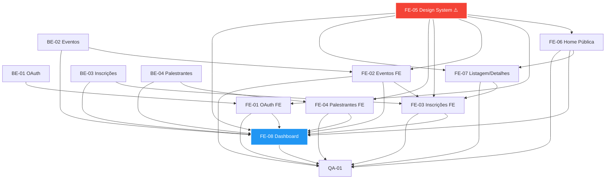

# Plano de Precedência das Issues

Data base de início: **01/03/2026**

## Ordem proposta (com dependências)

| Ordem | Issue                                             | Início planejado | Duração         | Dependências                         |
| ----: | ------------------------------------------------- | ---------------- | --------------- | ------------------------------------ |
|     1 | BE-01 — OAuth backend                             | 01/03/2026       | 3 dias          | —                                    |
|     2 | **FE-05 — Design System** ⚠️                      | **01/03/2026**   | **3-4 semanas** | — (fundacional)                      |
|     3 | BE-02 — Eventos/programação backend               | 08/03/2026       | 1 semana        | BE-01                                |
|     4 | BE-04 — Palestrantes/upload/repositório backend   | 13/03/2026       | 1 semana        | BE-01                                |
|     5 | BE-03 — Inscrições/presença/certificação backend  | 19/03/2026       | 1 semana        | BE-02                                |
|     6 | FE-06 — Página Inicial Pública                    | 25/03/2026       | 1 semana        | **FE-05**                            |
|     7 | FE-01 — OAuth frontend                            | 25/03/2026       | 1-2 semanas     | BE-01, **FE-05**                     |
|     8 | FE-02 — Eventos/programação frontend              | 01/04/2026       | 1-2 semanas     | BE-02, **FE-05**                     |
|     9 | FE-07 — Listagem e Detalhes de Eventos            | 01/04/2026       | 1-2 semanas     | **FE-05**, FE-06                     |
|    10 | FE-04 — Palestrantes/upload/repositório frontend  | 08/04/2026       | 2+ semanas      | BE-04, **FE-05**                     |
|    11 | FE-03 — Inscrições/presença/certificação frontend | 15/04/2026       | 2+ semanas      | BE-03, FE-02, FE-07, **FE-05**       |
|    12 | FE-08 — Dashboard Administrativo                  | 22/04/2026       | 2+ semanas      | **FE-05**, FE-01, FE-06, BE-02/03/04 |
|    13 | QA-01 — Cobertura de testes                       | 06/05/2026       | 1 semana        | Todas as anteriores                  |

## Mapeamento Completo de Telas

Esta seção mapeia todas as telas especificadas em `docs/DEFINICAO_LAYOUTS_PAGINAS.md` para suas respectivas issues:

| Seção | Tela/Layout                                     | Issue(s) Responsável(is) | Status     |
| ----- | ----------------------------------------------- | ------------------------ | ---------- |
| 9.1   | Página Inicial Pública (não autenticado)        | **FE-06**                | ✅ Mapeada |
| 9.2   | Página de Acesso (login/cadastro/OAuth)         | **FE-01**                | ✅ Mapeada |
| 9.3   | Página Inicial com Painel Interno (autenticado) | **FE-08**                | ✅ Mapeada |
| 9.4   | Página de Listagem de Eventos                   | **FE-07**                | ✅ Mapeada |
| 9.5   | Página de Detalhes do Evento (participante)     | **FE-07**                | ✅ Mapeada |
| 9.6   | Página de Cadastro/Edição de Evento             | **FE-02**                | ✅ Mapeada |
| 9.7   | Página de Cadastro/Edição de Palestrante        | **FE-04**                | ✅ Mapeada |
| 9.8   | Página de Configuração de Repositório           | **FE-04**                | ✅ Mapeada |
| 10    | Design System da Plataforma                     | **FE-05**                | ✅ Mapeada |

**Total: 8 issues de frontend cobrindo 9 telas + Design System**

## Observações Críticas

### ⚠️ Design System como Fundação (FE-05)

- **FE-05 é P0 CRÍTICA e BLOQUEANTE** para todas as issues de frontend.
- Deve iniciar **imediatamente em paralelo** com BE-01, pois não depende de backend.
- Duração: 3-4 semanas (XXL) — período crítico de desenvolvimento.
- **Todas as issues FE (FE-01, FE-02, FE-03, FE-04, FE-06, FE-07, FE-08) só podem iniciar após conclusão da FE-05**.

### 🚀 Nova Estratégia de Paralelização Frontend

Com a expansão das issues de frontend para cobrir todas as telas, a estratégia é:

**Fase 1: Fundação (Semanas 1-4)**

- Backend avança em paralelo (BE-01 → BE-02 → BE-03/BE-04)
- Design System (FE-05) é desenvolvido independentemente

**Fase 2: Páginas Públicas e Autenticação (Semanas 5-6)**

- **FE-06** (Página Inicial Pública) + **FE-01** (OAuth) iniciam em paralelo
- Ambas dependem apenas de FE-05, sem dependências entre si
- FE-06 é porta de entrada; FE-01 é fluxo de conversão crítico

**Fase 3: Gestão e Exploração (Semanas 6-8)**

- **FE-02** (CRUD Eventos) + **FE-07** (Listagem/Detalhes) iniciam em paralelo
- FE-07 depende de FE-06 para navegação
- **FE-04** (Palestrantes/Repositório) inicia após FE-02

**Fase 4: Operações e Dashboard (Semanas 8-10)**

- **FE-03** (Inscrições/Presenças/Certificados) depende de FE-02 e FE-07
- **FE-08** (Dashboard Administrativo) consolida todas as funcionalidades
- FE-08 é a issue mais complexa, integrando FE-01, FE-02, FE-03, FE-04

**Fase 5: QA (Semana 11)**

- Cobertura de testes completa após todas as features

### Estratégia de Paralelização Backend

- BE-01, BE-02, BE-03 e BE-04 podem avançar em paralelo parcial enquanto FE-05 está em desenvolvimento.
- Isso otimiza o tempo total do projeto, permitindo que o backend esteja pronto quando o Design System for concluído.

### Cronograma Otimizado Atualizado

```
Semana 1 (01-07/03):    BE-01 + FE-05 iniciam em paralelo
Semana 2 (08-14/03):    BE-02, BE-04 + FE-05 continua
Semana 3 (15-21/03):    BE-03 + FE-05 continua
Semana 4 (22-28/03):    FE-05 finaliza | Gate UX de aprovação
Semana 5 (29/03-04/04): FE-06 (Home Pública) + FE-01 (OAuth) iniciam
Semana 6 (05-11/04):    FE-02 (Eventos) + FE-07 (Listagem/Detalhes) iniciam
Semana 7 (12-18/04):    FE-04 (Palestrantes) inicia
Semana 8-9 (19/04-02/05): FE-03 (Inscrições) + FE-08 (Dashboard) em paralelo
Semana 10 (03-09/05):   Finalizações e integrações
Semana 11 (10-16/05):   QA-01 cobertura completa
```

**Duração total estimada: ~11 semanas (2,5 meses)**

### Dependências Detalhadas

#### Issues de Backend (não mudaram)

- **BE-01** → FE-01, FE-08
- **BE-02** → FE-02, FE-08
- **BE-03** → FE-03, FE-08
- **BE-04** → FE-04, FE-08

#### Issues de Frontend (expandidas)

- **FE-05** (Design System) → **BLOQUEIA TODAS** as demais FE
- **FE-06** (Home Pública) → FE-07, FE-08 (navegação e shell visual)
- **FE-01** (OAuth) → FE-08 (autenticação)
- **FE-02** (Eventos) → FE-03, FE-08 (eventos devem existir antes de inscrições)
- **FE-04** (Palestrantes) → FE-08
- **FE-07** (Listagem/Detalhes) → FE-03 (contexto de inscrição)
- **FE-03** (Inscrições) → FE-08
- **FE-08** (Dashboard) → Consolidação final (não bloqueia outras)

#### Fluxo de Dependências Visualizado



### Riscos e Mitigações

- **Risco:** Atraso na FE-05 impacta todo o roadmap de frontend.
  - **Mitigação:** Priorizar recursos experientes em UI/UX, validação UX contínua, entrega incremental de componentes.
- **Risco:** Retrabalho se DS não for bem planejado.
  - **Mitigação:** Gate UX obrigatório, documentação clara, Storybook para validação visual.
- **Risco:** FE-08 (Dashboard) é complexa e consolida muitas funcionalidades.
  - **Mitigação:** Implementação incremental por bloco, testes contínuos, validação UX por seção.
- **Risco:** Dependências cruzadas entre FE-03, FE-07 e FE-08 podem causar bloqueios.
  - **Mitigação:** Definir contratos de interface claamente, mocks para desenvolvimento paralelo.
