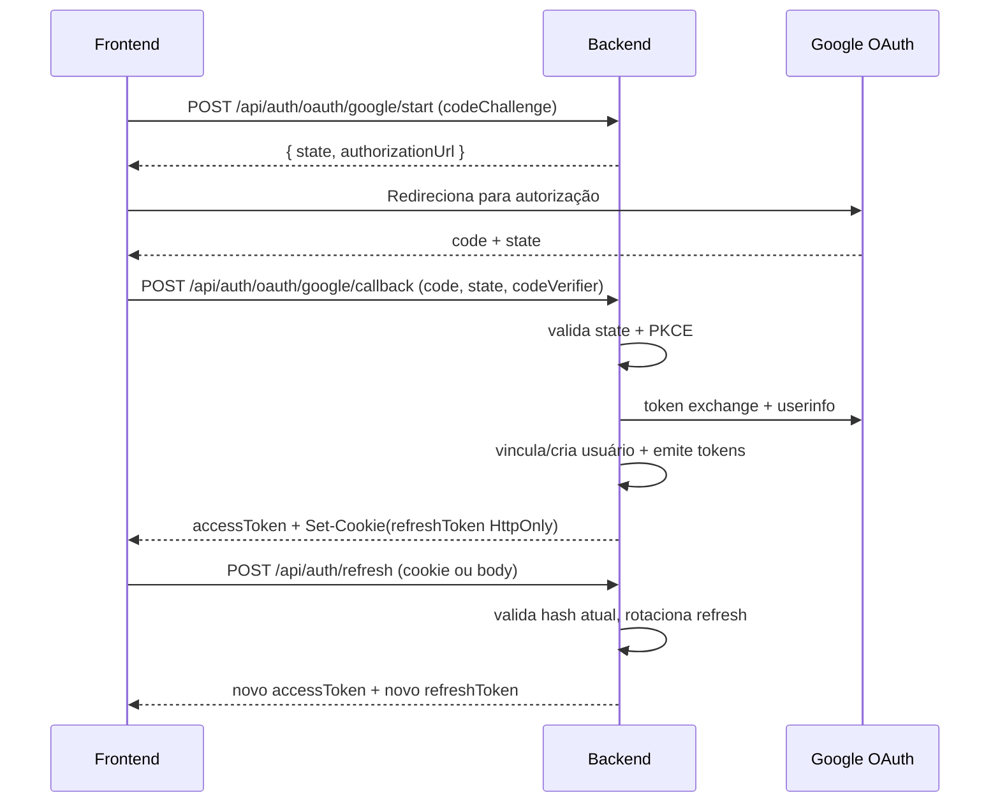

# Review — OAuth backend MVP (Issue #8)

## Contexto e objetivo
Implementar a base do fluxo OAuth 2.0 Authorization Code + PKCE no backend, com vínculo de identidade federada, rotação de refresh token e detecção de reuso, preservando compatibilidade com o fluxo legado de autenticação.

## Escopo técnico e arquivos modificados
### Backend (server)
- `server/src/domain/entities/UserEntity.ts`
- `server/src/domain/repositories/UserRepository.ts`
- `server/src/infrastructure/mappers/UserMapper.ts`
- `server/src/infrastructure/repositories/GoogleSheetsUserRepository.ts`
- `server/src/infrastructure/auth/JwtService.ts`
- `server/src/infrastructure/auth/TokenHashService.ts` (novo)
- `server/src/infrastructure/auth/OAuthStateStore.ts` (novo)
- `server/src/infrastructure/auth/providers/OAuthProviderClient.ts` (novo)
- `server/src/infrastructure/auth/providers/OAuthProviderRegistry.ts` (novo)
- `server/src/infrastructure/auth/providers/GoogleOAuthProviderClient.ts` (novo)
- `server/src/application/dtos/AuthDtos.ts`
- `server/src/application/usecases/auth/LoginUseCase.ts`
- `server/src/application/usecases/auth/RefreshTokenUseCase.ts`
- `server/src/application/usecases/auth/ListOAuthProvidersUseCase.ts` (novo)
- `server/src/application/usecases/auth/StartOAuthAuthorizationUseCase.ts` (novo)
- `server/src/application/usecases/auth/OAuthCallbackUseCase.ts` (novo)
- `server/src/presentation/http/controllers/AuthController.ts`
- `server/src/presentation/http/routes/authRoutes.ts`
- `server/src/container/index.ts`
- `server/src/config/environment.ts`
- `server/src/config/swagger.ts`
- `server/src/app.ts`
- `server/.env.example`

### Testes
- `server/tests-cypress/stubs/UserRepositoryStub.ts`
- `server/tests-cypress/specs/auth/RefreshTokenUseCase.spec.ts` (novo)
- `server/tests-cypress/specs/auth/StartOAuthAuthorizationUseCase.spec.ts` (novo)
- `server/tests-cypress/usecases.cy.ts`

## ADR resumido
### Decisão
Adotar MVP OAuth com provedor Google (arquitetura extensível), PKCE validado por `code_challenge`/`code_verifier` com `state` efêmero no backend e sessão baseada em refresh token rotativo com hash persistido no usuário.

### Alternativas consideradas
1. **Manter JWT stateless puro**: rejeitado por não suportar detecção de reuso.
2. **Implementar todos os provedores de uma vez**: rejeitado no MVP por risco e tamanho de mudança.
3. **Persistir transação OAuth em storage externo**: adiado; adotado store em memória para primeira entrega.

### Trade-offs
- **Prós:** entrega incremental, melhora imediata de segurança (rotação + reuse detection), baixa invasividade.
- **Contras:** `OAuthStateStore` em memória não sobrevive restart/múltiplas instâncias; revogação por reuso aplicada no escopo do token armazenado no usuário.

## Fluxo implementado

## Evidências de validação
### Build/type-check/lint
- `cd server && npx tsc --noEmit -p tsconfig.json` ✅
- `cd . && npm run -s lint` ✅ (com warnings preexistentes em `server/coverage/lcov-report/*`)

### Testes de auth
- `cd server && npx tsx -e "...auth-specs..."` ✅ (`auth-specs-ok`)

### Limitações de ambiente observadas
- `cd server && npm test -- --spec tests-cypress/usecases.cy.ts` ❌ `xvfb-run: not found`
- `cd server && npx cypress run ...` ❌ Cypress binary não instalado no cache local
- `npm run -s build` (raiz) ❌ permissão negada em `dist/` (EACCES preexistente)

## Riscos, impacto e rollback
### Riscos
- Store de `state` em memória: perda de contexto após restart.
- Dependência de configuração correta de OAuth Google no ambiente.
- Migração de range/headers `users` para esquema estendido precisa consistência em ambiente.

### Impacto
- Novos endpoints de auth OAuth.
- `refresh` agora aceita token por cookie e mantém compatibilidade por body.
- Persistência de hash de refresh em usuário para rotação/reuso.

### Rollback
1. Remover uso das rotas `/auth/oauth/*` (desativar config OAuth).
2. Reverter injeções no container para usar apenas login/refresh legados.
3. Restaurar mapeamento anterior de `users` (A:G) se necessário.

## Próximos passos recomendados
1. Persistir transações OAuth (`state`) em repositório durável (sheet dedicado).
2. Expandir providers (Microsoft/GitHub) reaproveitando `OAuthProviderRegistry`.
3. Adicionar testes de callback OAuth e integração HTTP.
4. Refinar política de revogação por reuso para família de sessões.
5. Validar UX Expert apenas quando houver mudanças de fluxo UI (não houve alteração de UI nesta entrega).
