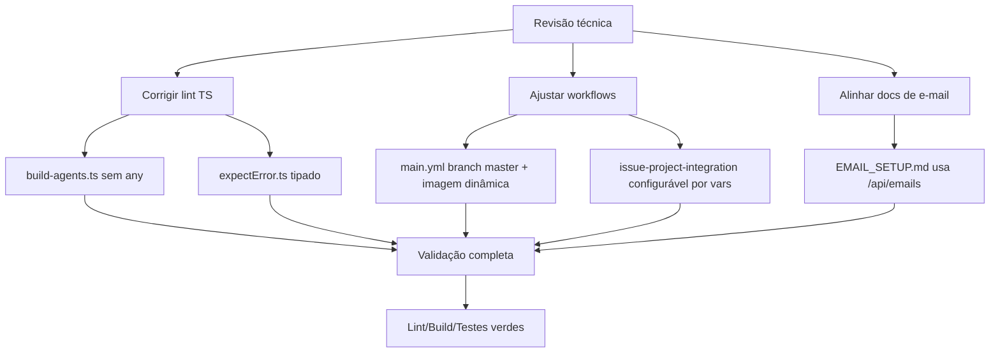

# Revisão técnica: lint, workflows e documentação

## Contexto e objetivo

Esta alteração corrige inconsistências identificadas na revisão geral do repositório: falhas de lint em arquivos TypeScript recém-adicionados, desalinhamento de workflows GitHub Actions com o branch/repositório atual e divergência entre a documentação de e-mail e a rota real da API.

## Escopo técnico e arquivos modificados

- `.github/agents/skills/nestjs-best-practices/scripts/build-agents.ts`
- `server/tests-cypress/utils/expectError.ts`
- `.github/workflows/main.yml`
- `.github/workflows/issue-project-integration.yml`
- `docs/EMAIL_SETUP.md`

## Decisão arquitetural (ADR resumido)

- **Decisão**: manter tipagem estrita (`no-explicit-any`) nos utilitários e scripts, e tornar integrações de workflow dependentes de configuração por variáveis (`vars`) para evitar acoplamento com organizações/projetos externos.
- **Alternativas consideradas**:
  1. Desabilitar regras de lint em arquivos de skills/scripts.
  2. Manter hardcodes de org/projeto e links fixos de documentação.
- **Trade-offs**:
  - Tipagem estrita aumenta manutenção inicial, porém reduz erros ocultos.
  - Workflows configuráveis exigem `vars` no repositório, porém evitam falhas por ambiente e melhoram portabilidade.

## Evidências de validação

- `npm run lint` (raiz): **OK**
- `npm run build` (raiz): **OK**
- `cd server && npm run build`: **OK**
- `cd server && npm test`: **OK** (26 passing)
- `npm test` (raiz): **OK** (2 passing)

## Riscos, impacto e plano de rollback

- **Riscos**:
  - Workflow de integração com Projects agora depende de `vars.GITHUB_PROJECT_URL` e `vars.GITHUB_PROJECT_NUMBER`; sem esses valores, a etapa será ignorada.
- **Impacto**:
  - Pipeline e documentação ficam consistentes com `master`, imagem do repositório correto e endpoint REST real (`/api/emails`).
- **Rollback**:
  1. Reverter commit desses arquivos.
  2. Restaurar branch alvo e nome da imagem no workflow.
  3. Reaplicar hardcodes de project URL/number, se necessário.

## Próximos passos recomendados

- Definir `Repository variables`:
  - `GITHUB_PROJECT_URL`
  - `GITHUB_PROJECT_NUMBER`
- Revisar vulnerabilidades pendentes reportadas por `npm install` e `server/npm install` via `npm audit`.
- Consolidar demais documentos para sempre refletirem as rotas fonte em `server/src/presentation/http/routes/**`.

## Diagrama (Mermaid)

