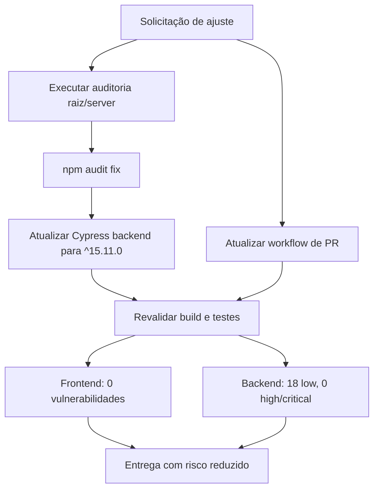

# Hardening: workflow de PR + redução de vulnerabilidades

## Contexto e objetivo

Após a correção anterior, foi solicitada uma segunda rodada para:

1. Ajustar o workflow de PR para usar referências dinâmicas com branch default.
2. Revisar e reduzir vulnerabilidades reportadas por `npm audit` no frontend e backend.

## Escopo técnico e arquivos modificados

- `.github/workflows/pr-issue-link.yml`
- `server/package.json`
- `package-lock.json` (raiz)
- `server/package-lock.json`
- `audit-root.json` (artefato local de auditoria)
- `audit-server.json` (artefato local de auditoria)

## Decisão arquitetural (ADR resumido)

- **Decisão 1 (workflow)**: incluir links de referência no comentário do workflow de PR com URL dinâmica baseada em `context.payload.repository.default_branch`.
  - **Alternativa**: manter sem links ou usar branch fixo (`main`/`master`).
  - **Trade-off**: comentários ficam mais úteis e resilientes a mudança de branch padrão, com custo mínimo de manutenção.

- **Decisão 2 (segurança dependências)**: aplicar `npm audit fix` e atualizar `cypress` no backend para `^15.11.0` para remover vulnerabilidades altas/críticas transitivas.
  - **Alternativa**: manter versão antiga e aceitar risco no ambiente de teste.
  - **Trade-off**: atualização de tooling de testes pode introduzir warning de migração, porém elimina risco alto/crítico e mantém suíte estável.

## Evidências de validação

- Frontend:
  - `npm audit` => **0 vulnerabilidades**
  - `npm run lint` => **OK**
  - `npm run build` => **OK**
  - `npm test` => **OK** (2 passing)

- Backend:
  - `npm run build` => **OK**
  - `npm test` => **OK** (26 passing)
  - `npm audit` => **18 low / 0 moderate / 0 high / 0 critical**

## Riscos, impacto e plano de rollback

- **Impacto positivo**:
  - Comentários de PR mais consistentes e sem acoplamento a branch fixa.
  - Remoção de vulnerabilidades altas/críticas no backend.
  - Frontend com auditoria zerada.

- **Riscos remanescentes**:
  - 18 vulnerabilidades de baixa severidade no backend (cadeia transitiva, principalmente AWS SDK/XML stack).
  - Warning de migração do Cypress (`allowCypressEnv`) sem quebra funcional.

- **Rollback**:
  1. Reverter alterações em `pr-issue-link.yml`.
  2. Reverter `server/package.json` e lockfiles.
  3. Executar `npm ci` na raiz e no backend para restaurar estado anterior.

## Próximos passos recomendados

- Planejar atualização controlada da cadeia AWS SDK para mitigar os 18 low remanescentes.
- Endereçar warning do Cypress (`allowCypressEnv`) migrando para `cy.env()`/`Cypress.expose()` quando aplicável.
- Opcional: remover arquivos `audit-*.json` do versionamento se forem apenas artefatos temporários.

## Diagrama (Mermaid)

