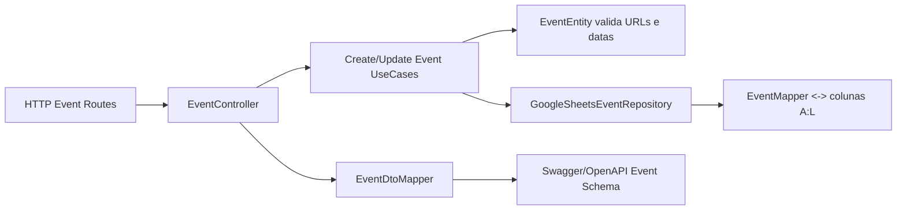

# Review — Issue #10 (Backend Eventos, Programação e Identidade Visual)

## Contexto e objetivo
Implementar suporte backend para os novos campos de identidade visual do evento, garantindo persistência, validação de domínio e exposição em contrato de API.

## Escopo técnico e arquivos modificados
- `server/src/domain/entities/EventEntity.ts`
- `server/src/application/usecases/events/CreateEventUseCase.ts`
- `server/src/application/usecases/events/UpdateEventUseCase.ts`
- `server/src/application/dtos/EventDtos.ts`
- `server/src/infrastructure/mappers/EventMapper.ts`
- `server/src/config/environment.ts`
- `server/src/config/swagger.ts`
- `server/tests-cypress/specs/events/CreateEventUseCase.spec.ts`
- `server/tests-cypress/specs/events/UpdateEventUseCase.spec.ts`

## Decisão arquitetural (ADR resumido)
- **Decisão:** modelar `appHeaderImageUrl` e `certificateHeaderImageUrl` no `EventEntity` e propagar pelas camadas Application/Infrastructure/Presentation.
- **Alternativas consideradas:**
  - manter campos apenas em DTO/controller (rejeitada por violar regra de domínio).
  - persistir metadados de imagem em outra tabela/sheet separada (rejeitada por complexidade prematura).
- **Trade-offs:** aumento de colunas no range da sheet de eventos (`A:L`) em troca de consistência ponta a ponta e simplicidade operacional.

## Evidências de validação
- Execução de testes backend:
  - Comando: `cd server && npm test`
  - Resultado: `Total: 31, Falhas: 0`
- Cobertura funcional adicionada:
  - cenário de sucesso com URLs de imagem no `CreateEventUseCase`.
  - cenário de erro com URL inválida no `CreateEventUseCase`.
  - atualização de URLs no `UpdateEventUseCase`.

## Riscos, impacto e rollback
- **Riscos:** necessidade de garantir header da planilha de eventos compatível com novas colunas.
- **Impacto:** contratos de evento passam a expor mais campos (`dateInit`, `dateFinal`, `inscriptionInit`, `inscriptionFinal`, URLs de header).
- **Rollback:** reverter commit da issue e retornar range/configuração/mapper ao formato anterior (`A:J`).

## Próximos passos recomendados
1. Atualizar consumidores frontend para leitura e edição dos novos campos.
2. Validar bootstrap de planilha em ambientes já provisionados.
3. Expandir testes de integração HTTP para payload completo de eventos.

## Diagrama (Mermaid)

