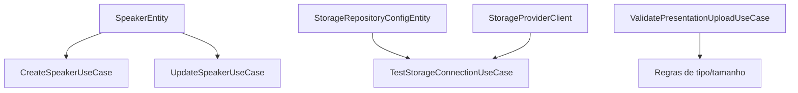

# Review — Issue #12 (Backend Palestrantes, Upload e Repositórios)

## Contexto e objetivo
Entregar base backend MVP para gestão de palestrantes, validação de upload de apresentações e teste de conectividade do repositório ativo.

## Escopo técnico e arquivos modificados
- `server/src/domain/entities/speakers/SpeakerEntity.ts` (novo)
- `server/src/domain/entities/speakers/StorageRepositoryConfigEntity.ts` (novo)
- `server/src/domain/repositories/speakers/SpeakerRepository.ts` (novo)
- `server/src/domain/repositories/speakers/StorageConfigRepository.ts` (novo)
- `server/src/domain/repositories/speakers/StorageProviderClient.ts` (novo)
- `server/src/application/usecases/speakers/CreateSpeakerUseCase.ts` (novo)
- `server/src/application/usecases/speakers/UpdateSpeakerUseCase.ts` (novo)
- `server/src/application/usecases/repository/ValidatePresentationUploadUseCase.ts` (novo)
- `server/src/application/usecases/repository/TestStorageConnectionUseCase.ts` (novo)
- `server/tests-cypress/stubs/speakers/SpeakerRepositoryStub.ts` (novo)
- `server/tests-cypress/stubs/speakers/StorageConfigRepositoryStub.ts` (novo)
- `server/tests-cypress/stubs/speakers/StorageProviderClientStub.ts` (novo)
- `server/tests-cypress/specs/speakers/CreateSpeakerUseCase.spec.ts` (novo)
- `server/tests-cypress/specs/speakers/UpdateSpeakerUseCase.spec.ts` (novo)
- `server/tests-cypress/specs/repository/ValidatePresentationUploadUseCase.spec.ts` (novo)
- `server/tests-cypress/specs/repository/TestStorageConnectionUseCase.spec.ts` (novo)
- `server/tests-cypress/runCoverage.ts`

## Decisão arquitetural (ADR resumido)
- **Decisão:** iniciar com modelagem domain-first e use cases testáveis, antes da integração completa com controllers e providers reais.
- **Alternativas consideradas:**
  - Implementar tudo diretamente em controllers (rejeitada por baixa testabilidade).
  - Integrar direto com S3/Drive neste passo (rejeitada por aumentar risco/escopo).
- **Trade-offs:** entrega incremental mais segura, porém com integração HTTP/infrastructure real planejada para etapa subsequente.

## Evidências de validação
- Execução de testes backend:
  - Comando: `cd server && npm test`
  - Resultado: `Total: 43, Falhas: 0`
- Cenários validados:
  - criação/atualização de palestrante.
  - validação de tipo e tamanho de upload.
  - teste de conexão de repositório ativo.

## Riscos, impacto e rollback
- **Riscos:** ainda não há endpoints REST específicos para speaker/upload/repositório nesta etapa.
- **Impacto:** base de domínio e aplicação pronta para wiring em container/controllers.
- **Rollback:** reverter commit da issue e remover os novos módulos `speakers`/`repository`.

## Próximos passos recomendados
1. Adicionar controllers e rotas REST para CRUD de palestrantes e configuração de repositório.
2. Integrar provedores reais (`local`, `drive`, `s3`) via `StorageProviderClient`.
3. Incluir testes de integração HTTP para upload/configuração.

## Diagrama (Mermaid)

