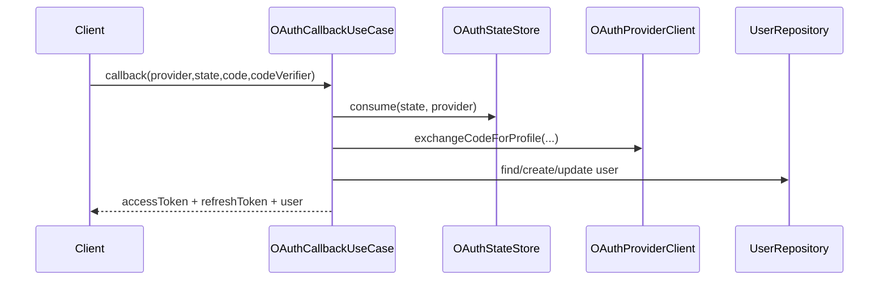

# Review — Issue #16 (Qualidade e Cobertura de Testes)

## Contexto e objetivo
Expandir cobertura automatizada para cenários críticos de OAuth callback, incluindo sucesso, replay de state e validação de PKCE inválido.

## Escopo técnico e arquivos modificados
- `server/tests-cypress/specs/auth/OAuthCallbackUseCase.spec.ts` (novo)
- `server/tests-cypress/runCoverage.ts`

## Decisão arquitetural (ADR resumido)
- **Decisão:** concentrar os novos cenários de OAuth na camada de use case (`OAuthCallbackUseCase`) para validar regras de segurança sem dependência de HTTP/infra externa.
- **Alternativas consideradas:**
  - testar apenas via e2e HTTP (rejeitada para este passo por maior custo e setup).
- **Trade-offs:** maior velocidade de feedback e determinismo, com necessidade de complementar futuramente com testes de integração HTTP.

## Evidências de validação
- Execução de testes backend:
  - Comando: `cd server && npm test`
  - Resultado: `Total: 46, Falhas: 0`
- Novos cenários cobertos:
  - callback OAuth válido cria sessão e tokens.
  - replay de state é bloqueado.
  - `code_verifier` inválido é rejeitado.

## Riscos, impacto e rollback
- **Riscos:** cobertura ainda centrada em use cases, sem validar roteamento HTTP completo.
- **Impacto:** melhoria direta na confiança dos fluxos críticos de autenticação OAuth.
- **Rollback:** reverter commit da issue para remover os novos cenários.

## Próximos passos recomendados
1. Adicionar testes de integração HTTP para `/auth/oauth/:provider/callback`.
2. Cobrir também cenários de falha de provider externo.

## Diagrama (Mermaid)

