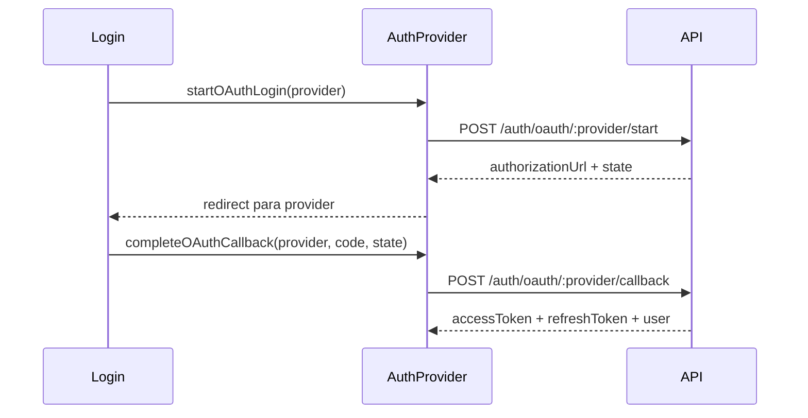

# Review — Issue #9 (Frontend OAuth e Sessão Segura)

## Contexto e objetivo
Adicionar fluxo MVP de autenticação OAuth no frontend, com início do login social e conclusão de callback PKCE, integrado ao `AuthProvider`.

## Escopo técnico e arquivos modificados
- `src/infrastructure/auth/oauthPkce.ts` (novo)
- `src/presentation/contexts/AuthContext.ts`
- `src/presentation/contexts/AuthProvider.tsx`
- `src/presentation/components/Login.tsx`
- `src/App.tsx`

## Decisão arquitetural (ADR resumido)
- **Decisão:** encapsular PKCE no frontend em util dedicado (`oauthPkce.ts`) e centralizar estado/ações OAuth no `AuthProvider`.
- **Alternativas consideradas:**
  - implementar OAuth diretamente no componente `Login` (rejeitada por acoplamento de UI com autenticação).
- **Trade-offs:** implementação MVP com callback por query params, mantendo simplicidade sem introduzir roteamento adicional neste passo.

## Evidências de validação
- Execução de testes frontend:
  - Comando: `npm test`
  - Resultado: `2 passing, 0 failing`
- Fluxos adicionados:
  - listagem de providers OAuth (`/auth/providers`).
  - início de login OAuth (`/auth/oauth/:provider/start`).
  - finalização de callback OAuth (`/auth/oauth/:provider/callback`).

## Riscos, impacto e rollback
- **Riscos:** callback depende de retorno via query params (`provider`, `code`, `state`).
- **Impacto:** tela de login passa a exibir opções OAuth quando providers estiverem habilitados.
- **Rollback:** reverter commit da issue e remover `oauthPkce`/ações OAuth do contexto.

## Próximos passos recomendados
1. Adicionar rota dedicada para callback OAuth no frontend.
2. Exibir feedback visual específico para erro de callback/replay.
3. Cobrir fluxo OAuth em testes e2e frontend.

## Diagrama (Mermaid)

