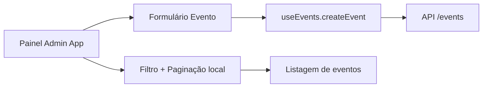

# Review — Issue #11 (Frontend Eventos, Programação e Identidade Visual)

## Contexto e objetivo
Evoluir o frontend para suportar os novos campos de evento (datas de programação/inscrição e URLs de identidade visual), além de oferecer filtro e paginação local na gestão administrativa.

## Escopo técnico e arquivos modificados
- `src/domain/entities/Event.ts`
- `src/App.tsx`

## Decisão arquitetural (ADR resumido)
- **Decisão:** manter MVP concentrado no `App` atual (sem introduzir novas páginas) para reduzir impacto e respeitar o estado atual do frontend.
- **Alternativas consideradas:**
  - criar módulo completo de CRUD em novas rotas/componentes (rejeitada neste passo por escopo).
- **Trade-offs:** entrega rápida e incremental, com parte da experiência administrativa ainda em layout simplificado.

## Evidências de validação
- Execução de testes frontend:
  - Comando: `npm test`
  - Resultado: `2 passing, 0 failing`
- Funcionalidades MVP adicionadas:
  - formulário administrativo para criação de evento com campos de imagem.
  - listagem administrativa com filtro por título/local.
  - paginação local para o painel de eventos.

## Riscos, impacto e rollback
- **Riscos:** interface administrativa permanece no `App` monolítico, exigindo futura modularização.
- **Impacto:** alinhamento com contrato backend expandido de eventos.
- **Rollback:** reverter commit da issue para retornar ao modelo anterior de evento e painel.

## Próximos passos recomendados
1. Extrair painel administrativo para componentes dedicados.
2. Incluir edição de evento com os novos campos no mesmo fluxo.
3. Adicionar testes e2e cobrindo criação/filtro/paginação no painel.

## Diagrama (Mermaid)

