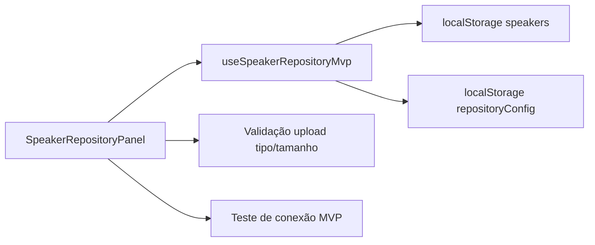

# Review — Issue #13 (Frontend Palestrantes, Upload e Repositório)

## Contexto e objetivo
Adicionar no frontend um fluxo MVP para gestão de palestrantes, validação de upload e configuração/teste de repositório ativo.

## Escopo técnico e arquivos modificados
- `src/presentation/hooks/useSpeakerRepositoryMvp.ts` (novo)
- `src/presentation/components/SpeakerRepositoryPanel.tsx` (novo)
- `src/App.tsx`

## Decisão arquitetural (ADR resumido)
- **Decisão:** implementar MVP com estado persistido em `localStorage` para viabilizar fluxo de UI mesmo antes do wiring completo de endpoints backend dedicados.
- **Alternativas consideradas:**
  - bloquear entrega até backend completo de speaker/upload (rejeitada para manter avanço incremental).
- **Trade-offs:** funcionalidade útil para validação de UX e regras de entrada, porém com integração parcial nesta fase.

## Evidências de validação
- Execução de testes frontend:
  - Comando: `npm test`
  - Resultado: `2 passing, 0 failing`
- Fluxos cobertos no MVP:
  - cadastro de palestrante.
  - validação de arquivo de apresentação (tipo/tamanho).
  - configuração de repositório e teste de conexão simulado.

## Riscos, impacto e rollback
- **Riscos:** persistência local não substitui validações e auditoria backend.
- **Impacto:** habilita demonstração funcional do fluxo administrativo de palestrantes/upload/repositório.
- **Rollback:** reverter commit e remover painel/hook MVP.

## Próximos passos recomendados
1. Integrar painel aos endpoints backend de palestrantes/repositório quando expostos.
2. Substituir teste de conexão simulado por chamada real API.
3. Adicionar testes e2e para fluxos administrativos do painel.

## Diagrama (Mermaid)

