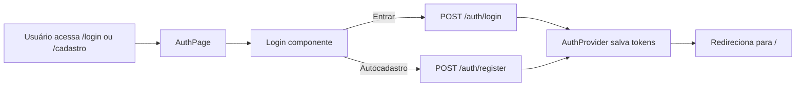

# Review — Login com página e rotas de autocadastro

## Contexto e objetivo
Implementar fluxo de login/autocadastro com endpoint público de registro no backend e página dedicada no frontend com rotas explícitas de autenticação.

## Escopo técnico e arquivos modificados
- Frontend
  - package.json
  - src/main.tsx
  - src/AppRoutes.tsx
  - src/presentation/pages/AuthPage.tsx
  - src/presentation/components/Login.tsx
  - src/presentation/contexts/AuthContext.ts
  - src/presentation/contexts/AuthProvider.tsx
- Backend
  - server/src/application/dtos/AuthDtos.ts
  - server/src/presentation/http/controllers/AuthController.ts
  - server/src/presentation/http/routes/authRoutes.ts
  - server/src/container/index.ts
  - server/src/config/swagger.ts

## Decisão arquitetural (ADR resumido)
- Decisão: adicionar endpoint público POST /auth/register para autocadastro, manter login automático após criação do usuário e expor rota dedicada de autenticação no frontend (`/auth`, `/login`, `/cadastro`).
- Alternativas avaliadas:
  - usar POST /users para cadastro público (rejeitada, rota protegida por autenticação).
  - autocadastro apenas no frontend sem endpoint real (rejeitada por não atender fluxo funcional).
- Trade-off: inclusão de nova superfície pública de autenticação em troca de experiência completa de entrada do usuário.
  - Trade-off adicional: introdução de roteamento no frontend (dependência `react-router-dom`) para separar claramente a tela de autenticação do painel principal.

## Evidências de validação
- Frontend testes:
  - comando: npm test
  - resultado: 2 passing
- Frontend build:
  - comando: npm run build
  - resultado: falhou por erro pré-existente em `src/infrastructure/repositories/GoogleSheetsEventRepository.ts` (assinatura de `EventEntity`), sem relação com a alteração de rotas/login.

## Riscos, impacto e rollback
- Riscos:
  - endpoint de registro precisa seguir política de segurança e validação de senha no futuro.
- Impacto:
  - login agora oferece alternância entre entrar e autocadastro.
  - backend aceita criação pública de usuário via auth.
  - frontend passa a ter página dedicada para autenticação acessível por rotas explícitas.
- Rollback:
  - remover rota /auth/register e retirar ação register do AuthProvider/Login.

## Próximos passos recomendados
1. Adicionar validação forte de senha e confirmação de senha na UI.
2. Incluir testes automatizados para fluxo de autocadastro.
3. Opcional: adicionar verificação de e-mail antes de liberar acesso.

## Diagrama (Mermaid)

