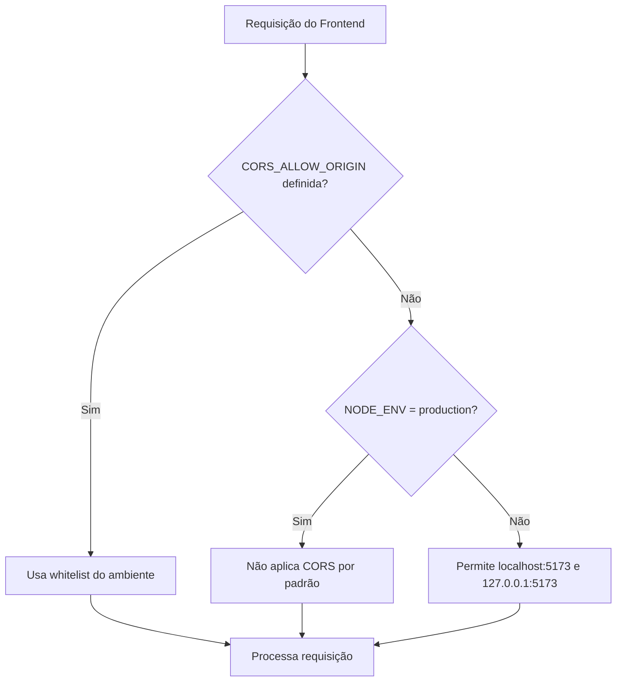

# Review — Correção de CORS no backend

## Contexto e objetivo
Resolver erro de CORS reportado pela API ao consumir o backend a partir do frontend em ambiente local.

## Escopo técnico e arquivos modificados
- Backend
  - server/src/app.ts
  - server/.env.example

## Decisão arquitetural (ADR resumido)
- Decisão: aplicar fallback de origens permitidas apenas em desenvolvimento quando `CORS_ALLOW_ORIGIN` não estiver configurada.
- Alternativas avaliadas:
  - Liberar CORS global com `*` (rejeitada por risco de segurança com credenciais).
  - Exigir sempre configuração manual de `CORS_ALLOW_ORIGIN` (rejeitada por pior DX e recorrência de erro local).
- Trade-offs:
  - Prós: reduz falhas em dev local sem abrir produção por padrão.
  - Contras: adiciona comportamento condicional por ambiente.

## Evidências de validação
- Build backend:
  - comando: `cd server && npm run build`
  - resultado: pendente nesta revisão (executado após edição)

## Riscos, impacto e rollback
- Riscos:
  - Uso de porta de frontend diferente de `5173` ainda exigirá `CORS_ALLOW_ORIGIN` explícita.
- Impacto:
  - Chamadas do frontend local para API deixam de falhar por CORS quando env não configurada.
  - Produção permanece fechada sem configuração explícita de origens.
- Rollback:
  - Reverter alterações em `server/src/app.ts` e remover documentação em `server/.env.example`.

## Próximos passos recomendados
1. Definir `CORS_ALLOW_ORIGIN` em todos ambientes não-locais.
2. Padronizar checklist de variáveis obrigatórias no deploy.
3. Considerar teste automatizado para política de CORS.

## Diagrama (Mermaid)

