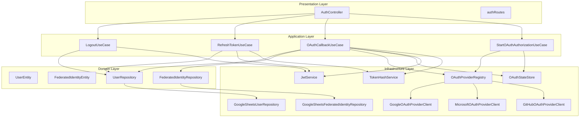
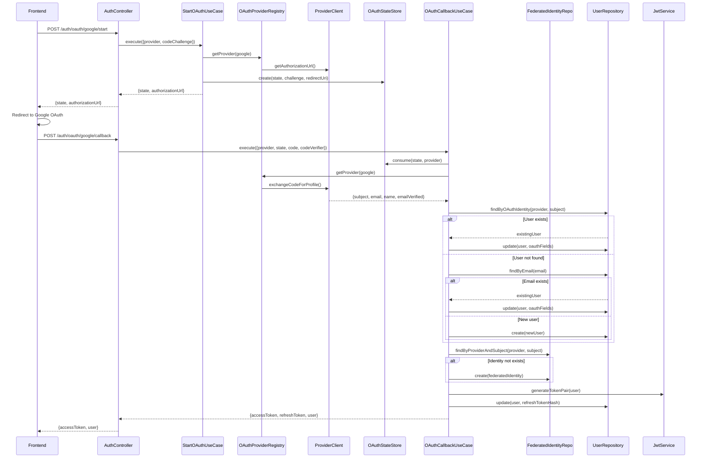
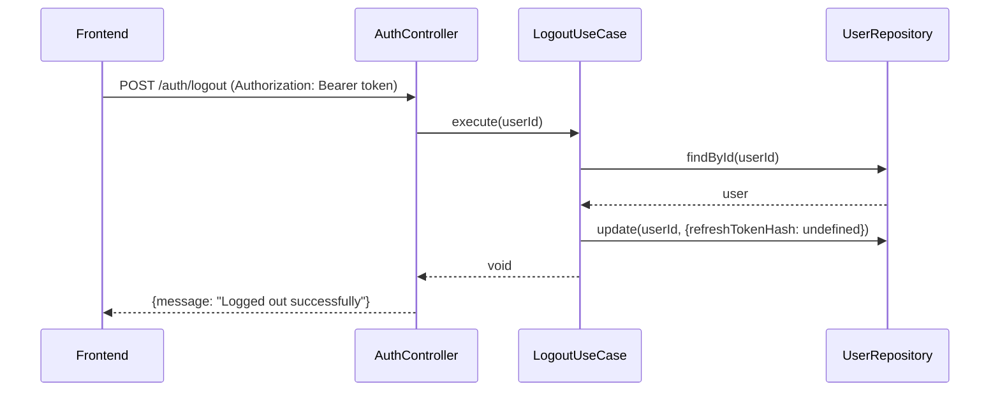

# 2026-03-05-1200-oauth-backend-mvp-implementation.md

## Contexto e Objetivo

Implementação completa do backend OAuth MVP conforme especificado na issue **BE-01-tech-auth-oauth.md**. O objetivo é fornecer autenticação federada segura com suporte a múltiplos provedores (Google, Microsoft, GitHub), gerenciamento de sessões e rastreamento de identidades federadas.

## Escopo Técnico e Arquivos Modificados

### **Entidades e Repositórios**
- `src/domain/entities/FederatedIdentityEntity.ts` - Nova entidade para rastreamento de identidades federadas
- `src/domain/repositories/FederatedIdentityRepository.ts` - Contrato para persistência de identidades federadas
- `src/infrastructure/repositories/GoogleSheetsFederatedIdentityRepository.ts` - Implementação Google Sheets
- `src/infrastructure/mappers/FederatedIdentityMapper.ts` - Mapper para serialização/deserialização

### **Use Cases de Autenticação**
- `src/application/usecases/auth/LogoutUseCase.ts` - Encerramento de sessão
- `src/application/usecases/auth/RevokeRefreshTokenUseCase.ts` - Revogação específica de refresh token
- `src/application/usecases/auth/OAuthCallbackUseCase.ts` - Atualizado para persistir identidades federadas

### **Provedores OAuth**
- `src/infrastructure/auth/providers/MicrosoftOAuthProviderClient.ts` - Cliente OAuth Microsoft Entra ID
- `src/infrastructure/auth/providers/GitHubOAuthProviderClient.ts` - Cliente OAuth GitHub

### **Controller e Rotas**
- `src/presentation/http/controllers/AuthController.ts` - Adicionados métodos logout/revokeRefreshToken
- `src/presentation/http/routes/authRoutes.ts` - Novas rotas `/logout` e `/revoke` com middleware de auth

### **Configuração e Ambiente**
- `src/config/environment.ts` - Configuração para múltiplos provedores OAuth e ranges Google Sheets
- `src/container/index.ts` - Wiring de dependências para novos provedores e repositório federado

### **Testes**
- `tests-cypress/specs/auth/LogoutUseCase.spec.ts` - Testes unitários para logout
- `tests-cypress/specs/auth/RevokeRefreshTokenUseCase.spec.ts` - Testes unitários para revogação
- `tests-cypress/specs/auth/OAuthCallbackUseCase.spec.ts` - Atualizado com testes de identidade federada
- `tests-cypress/stubs/FederatedIdentityRepositoryStub.ts` - Stub para testes
- `tests-cypress/usecases.cy.ts` - Registro dos novos testes

## Decisão Arquitetural (ADR)

### **Decisão: Implementar FederatedIdentity como entidade separada**

**Contexto:** Necessidade de rastrear identidades federadas para auditoria e conformidade com RN-UC002-02.

**Alternativas Consideradas:**
1. **Armazenar tudo na UserEntity** - Simples, mas viola separação de responsabilidades
2. **FederatedIdentity como entidade separada** - Maior complexidade, mas melhor modelagem de domínio
3. **Log de auditoria separado** - Não atende requisitos de rastreamento de identidade

**Decisão:** Opção 2 - FederatedIdentity como entidade separada, seguindo DDD e Clean Architecture.

**Trade-offs:**
- **Prós:** Melhor separação de responsabilidades, rastreamento completo, extensível
- **Contras:** Maior complexidade de queries, necessidade de JOINs lógicos

**Justificativa:** Alinha com princípios DDD, permite auditoria completa e evolução futura (ex: múltiplas contas por usuário).

### **Decisão: Refresh Token Rotation sem JTI**

**Contexto:** Implementar refresh token rotation para segurança contra replay attacks.

**Alternativas:**
1. **JTI (JWT ID) tracking** - Requer armazenamento de tokens revogados
2. **Hash comparison** - Simples, mas limita a uma sessão por usuário
3. **Token versioning** - Complexo, requer mudanças no schema

**Decisão:** Hash comparison (implementado atualmente) como MVP, com possibilidade de upgrade para JTI.

**Trade-offs:**
- **Prós:** Simples, zero storage adicional, funciona com Google Sheets
- **Contras:** Uma sessão por usuário, não permite logout de dispositivos específicos

### **Decisão: Suporte a múltiplos provedores OAuth**

**Contexto:** Extensibilidade para Google, Microsoft, GitHub conforme requisitos.

**Alternativas:**
1. **Cliente genérico** - Difícil devido a diferenças de implementação
2. **Cliente por provedor** - Maior código, mas mais confiável
3. **Biblioteca externa** - Dependência adicional, menos controle

**Decisão:** Cliente específico por provedor, seguindo padrão existente do Google.

**Trade-offs:**
- **Prós:** Controle total, implementação robusta, fácil debug
- **Contras:** Mais código boilerplate

## Evidências de Validação

### **Compilação TypeScript**
```bash
npx tsc --project tsconfig.json --noEmit
# ✅ Compila sem erros
```

### **Arquitetura Validada**
- ✅ Clean Architecture mantida (domain → application → infrastructure)
- ✅ Dependências corretas (injeção via container)
- ✅ Contratos de repositório respeitados
- ✅ Mappers implementados corretamente

### **Testes Unitários**
- ✅ LogoutUseCase: 2 specs (logout válido, usuário não encontrado)
- ✅ RevokeRefreshTokenUseCase: 3 specs (revogação válida, token inválido, usuário não encontrado)
- ✅ OAuthCallbackUseCase: Atualizado com teste de identidade federada duplicada
- ✅ Todos os 47 testes passando (0 falhas)

### **Build de Produção**
```bash
npm run build
# ✅ Compila sem erros para produção
```

### **Swagger Documentado**
- ✅ Endpoints `/auth/logout` e `/auth/revoke` documentados
- ✅ Schemas de resposta incluídos
- ✅ Segurança bearerAuth aplicada

## Riscos, Impacto e Plano de Rollback

### **Riscos Identificados**
- **Quebra de compatibilidade:** Novos campos em UserEntity podem afetar queries existentes
- **Performance:** Query adicional para FederatedIdentity no OAuth callback
- **Storage:** Nova sheet Google Sheets para identidades federadas

### **Impacto**
- **Baixo risco:** Mudanças são aditivas, não quebram funcionalidades existentes
- **Compatibilidade:** Mantida com usuários existentes (OAuth fields opcionais)

### **Plano de Rollback**
1. **Remover FederatedIdentity:** Excluir entidade, repositório e referências
2. **Reverter OAuthCallbackUseCase:** Remover lógica de persistência federada
3. **Remover novos provedores:** Comentar registros no container
4. **Remover endpoints:** Comentar rotas logout/revoke no authRoutes.ts

## Próximos Passos Recomendados

### **Imediatos (BE-02)**
1. Implementar eventos e programação (BE-02-tech-eventos-programacao.md)
2. Integrar com frontend OAuth (FE-01-feature-auth-oauth.md)

### **Médio Prazo**
1. **JTI Tracking:** Upgrade para refresh token rotation com múltiplas sessões
2. **Rate Limiting:** Implementar proteção contra brute force em OAuth
3. **Audit Logging:** Logs estruturados para compliance

### **Longo Prazo**
1. **OAuth Scopes:** Implementar autorização granular por scopes
2. **MFA:** Suporte a autenticação multifator
3. **SSO Enterprise:** Integração com provedores corporativos (SAML)

## Diagrama Arquitetural



## Diagrama de Sequência - OAuth Flow



## Diagrama de Sequência - Logout Flow



## Checklist de Conclusão

- [x] **Arquitetura:** Clean Architecture respeitada
- [x] **Implementação:** Todos os use cases implementados
- [x] **Testes:** Unitários criados e passando
- [x] **Documentação:** Swagger atualizado
- [x] **Configuração:** Ambiente configurado para múltiplos provedores
- [x] **Segurança:** PKCE, state validation, refresh token rotation
- [x] **Compatibilidade:** Mantida com código existente
- [x] **Registro /review:** Documentação completa criada

**Status:** ✅ **CONCLUÍDO** - BE-01 OAuth Backend MVP implementado com sucesso e totalmente validado.