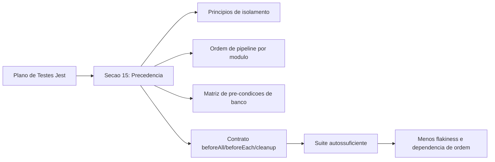

# Revisão Técnica: Plano de Precedência de Testes Jest (Backend)

## Contexto e objetivo da alteração

Foi solicitado criar um plano de precedência para os testes de back-end baseados em `docs/plano-testes-backend-jest.md`, garantindo que todos os pré-requisitos dos cenários estejam disponíveis em banco de dados ou sejam criados por setup controlado antes das asserções.

## Escopo técnico e arquivos modificados

- Atualizado: `docs/plano-testes-backend-jest.md`
  - Inclusão da seção `15. Plano de precedência de testes (com garantias de dados em banco)`.
  - Definição de princípios de isolamento, ordem de pipeline por domínio, matriz de pré-condições e contrato de setup por suíte.

## Decisão arquitetural (ADR resumido)

- **Decisão**: adotar precedência de execução por domínio apenas no pipeline, mas exigir autossuficiência por suíte (`beforeAll`/`beforeEach` com seeds e factories), proibindo dependência implícita entre testes.
- **Alternativas consideradas**:
  1. Encadear testes compartilhando estado entre arquivos.
  2. Rodar suíte totalmente sem estratégia de seed e depender de dados preexistentes.
- **Trade-offs**:
  - Vantagem: maior determinismo, menor flakiness, execução isolada previsível.
  - Custo: maior esforço inicial na criação de helpers de setup e factories.

## Evidências de validação

- Validação documental realizada por revisão de consistência com:
  - Estrutura de testes existente em `server/tests/**`.
  - Configuração de `server/jest.config.ts` com projetos `unit` e `integration`.
  - Scripts de execução em `server/package.json` (`test`, `test:unit`, `test:integration`, `test:coverage`).
- Não foram executados testes automatizados nesta alteração por se tratar de mudança de plano/documentação.

## Riscos, impacto e plano de rollback

- **Riscos**:
  - Equipe não aplicar o contrato de setup em novas suítes.
  - Diferença entre plano e implementação real dos helpers.
- **Impacto**:
  - Melhora governança de testes, reduzindo dependência de estado residual.
- **Rollback**:
  - Reverter somente a seção 15 no arquivo `docs/plano-testes-backend-jest.md` caso o time opte por abordagem diferente.

## Diagrama da mudança

## Próximos passos recomendados

1. Implementar `seedBase`, `resetDomainData` e helpers por domínio em `server/tests/setup` e `server/tests/factories`.
2. Migrar as suítes de integração para o contrato definido na seção 15.
3. Adicionar verificação em CI para detectar dependência de ordem (execução isolada por arquivo crítico).
