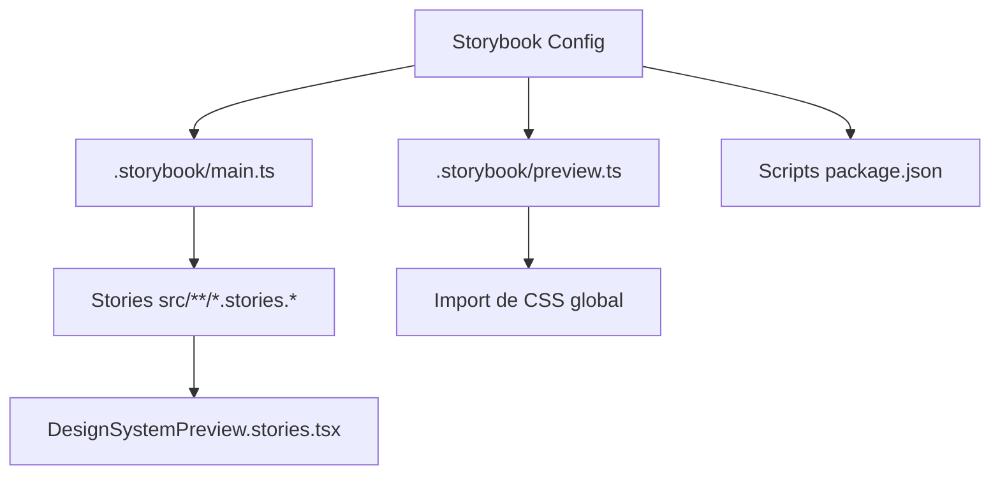

# Configuracao Storybook para CA12 (FE-05)

## Contexto e objetivo

Implementar a configuracao operacional do Storybook no frontend para atender o criterio CA12 (Storybook configurado) da FE-05.

## Escopo tecnico e arquivos modificados

- `package.json`
  - Script `storybook`: `storybook dev -p 6006`
  - Script `build-storybook`: `storybook build`
- `.storybook/main.ts`
  - Framework `@storybook/react-vite`
  - Descoberta de stories em `src/**/*.stories.@(ts|tsx|mdx)`
  - Addon de acessibilidade `@storybook/addon-a11y`
- `.storybook/preview.ts`
  - Import global de estilos existentes (`src/index.css` e `src/App.css`)
  - Parametros de controles e a11y
- `src/stories/DesignSystemPreview.stories.tsx`
  - Story inicial para validacao de classes base (`btn`, `panel-card`, `eyebrow`, `muted`, `alert`)

## Decisao arquitetural (ADR resumido)

- Decisao: iniciar Storybook com configuracao minima e aderente ao stack atual (React + Vite) reaproveitando estilos globais existentes.
- Alternativas:
  - Configuracao completa com addons adicionais desde o inicio.
  - Documentacao alternativa sem Storybook.
- Trade-offs:
  - Configuracao minima reduz risco e tempo de setup.
  - Exige evolucao incremental para cobranca completa de documentacao por componente e tokens.

## Evidencias de validacao

- Comando executado: `npm run build-storybook`
- Resultado: build concluido com sucesso.
- Versoes em uso:
  - `storybook@10.2.17`
  - `@storybook/react-vite@10.2.17`
  - `vite@7.3.1`

## Riscos, impacto e plano de rollback

- Riscos:
  - Warning de chunk size no build do Storybook (nao bloqueante).
  - Dependencia de estilos globais atuais pode gerar acoplamento inicial.
- Impacto:
  - Nenhum impacto em runtime de producao.
  - Ganho imediato de trilha de documentacao visual para FE-05.
- Rollback:
  - Reverter os arquivos listados no escopo e remover scripts do `package.json`.

## Proximos passos recomendados

1. Adicionar stories para componentes de design system reais (Button, Card, Input).
2. Documentar tokens de design via MDX/stories dedicadas.
3. Integrar gate de QA de a11y no pipeline do Storybook.
