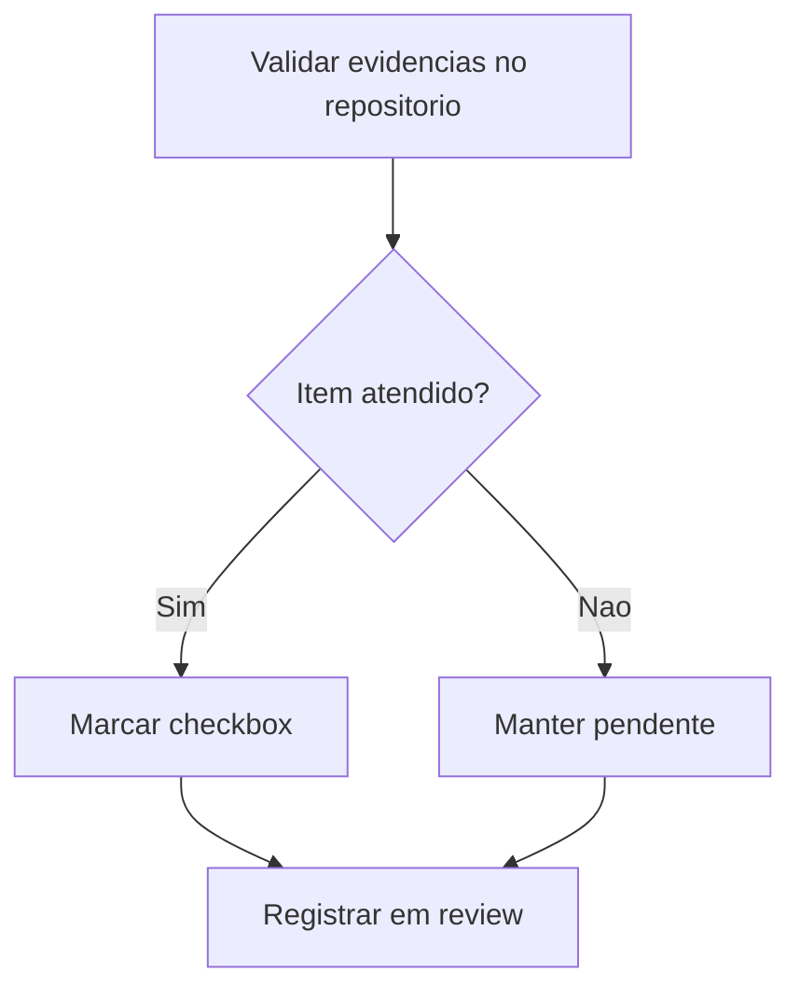

# Validacao da documentacao FE-05 (CA12)

## Contexto e objetivo

Validar o estado atual da implementacao de Storybook e atualizar os checklists correspondentes na issue FE-05 com base apenas em evidencias tecnicas existentes no repositorio.

## Escopo tecnico e arquivos modificados

- Atualizado checklist em `issue/FE-05-feature-design-system-implementacao.md`:
  - Marcado como concluido: `Storybook (ou equivalente) configurado`.
  - Mantidos como pendentes os demais itens de CA12 por falta de cobertura completa.

## Decisao arquitetural (ADR resumido)

- Decisao: aplicar criterio de evidencias minimas verificaveis para atualizacao de status dos checklists.
- Alternativas:
  - Marcar CA12 completo com base em implementacao parcial de stories.
  - Nao atualizar nenhum item ate cobertura total.
- Trade-offs:
  - Atualizacao parcial evita falso positivo de aceite.
  - Mantem rastreabilidade de progresso real sem bloquear visibilidade do avanço.

## Evidencias de validacao

- Configuracao Storybook presente:
  - `.storybook/main.ts`
  - `.storybook/preview.ts`
- Scripts de execucao presentes:
  - `storybook` e `build-storybook` em `package.json`
- Story inicial existente:
  - `src/stories/DesignSystemPreview.stories.tsx`
- Build previamente validado com sucesso por `npm run build-storybook`.

## Riscos, impacto e plano de rollback

- Riscos:
  - Interpretacao de progresso parcial como conclusao total de CA12.
- Impacto:
  - Nenhum impacto em runtime; alteracao documental de status.
- Rollback:
  - Reverter a linha do checklist em `issue/FE-05-feature-design-system-implementacao.md` para `[ ]`.

## Proximos passos recomendados

1. Criar stories por componente do design system (Button, Card, Input, Loading, Alert).
2. Incluir diretrizes de uso e tokens em stories/MDX para completar CA12.
3. Revalidar e atualizar os demais itens do CA12 apos cobertura total.
