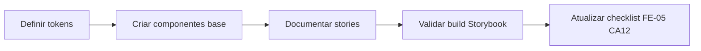

# FE-05 CA12 - Documentacao de componentes e tokens no Storybook

## Contexto e objetivo

Concluir o proximo passo de aceite da FE-05, cobrindo pendencias de documentacao (CA12) com evidencias concretas no repositorio. O foco foi estruturar o Design System inicial com tokens e componentes base e documentar tudo no Storybook com exemplos, variacoes, estados e diretrizes de uso.

## Escopo tecnico e arquivos modificados

Arquivos criados/modificados nesta etapa:

- `src/presentation/design-system/tokens/colors.ts`
- `src/presentation/design-system/tokens/spacing.ts`
- `src/presentation/design-system/tokens/typography.ts`
- `src/presentation/design-system/tokens/breakpoints.ts`
- `src/presentation/design-system/tokens/index.ts`
- `src/presentation/design-system/tokens/Tokens.stories.tsx`
- `src/presentation/design-system/components/Button/Button.tsx`
- `src/presentation/design-system/components/Button/Button.module.css`
- `src/presentation/design-system/components/Button/Button.stories.tsx`
- `src/presentation/design-system/components/Card/Card.tsx`
- `src/presentation/design-system/components/Card/Card.module.css`
- `src/presentation/design-system/components/Card/Card.stories.tsx`
- `src/presentation/design-system/components/Input/Input.tsx`
- `src/presentation/design-system/components/Input/Input.module.css`
- `src/presentation/design-system/components/Input/Input.stories.tsx`
- `src/presentation/design-system/components/index.ts`
- `src/presentation/design-system/index.ts`
- `issue/FE-05-feature-design-system-implementacao.md`

## Decisao arquitetural (ADR resumido)

### Decisao

Adotar uma base de Design System em camadas:

1. Tokens semanticos centralizados (`tokens/*`).
2. Componentes base reutilizaveis (`components/*`) com CSS Modules.
3. Documentacao obrigatoria via Storybook para cada componente/foundation.

### Alternativas avaliadas

- Manter apenas estilos globais sem tokens tipados.
- Documentar componentes apenas em markdown estatico sem Storybook.

### Trade-offs

- Pro:
  - Consistencia visual e evolucao previsivel.
  - Melhor onboarding para frontend/UX.
  - Evidencia objetiva para criterios de aceite.
- Contra:
  - Mais arquivos e manutencao inicial de stories.
  - Custo de sincronizacao entre token e apresentacao visual.

## Fluxo da alteracao

## Evidencias de validacao

- Build Storybook executado com sucesso:
  - Comando: `npm run build-storybook`
  - Resultado: build concluido sem erros de compilacao.
- Artefato gerado removido do working tree apos validacao:
  - `storybook-static/` removido.
- Checklist CA12 atualizado em `issue/FE-05-feature-design-system-implementacao.md` para itens agora comprovados.

## Riscos, impacto e plano de rollback

### Riscos

- Divergencia futura entre tokens e implementacao visual se nao houver governance continua.
- Cobertura parcial do DS (itens CA07-CA11/CA13-CA15 ainda dependem de entregas adicionais).

### Impacto

- Positivo na padronizacao de UI e na produtividade para novas features frontend.
- Melhora rastreabilidade do aceite de documentacao FE-05.

### Rollback

1. Reverter commit desta etapa na branch de feature.
2. Restaurar estado anterior da issue FE-05 se necessario.
3. Manter somente setup de Storybook previamente estabilizado.

## Proximos passos recomendados

1. Implementar CA07/CA08 (Loading States e Feedback Visual).
2. Cobrir CA11/CA13 com testes automatizados de acessibilidade e unidade.
3. Solicitar validacao formal do UX Expert para avancar CA14.
