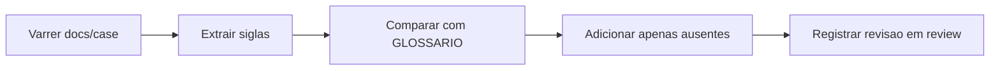

# Atualizacao do Glossario com Siglas dos Casos de Uso

## Contexto e objetivo

Revisar todos os documentos em `docs/case/*.md` para identificar siglas ainda nao catalogadas no glossario central e atualizar `docs/GLOSSARIO.md` apenas quando necessario.

## Escopo tecnico e arquivos modificados

- `docs/GLOSSARIO.md`

Siglas adicionadas:

- OIDC
- PKCE
- URL
- ID
- AWS

## Decisao arquitetural (ADR resumido)

### Decisao

Manter o glossario como fonte unica de verdade para siglas usadas nos UCs, incluindo termos tecnicos de autenticacao, infraestrutura e rastreabilidade funcional.

### Alternativas avaliadas

- Nao atualizar o glossario e deixar siglas apenas contextualizadas em cada UC.
- Criar glossario separado somente para casos de uso.

### Trade-offs

- Pro:
  - Melhora consistencia terminologica entre requisitos, issues e implementacao.
  - Reduz ambiguidade na leitura dos UCs e PRs.
- Contra:
  - Exige manutencao incremental do glossario quando novos UCs surgirem.

## Evidencias de validacao

- Varredura de siglas em `docs/case/*.md` e comparacao com o glossario.
- Atualizacao aplicada somente para siglas ausentes e com uso concreto nos UCs.

## Fluxo da alteracao

## Riscos, impacto e plano de rollback

### Riscos

- Baixo risco funcional, alteracao documental.
- Possivel divergencia futura caso novos UCs sejam adicionados sem atualizar glossario.

### Impacto

- Positivo para comunicacao entre times e agentes.
- Melhora rastreabilidade de termos em autenticacao (OIDC/PKCE) e infraestrutura (AWS).

### Rollback

1. Reverter o commit que contem a alteracao de `docs/GLOSSARIO.md`.
2. Restaurar versao anterior do glossario, se necessario.

## Proximos passos recomendados

1. Incluir verificacao de siglas novas no checklist de revisao documental.
2. Repetir a varredura ao adicionar novos UCs no diretorio `docs/case`.
