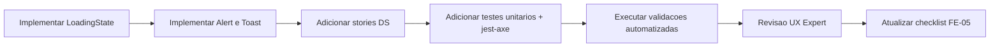

# FE-05 - Implementacao CA07/CA08 + Testes CA13 + Gate UX CA14

## Contexto e objetivo

Implementar os proximos passos recomendados da FE-05 apos a etapa de documentacao CA12:

1. CA07 - Loading States.
2. CA08 - Feedback Visual.
3. CA13 - Testes unitarios e acessibilidade automatizada.
4. CA14 - Validacao formal do UX Expert.

## Escopo tecnico e arquivos modificados

### Configuracao de testes

- `package.json`
- `package-lock.json`
- `vitest.unit.config.ts`
- `src/test/setup.ts`

### Componentes novos

- `src/presentation/design-system/components/LoadingState/LoadingState.tsx`
- `src/presentation/design-system/components/LoadingState/LoadingState.module.css`
- `src/presentation/design-system/components/LoadingState/LoadingState.stories.tsx`
- `src/presentation/design-system/components/Feedback/Alert.tsx`
- `src/presentation/design-system/components/Feedback/Alert.module.css`
- `src/presentation/design-system/components/Feedback/Toast.tsx`
- `src/presentation/design-system/components/Feedback/Toast.module.css`
- `src/presentation/design-system/components/Feedback/Feedback.stories.tsx`
- `src/presentation/design-system/components/Feedback/index.ts`
- `src/presentation/design-system/components/index.ts`

### Testes adicionados

- `src/presentation/design-system/components/Button/Button.test.tsx`
- `src/presentation/design-system/components/Card/Card.test.tsx`
- `src/presentation/design-system/components/Input/Input.test.tsx`
- `src/presentation/design-system/components/LoadingState/LoadingState.test.tsx`
- `src/presentation/design-system/components/Feedback/Alert.test.tsx`
- `src/presentation/design-system/components/Feedback/Toast.test.tsx`

### Checklist atualizado

- `issue/FE-05-feature-design-system-implementacao.md`

## Decisao arquitetural (ADR resumido)

### Decisao

Adotar componentes reutilizaveis de loading e feedback com semantica de acessibilidade nativa e testes automatizados de unidade + a11y no frontend.

### Alternativas avaliadas

- Manter apenas loading interno no botao sem componente dedicado.
- Implementar feedback somente visual, sem role/aria-live e sem testes de acessibilidade.

### Trade-offs

- Pro:
  - Aumenta consistencia do DS e reduz retrabalho nas features FE subsequentes.
  - Melhora qualidade percebida e rastreabilidade de conformidade (CA07/08/13/14).
- Contra:
  - Cresce base de manutencao de testes e stories.
  - Exige governanca continua para manter cobertura e semantica.

## Fluxo da alteracao

## Evidencias de validacao

- Testes unitarios + a11y executados com sucesso:
  - Comando: `npm run test:unit`
  - Resultado: `17 passed`.
  - Cobertura global de componentes base monitorados: `86.95%`.
- Build Storybook executado com sucesso:
  - Comando: `npm run build-storybook`
- Gate UX validado por UX Expert:
  - Parecer final: `APROVADO`.
  - Ajustes criticos incorporados antes da aprovacao:
    - foco visivel no fechamento de alert;
    - semantica por severidade (`status` para info/success e `alert` para warning/error);
    - viewport de toast responsiva/mobile;
    - teste a11y para toast.

## Riscos, impacto e plano de rollback

### Riscos

- CA11 ainda possui criterios que dependem de evidencias adicionais (ex.: NVDA/VoiceOver e validacao de contraste por ferramenta dedicada).
- Testes visuais de regressao e testes de responsividade ainda nao foram formalizados (itens restantes de CA13).

### Impacto

- Melhora direta na UX de estados de carregamento e mensagens de feedback.
- Aumenta confiabilidade de componentes por testes automatizados.
- Reduz risco de regressao em iteracoes futuras do frontend.

### Rollback

1. Reverter commit desta etapa na branch de feature.
2. Remover componentes `LoadingState` e `Feedback` e seus exports.
3. Restaurar configuracao anterior de testes frontend, se necessario.

## Proximos passos recomendados

1. Fechar CA11 com evidencias complementares (contraste por ferramenta, navegacao por teclado end-to-end, leitura NVDA/VoiceOver).
2. Cobrir item opcional de regressao visual em CA13 (Chromatic ou equivalente).
3. Adicionar testes de responsividade por viewport para componentes de feedback/loading.
