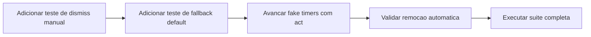

# FE-05 - Cobertura de Testes do Toast (fallback e dismiss)

## Contexto e objetivo

Cobrir os trechos do `ToastProvider` que estavam sem cobertura no relatorio de testes, especialmente:

- fallback de `variant` e `durationMs`;
- caminho de remocao manual (`onClose`);
- caminho de remocao automatica por timeout (`setTimeout`).

## Escopo tecnico e arquivos modificados

- `src/presentation/design-system/components/Feedback/Toast.test.tsx`

## Decisao arquitetural (ADR resumido)

### Decisao

Expandir os testes unitarios do Toast com cenarios orientados a comportamento, exercitando os ramos de fallback e as duas formas de dismiss.

### Alternativas avaliadas

- Manter apenas teste de renderizacao basica.
- Cobrir timeout apenas por mock de funcao sem avancar timers.

### Trade-offs

- Pro:
  - Cobertura completa do fluxo de notificacao.
  - Reduz risco de regressao em comportamento assíncrono.
- Contra:
  - Teste levemente mais complexo por uso de fake timers.

## Evidencias de validacao

- Execucao direcionada:
  - `npm run test:unit -- src/presentation/design-system/components/Feedback/Toast.test.tsx`
  - Resultado: `4 passed`.
- Execucao completa da suite:
  - `npm run test:unit`
  - Resultado: `19 passed`.
- Cobertura final do arquivo `Toast.tsx`: `100%`.

## Fluxo da alteracao

## Riscos, impacto e plano de rollback

### Riscos

- Baixo risco funcional, alteracao restrita a testes.

### Impacto

- Aumenta confiabilidade do comportamento de notificacoes.
- Melhora rastreabilidade de cobertura para CA13.

### Rollback

1. Reverter commit da alteracao de `Toast.test.tsx`.
2. Restaurar testes anteriores, se necessario.

## Proximos passos recomendados

1. Manter padrao de testes com ramos de fallback para novos componentes assíncronos.
2. Incluir esse criterio na revisao de PRs de frontend (caminhos default + timers + dismiss).
